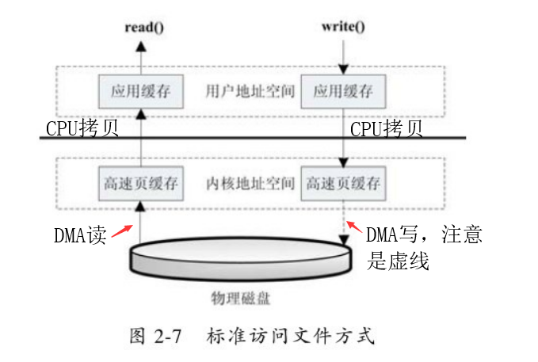
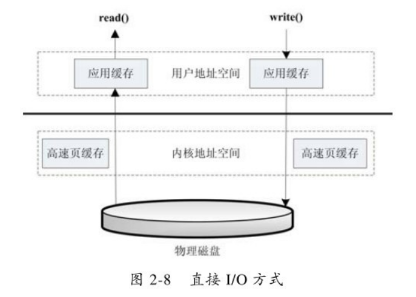
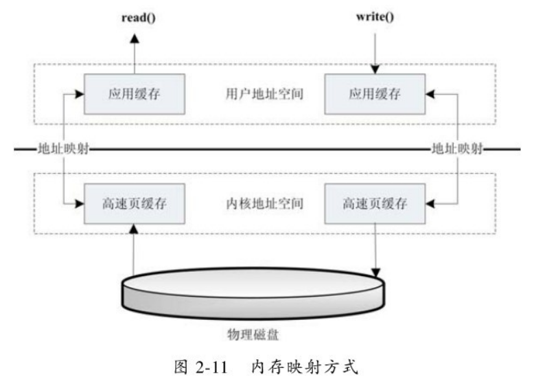

# 1、基本概念回顾

## 1.1 文件描述符

**文件描述符**是Unix(like)系统的一个概念，用于表述指向文件引用的抽象化概念。

当程序打开或创建文件时，内核会向进程返回一个文件描述符，形式上是一个**非负整数**。

## 1.2 PIO与DMA

相对于内存，IO设备往往时慢速的；而CPU是与内存打交道的，其处理速度很快。下面是**慢速IO与内存之间数据传输的方式**：

- **PIO**：很早之前，读取磁盘到内存中，数据需要通过CPU存储转发，这种方式称为PIO。缺点：占用大量CPU时间来读取文件，造成文件访问时CPU很难响应其他工作。
- **DMA**：DMA（直接内存访问）取代了PIO，**它是一种硬件技术**，它可以不经过CPU而直接进行磁盘和内存的数据交换。在DMA模式下，CPU只需要向DMA控制器下达指令，使其处理数据传送即可，数据传送完毕之后再通知CPU。这样大大降低了数据传输时CPU的占用率，节省了系统资源。**注意**：其传输速度与PIO差异不大，DMA主要优势在于节省了CPU资源。

PIO模式的计算机现在已经很少见了。

## 1.3 Linux2.6中的文件访问方式

在Unix系统中，读取/写入文件的IO操作需要调用系统接口，涉及到用户态-->内核态的转换。

读：read()

写：write()

### 1 标准访问文件方式

这种标准IO方式也称为**缓冲IO**。

- **read()操作：**当应用调用 read接口，操作系统检查内核空间的缓存中是否存在该数据，
  - 若已经缓存，直接将内核空间的数据复制到应用缓存；
  - 若没有，则用DMA读从磁盘中读取数据，缓存在内核空间，随后再将其复制到应用缓存中。
- **write()操作：**将数据从 用户空间 复制到 内核空间 的缓存中。**注意：**此时**写操作对于用户来说已经完成**，至于数据什么时候写回到磁盘，由操作系统决定（或者显示调用sync命令）。

**优点**：读操作时，若缓冲命中，则不需要从磁盘读，提升了这次的读取速度。

**缺点**：多次数据拷贝，给CPU带来了开销，而且若缓冲不命中，读操作速度会很慢，多了一次拷贝操作。

### 2 直接IO方式

**数据直接在用户地址空间的缓冲区和磁盘之间直接进行传输**，完全不需要页缓存的支持，**即绕过了内核缓冲区**。

操作系统层提供的缓存往往会使应用程序在读写数据的时候获得更好的性能，但是对于某些特殊的应用程序，比如说**数据库管理系统这类应用，他们更倾向于选择他们自己的缓存机制**，因为数据库管理系统往往比操作系统更了解数据库中存放的数据，数据库管理系统可以提供一种更加有效的缓存机制来提高数据库中数据的存取性能。

### 3 内存映射方式

Linux中提供了系统调用`mmap()`来实现这种文件访问方式。

内存映射是指将硬盘上文件的位置与进程逻辑地址空间中一块大小相同的区域一一对应，当要访问内存中一段数据时，转换为访问文件的某一段数据。**这种方式的目的同样是减少数据在用户空间和内核空间之间的拷贝操作，因为这两个空间的数据时共享的。当大量数据需要传输的时候，采用内存映射方式去访问文件会获得比较好的效率。**

使用内存映射文件处理存储于磁盘上的文件时，将不必再对文件执行I/O操作，这意味着在对文件进行处理时将不必再为文件申请并分配缓存，所有的文件缓存操作均由系统直接管理，由于取消了将文件数据加载到内存、数据从内存到文件的回写以及释放内存块等步骤，使得**内存映射文件在处理大数据量的文件时能起到相当重要的作用**。

### 4 同步访问文件方式

### 5 异步访问文件方式

## 1.4 Linux下的零拷贝技术

# 2、Unix的5种网络IO模型

## 2.1 阻塞IO模型

## 2.2 非阻塞IO模型

## 2.3 多路复用IO模型

## 2.4 信号驱动IO模型

## 2.5 异步IO模型