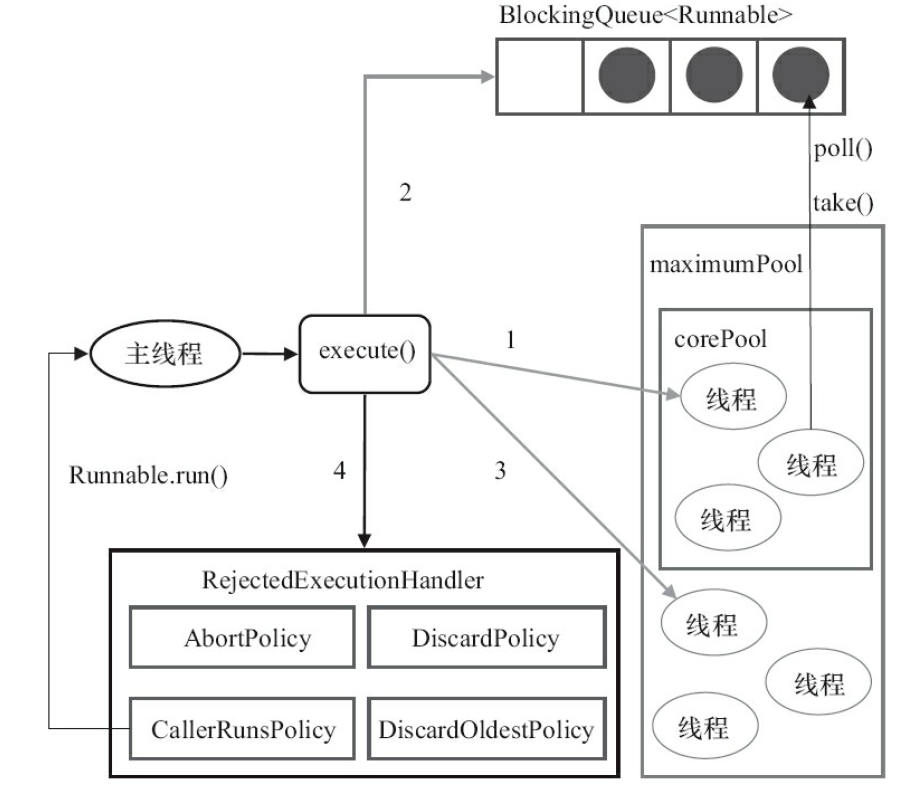
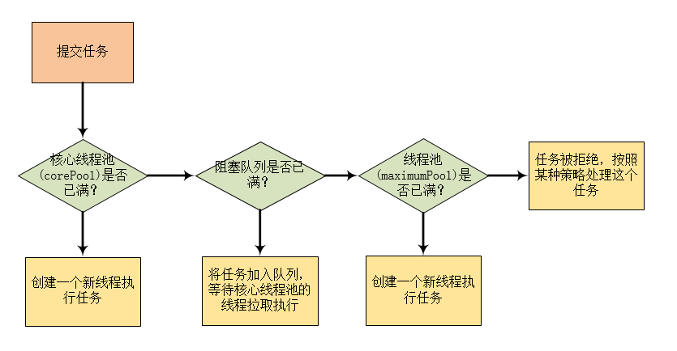

[TOC]

## 一、线程池的作用

合理使用线程池，能带来*3个好处*：

1. **降低资源消耗**

   减少了每次 创建线程 、销毁线程 的开销。 

2. **提高响应速度**

   任务到达时，由于线程已经创建，故可以直接执行任务，因此提高了响应速度。

3. **提高线程的可管理性**

   线程是一种稀缺资源，若不加以限制，不仅会大量消耗系统资源，还会影响系统的稳定性。

   因此，线程池可以对线程的 创建与停止、线程数量等因素加以控制，可以进行统一分配、调优和监控。


## 二、线程池的实现原理

线程池主要有2种角色：多个工作线程 和 一个阻塞队列。

* **工作线程**

  工作线程指的是 一组处于运行中(Runnable状态)的线程，它们不断地向阻塞队列拉取任务执行。

* **阻塞队列**

  阻塞队列用于存储工作线程来不及处理的任务，当工作线程全部都在执行任务时，到来的新任务只能暂时存储在阻塞队列中，等待工作线程的执行。

### 2.1 线程池是处理任务的？

#### 2.1.1 处理流程

当我们向线程池提交一个任务后，线程池是如何处理这个任务的？

在Java中，线程池 **ThreadPoolExecutor** 执行 `execute()` 方法的示意图如下：



从上图可知，当用户提交一个任务到线程池， **ThreadPoolExecutor** 执行 `execute()` 方法分4种情况：

1. 如果 **当前运行的线程数量 < corePoolSize**，则创建新的线程来执行任务。（这一步骤**需要获取全局锁**）
2. 如果**当前运行的线程数量 >= corePoolSize**，则将任务加入**阻塞队列BlockingQueue**中，等待线程拉取执行。
3. 如果**阻塞队列BlockingQueue**已满，任务无法加入，则 创建新的线程来处理任务。（**需要获取全局锁**）
4. 如果创建线程使 **当前运行的线程数量 > maximumPollSize**，任务将会被拒绝，并调用`RejectedExecutionHandler.rejectedExecution()`方法。

#### 2.1.2 线程池答疑

**问题1**：maximumPool很容易理解是自行设置的最大允许线程数量，那么corePool是拿来干什么的？

- **线程池每一次创建新的线程时，都需要获取全局锁**，这会是一个瓶颈。所以设计线程池有一个基本思想：执行`execute()`尽量避免获取全局锁。

- **corePool的设计就是一个预热过程，**当**ThreadPoolExecutor** 完成预热之后（**当前运行的线程数量 >= corePoolSize**），在线程池线程数量未满的情况下，所有的`execute()`方法调用都是执行步骤2，步骤2是不需要获取全局锁的。

**问题2**：为什么Java的ThreadPoolExecutor 要采取上述的设计思路？

与问题1是一样的问题。

**问题3：工作线程是怎么工作的？**

线程池创建线程时，会将其封装成Worker工作线程，Worker在执行完任务后，会循环从阻塞队列里的任务拉取执行。

### 2.2 线程池处理任务的流程图



结合2.1的分析，上图的流程应该很清晰。

## 三、线程池的使用

这节主要讲解**ThreadPoolExecutor的使用** 。

### 3.1 线程池的创建

通过以下代码创建一个线程池（JDK1.8）：

```java
public ThreadPoolExecutor(int corePoolSize,
                              int maximumPoolSize,
                              long keepAliveTime,
                              TimeUnit unit,
                              BlockingQueue<Runnable> workQueue,
                              RejectedExecutionHandler handler)
```

几个参数的讲解：

1. **corePoolSize**：线程池的基本线程的数量，也称为 核心线程池数量

   * 提交一个任务，如果 **当前运行的线程数量 < corePoolSize**，即使有空闲的基本线程，也会创建新的线程来执行任务。

   * 可以调用线程池的`prestartAllCoreThreads()`方法，可以提前启动所有的基本线程。

     

2. **maximumPoolSize**：线程池允许运行线程数量的最大值

   这是运行线程数量的上界，如果实际线程数量达到这个值，

   * 阻塞队列未满：任务存放至阻塞队列中等待执行
   * 阻塞队列已满：任务被拒绝，调用饱和策略处理任务

   **注意**：如果使用的是无界队列，这个参数就没意义了。

   

3. **keepAliveTime**：空闲线程的存活时间

   工作线程空闲后，保持存活的时间。

   PS：如果任务多 且 每个任务执行较短的情况下，可以调大时间，提高线程的利用率。

   

4. **unit：keepAliveTime**的单位

   

5. **workQueue**：存放任务的阻塞队列

   用于存放等待执行任务的阻塞队列，可以选择以下几种：

   * **ArrayBlockingQueue**: 基于数组实现的有界阻塞队列，FIFO。

   * **LinkedBlockingQueue**:基于链表实现的无界阻塞队列，FIFO，吞吐量高于ArrayBlockingQueue。静态工厂方法`Executors.newFixedThreadPool()`使用的就是它。

   * **SynchronousQueue**:一个不存储元素的无界阻塞队列（内部没有容器），一个线程的插入操作必须等到另一个线程调用移除操作，否则插入操作的线程一直处于阻塞状态，吞吐量高于LinkedBlockingQueue。静态工厂方法`Executors.newCachedThreadPool()`使用的就是它。

   * **PriorityBlockingQueue**:一个具有优先级的无限阻塞队列。

     

6. **handler**：饱和策略

   当 线程池 和 队列 都满了，说明线程池处于饱和状态，此时需要调用饱和策略。Java线程池（JDK1.5）提供了4种策略处理提交的新任务（默认是AbortPolicy）：

   * **AbortPolicy**：直接抛出异常
   * **CallerRunsPolicy**：用 调用者所在的线程来运行任务
   * **DiscardOldestPolicy**：丢弃队列里最近的任务，并执行当前任务
   * **DiscardPolicy**：不处理，直接丢弃

   **注意**：也可以实现`RejectedExecutionhandler`接口自定义策略。

   

### 3.2 向线程池提交任务

可以向**ThreadPoolExecutor**提交2种任务： Callable 和 Runnable。

1. **Callable** 
   * 该类任务有返回结果，且可以抛出异常。
   * 通过`sumbit()`方法提交，返回Futrue对象。
   * 使用Futrue对象的`get()`可以获得返回值，该方法会阻塞当前线程，直到任务被线程池执行完成。
2. **Runnable**
   * 该类任务只提交，没有返回结果，也不能抛异常。
   * 通过`execute()`提交。

### 3.3 关闭线程池

关闭线程池一共有2种方式： `shutdown()` 和 `shutdownNow()`。

**原理基本一样**：

遍历所有的线程，调用它们的`interrupt()`方法中断线程。

**区别**：

*  `shutdown()`

  将线程池状态设置为SHUTDOWN，仅仅中中断 没有正在执行任务的线程。

* `shutdownNow()`

  将线程池状态设置为STOP，会尝试停止所有正在执行 或者 暂停任务的线程，并返回等待执行任务的列表。

**注意事项**：

* 任务需要能响应中断，否则上述2种方法可能永远无法终止任务。
* 调用2个方法都会使 `isShutdown()`返回true。
* 当所有任务都被关闭后，才表示线程池关闭成功，`isTerminated()`返回true。


### 3.4 如何合理配置线程池

要合理配置线程池，需要先分析任务的特性：

1. 任务的性质：CPU密集型任务、IO密集型任务 和 混合型任务。
2. 优先级：高、中、低。
3. 执行时间：长、中、短。
4. 任务的依赖性：是否依赖其他的系统资源，如数据库连接等。


**配置方案**：

* 根据任务性质，可做如下配置：
  * CPU密集型任务

    尽量使用小规模线程池，一般线程数量：CPU核心数 + 1。

    因为CPU密集型任务的CPU利用率很高，过多线程导致上下文切换过多，造成额外开销。

    

  * IO密集型任务

    使用稍大的线程池，尽量配置多的线程，一般线程配置数量：CPU核心数 * 2。

    这种任务CPU利用率不是很高，因此可以让CPU在等待IO的时候去处理别的任务。

    

  * 混合型任务

    任务分解成：CPU密集 和 IO密集 型任务，然后分别用不同规模线程池处理。

    **注意**：只要分解后的两个任务执行时间相差不大，会比原来串行执行吞吐量高。

    但是，如果相差时间不大，先执行完的任务 要等待 后执行完的任务，最终执行时间依然取决于 后执行完的任务，还要加上任务拆分、合并的开销，得不偿失。


* 优先级，可以使用优先级队列**PriorityBlockingQueue**来处理，它会让优先级高的任务先执行。
* 执行时间不同的任务，可以交给不同规模的线程池来处理，或使用优先级队列，让短任务先执行。
* 数据库依赖性任务，线程提交SQL等待数据库返回结果，等待时间越长，则CPU空闲时间越长。因此，可以将线程数量设置较大，能更好利用CPU。


使用线程池建议：**建议使用有界队列**，可以增加系统稳定性 和 预警能力。


### 3.5 线程池的监控

如果系统大量使用线程池，则有必要对线程池进行监控。

可以通过**线程池提供的参数进行监控**：

* taskCount：需要执行的任务数量
* completedTaskCount：已完成的任务数量
* largestPoolSize：线程池中曾经创建过的最大线程数量
* getPoolSize：线程池的线程数量，只增不减
* getActiveCount：获取活动的线程数量

也可**继承线程池来自定义线程池**进行监控，重写`beforeExecute()`、`afterExecute()`和`terminated()`方法进行监控。