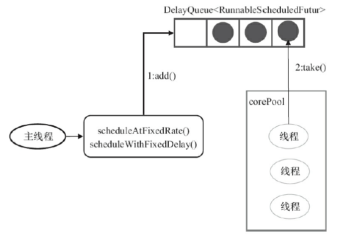

[TOC]

# Executor框架

## 1、Executor框架的作用

> Executor框架是在 JDK 1.5 引入的，内部使用了线程池机制，通过该框架来控制线程的启动、执行和关闭。

以前的Thread 即是工作单元，也是执行机制，JDK 1.5 之后，就将执行机制由Executor框架提供，工作单元指的是任务Runnable 和 Callable。

与Thread的`start()`方法对比，好处有：

* 易于管理，效率更好（用线程池实现，节约开销）
* 有助于避免 this 逸出

**Executor框架的主要成员**有：ThreadPoolExecutor、ScheduledThreadPoolExecutor、Futrue接口、Callable接口、Runnable接口、Executor接口 和 工具类Executors。

## 2、Executor两级调度模型


在HotSpot VM的线程模型中，Java线程被一对一映射成操作系统的线程。

两级调度模型指的是：

* 在上层，用户将应用分解为若干个任务，然后用 Executor框架 将这些任务映射为固定数量的线程。
* 在底层，操作系统内核将这些线程映射到处理器上。

## 3、Executor框架详解


如上图所示，Executor框架由 3大部分组成：

* **任务**。即执行任务需要实现的接口：Runnable 接口 或 Callable接口。
* **任务的执行**。任务执行机制核心接口Executor、和继承自Executor的ExecutorService接口（2个关键类实现：ThreadPoolExecutor 和 ScheduledThreadPoolExecutor）。
* **异步计算的结果**。即 Future接口 和 它的实现类 FutureTask类。

### 3.1、Executor的使用


使用流程：

1. 主线程主要创建 Runnable 和 Callable 的任务对象。调用`Executors.callable(Runnable)`可以把Runnable对象包装成Future对象。
2. 再创建一个ExecutorService的一个子类对象。
3. 调用`ExecutorService.submit(Runnable / Callable<T>)` 或 `ExecutorService.execute(Runnable)`，把任务提交给ExecutorService。
4. 调用`submit()`会返回一个FutureTask对象，主线程可调用`FutureTask.get()`使主线程等待任务执行完成，也可以调用`FutureTask.cancel(boolean)`取消任务执行。

### 3.2、Executor框架成员

#### 1）Executor接口

Executor接口仅仅只有一个`execute(Runnable)`方法，ExecutorService接口是继承该接口的一个子接口。

#### 2）ThreadPoolExecutor

线程池的核心实现类，用来执行被提交的任务。之前的线程池有讲过[用法和原理](./Java并发编程的艺术(5)——Java中的线程池.md)，这里不再介绍。

#### 3）ScheduledThreadPoolExecutor

是ThreadPoolExecutor的一个子类，只是ThreadPoolExecutor的一个简单封装。可以在给定的延迟后运行命令，或者定期指定命令，比 工具类Timer更加灵活、功能更强大。

#### 4）Runnable 和 Callable接口 

都是任务，可以提交给ExecutorService执行。

Callable 可以返回结果 且 可抛出异常，Runnable 则不可以。调用`Executors.callable(Runnable)`可以把Runnable对象包装成Future对象。

#### 5）Future接口

Future接口 和 FutureTask实现类 是用来表示异步计算的结果的。JDK 1.8为止，调用`submit()`会返回一个FutureTask对象。

#### 6）Executors工具类

Executors工厂类可以，

* **创建3三种ThreadPoolExecutor**：SinglePoolExecutor、FixedThreadPool和CachedThreadPool。
* 还可以**创建ScheduledThreadPoolExecutor**、**SingleThreadScheduledExecutor**。

### 3.3 各类线程池 和 FutureTask详解

#### 1）3种ThreadPoolExecutor类型的线程池

##### 1.1)  FixedThreadPool

目的是为了**创建固定线程数量的线程池**，**适用于负载比较重的服务器**，使用了无界队列LinkedBlockingQueue。

使用Executors工厂类创建的源代码为：

```java
public static ExecutorService newFixedThreadPool(int nThreads) {
        return new ThreadPoolExecutor(nThreads, nThreads,
                                      0L, TimeUnit.MILLISECONDS,
                                      new LinkedBlockingQueue<Runnable>());
    }
```

可知：

- corePoolSize 和 maximumPoolSize 都被设置为 指定参数 nThreads。
- keepAliveTime 为0，说明多余的空闲线程会被立即终止。
- 使用了无界队列LinkedBlockingQueue，会带来如下影响：
  - 由于无界队列，maximumPoolSize 和 keepAliveTime 都是无效参数；
  - 由于无界队列，线程池不会拒绝任务（即不会调用饱和策略），且线程池的线程池数量不会超过corePoolSize 。


其执行流程如下：


这里大概说明一下流程（可以回顾[线程池的笔记](./Java并发编程的艺术(5)——Java中的线程池.md)）：

1. 如果 运行中的线程数量 < corePoolSize，则创建新线程执行任务。
2. 线程池完成预热之后，将任务将入 LinkedBlockingQueue。
3. 线程执行完 1 的任务后，会循环反复从 LinkedBlockingQueue 获取任务来执行。

##### 1.2) SingleThreadExecutor

使用了无界队列LinkedBlockingQueue，**目的是创建使用单个线程的Executor**，适用于**需要保证各个任务顺序执行且不会有多个线程活动**的应用场景。

使用Executors工厂类创建的源代码为：

```java
public static ExecutorService newSingleThreadExecutor() {
        return new FinalizableDelegatedExecutorService
            (new ThreadPoolExecutor(1, 1,
                                    0L, TimeUnit.MILLISECONDS,
                                    new LinkedBlockingQueue<Runnable>()));
    }
```

使用无界队列LinkedBlockingQueue带来的影响同上。

其执行流程如下：


流程说明略。

##### 1.3) CachedThreadPool

CachedThreadPool 是一个会**根据需求创建新线程的线程池**，是一个**线程数量无界**的线程池。适用于 执行很多的短任务的小程序 或者 负载较轻的服务器。使用的是无容量的无界队列SynchronousQueue。

使用Executors工厂类创建的源代码为：

```java
public static ExecutorService newCachedThreadPool() {
        return new ThreadPoolExecutor(0, Integer.MAX_VALUE,
                                      60L, TimeUnit.SECONDS,
                                      new SynchronousQueue<Runnable>());
    }
```

说明：

* corePoolSize被设置为0，maximumPoolSize为最大整数值。说明线程池的允许线程数量是无限的。
* keepAliveTime被设置为60s，说明空闲线程超过60s就会被停止。
* SynchronousQueue是没有容量的工作队列，且maximumPool是无界的，说明 主线程提交任务速度  高于 线程处理任务的速度（来一个任务就使用 **创建的新线程 或 空闲线程** 来运行，不将任务保存在任务队列中）；由于线程数量不限制，**极端情况下，可能会导致太多线程耗尽CPU资源**。

其执行流程如下：


流程说明：

1. 先执行`SynchronousQueue.offer(Runnable)`。如果 maximumPool中有空闲线程 执行了 `poll()`，那么与主线程执行的`offer()`配对成功，主线程则把任务直接提交给空闲线程执行，`execute()`执行完成。否则，执行步骤2.
2. 当 初始maximumPool为空 或者 maximumPool 没有空闲线程时，这时没有线程执行  `poll()`，这种情况下CachedThreadPool 会创建一个新线程执行任务，`execute()`执行完成。
3. 在 步骤2 中新创建的线程执行完任务后，会执行`poll()`，会让空闲线程最多在 SynchronousQueue 中等待60s，
   * 如果60s内主线程提交了任务，空闲线程会执行提交的任务。
   * 否则，空闲线程被终止。

#### 2）ScheduledThreadPoolExecutor详解

ScheduledThreadPoolExecutor继承自ThreadPoolExecutor，主要用来给 **给定延迟之后运行任务，或者定期执行任务**。**适用于 需要多个后台执行周期任务 且 又需要限制线程数量** 的应用场景。

使用了无界队列 DelayQueue。

**功能与Timer类似，但区别有**：

* ScheduledThreadPoolExecutor功能更强大。
* Timer类不管启动多少定时器，只会启动单个线程，而ScheduledThreadPoolExecutor可以指定多条线程。
* Timer执行周期任务依赖于系统时间，而ScheduledThreadPoolExecutor基于时间的延迟，因此不会因系统时间的改变而改变。

使用Executors工厂类创建的源代码为：

```java
public static ScheduledExecutorService newScheduledThreadPool(int corePoolSize) {
        return new ScheduledThreadPoolExecutor(corePoolSize);
    }
```

说明：其中corePoolSize是指定的后台线程的基本数量（但是它的maximumPool是无界的）。

ScheduledThreadPoolExecutor的构造函数如下：

```java
public ScheduledThreadPoolExecutor(int corePoolSize) {
        super(corePoolSize, Integer.MAX_VALUE, 0, NANOSECONDS,
              new DelayedWorkQueue());
    }
```


##### 2.1）任务的传递

ScheduledThreadPoolExecutor 的任务是直接增加到 DelayQueue队列中，然后由coolPool的线程以一定方式获取任务执行，是一次**任务传递**，而不是直接交付给线程执行，其流程如下：



为了实现周期性的执行任务，**对ThreadPoolExecutor做了3个方面的修改**：

1. 使用DelayQueue最为任务队列。
2. 获取任务的方式不同。
3. 执行周期任务后，增加了额外的处理。

##### 2.2）任务执行步骤

主线程调用 `scheduleAtFixedRate()`或 `scheduleWithFixedDelay()`提交任务(一个ScheduledFutureTask对象)直接到DelayQueue队列中。

**ScheduledFutureTask主要由3个成员变量**：

|      成员变量       |          描述          |
| :-----------------: | :--------------------: |
|      long time      |    任务被执行的时间    |
| long sequenceNumber | 任务添加到线程池的序号 |
|     long period     |   任务执行的间隔周期   |

**DelayQueue 封装了一个PriorityQueue**，这个优先队列会对任务列表的任务排序，排序规则如下：

* time小的排在前面（即时间早的任务优先被执行）。
* 若time相同，sequenceNumber小的排在前面（time相同，先提交的任务先执行）。

**线程执行某个任务的步骤**：


1. `DelayQueue.take()`，线程1 从DelayQueue获取已到期的任务。到期任务指的是 time大于等于当前时间的任务。
2. 线程1执行这个任务。
3. 线程1修改任务的time变量为下次执行的时间。（根据period）
4. 线程1把这个任务放回DelayQueue中。`DelayQueue.add()`。

#### 3）FutureTask详解

FutureTask 实现了2个接口：Future 、 Runnable。因此，

* FutureTask 可以交给Executor框架执行。
* 也可以调用`FutureTask .run()`直接启动线程运行。

调用`FutureTask .run()`有3种状态：**未启动、已启动 和 已完成**，其状态迁移图如下：


**在3种状态下，调用`get()`和`cancle()`方法**的执行示意图如下：


