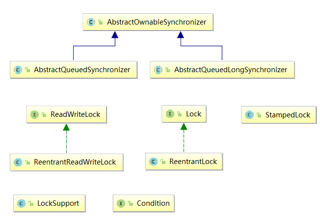
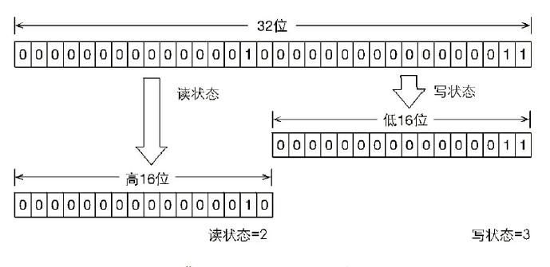
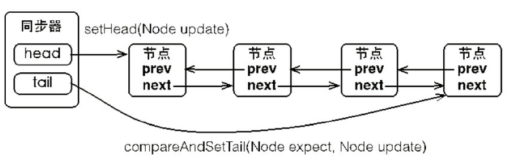
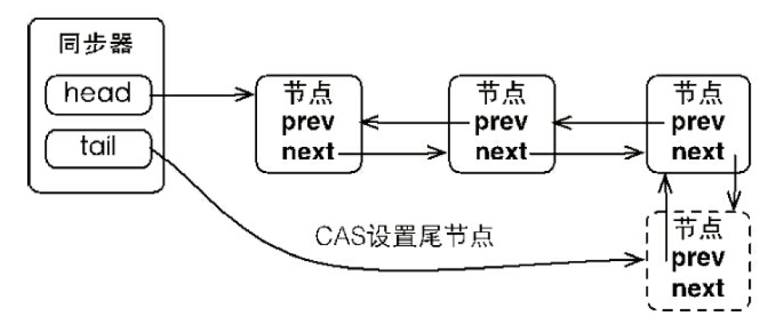
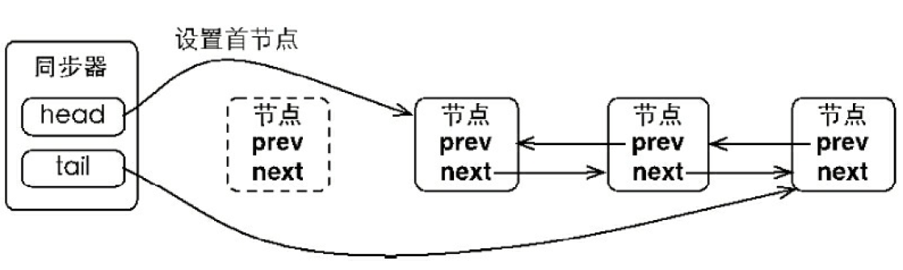
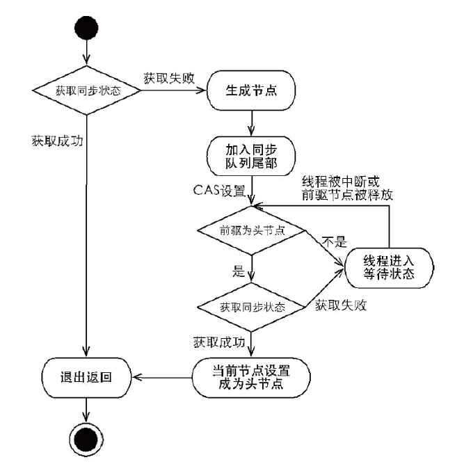
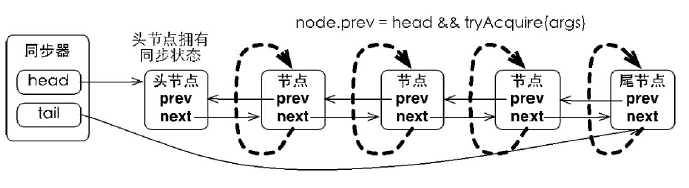

[TOC]

# 1、Overview

JDK 1.5之前都是使用***synchronized*关键字**来实现锁功能，***synchronized*关键字**会**隐式**获取锁，但是固化了锁的获取和释放：**先获取再释放**。优缺点：简化了同步的管理，但可扩展性没有显式的好。

**针对一些场景**，如：一个线程需要先获得锁A，再获取锁B，获取到锁B之后，释放锁A，最后释放锁A。

使用*Lock*很容易实现，**其基本使用方式**：

```java
Lock lock = new ReentrantLock();
lock.lock();
try{
    //注意点1：不要将lock锁获取过程放在try中，如果获取锁时发生异常，会导致锁被无故释放
}finally {
    //注意点2：保证不管有无异常，该线程在获取锁后，最后都能释放锁
    lock.unlock();
}
```

JDK1.5之后，就引入了 *Lock接口* 及其实现类，其在 *java.util.concurrency.locks* 的简单类图(JDK 1.8)如下：




# 2、Lock 接口

## 2.1 Lock 与 synchronized 的区别

*Lock接口* 主要提供了一些 *synchronized*  所没有的特征：

1. *synchronized* **只支持 非公平地** 获取锁，*Lock接口* 支持 **公平 和 非公平** 两种方式。
2. *synchronized***只支持 阻塞地** 获取锁，*Lock接口* 支持 **阻塞 和 非阻塞** 两种方式。
3. *Lock接口*  能够 **中断地获取锁** ，即在锁的获取过程中可以中断当前线程。
4. *Lock接口*  支持 **超时获取锁**，即 在指定时间前仍未获取锁，则返回。

## 2.2 Lock API

*Lock*只是一个接口，定义了锁获取 和 释放 的基本操作，API如下所示：

|                      方法名称                      |                             描述                             |
| :------------------------------------------------: | :----------------------------------------------------------: |
|                   *void lock()*                    |       **获取锁**，如果失败会阻塞当前线程，成功则返回。       |
|             *void lockInterruptibly()*             |   **可中断地获取锁**，即在锁的获取过程中可以中断当前线程。   |
|                *boolean tryLock()*                 | **尝试非阻塞地获取锁**，即获取锁失败直接返回*false*，不会阻塞当前线程。 |
| *boolean tryLock(long timeout, TimeUnit timeUnit)* | **超时地获取锁**，也是非阻塞，与*tryLock()*很类似，多了个超时时间，有3种情况返回：1.超时时间内获得了锁，返回*true* ；2. 超时时间内被中断；3. 超时时间结束，返回*false*； |
|                  *void unlock()*                   |                            释放锁                            |
|             *Condition newCondition()*             | 获取 等待/通知组件，该组件与当前的锁绑定。当前线程在获得锁之后，才能调用组件的*wait()*方法，调用之后，锁也会被释放。 |


## 2.3 Java提供的锁

### 1）重入锁：ReentrantLock

**重入锁 *ReentrantLock* ，是Lock接口的实现类，它是支持重进入的锁**，，即：已经获取该锁的线程，能够再次调用`lock()`获取锁而不被阻塞。*ReentrantLock* 还支持两种模式：**公平锁 和 非公平锁**。

***synchronized*关键字 支持隐式的重进入，并且是非公平的锁。**

#### 1.1）实现重进入

实现重进入需要解决2个问题：

1. **线程再次获取锁**。锁需要识别 要获取锁的线程 是否是 当前占据锁的线程 ，如果是，则再次获取。
2. **锁的最终释放**。当锁被某一线程n次获取，计数会自增，当计数为0表示锁已经被成功释放。

以 **非公平的**（默认）*ReentrantLock* 的实现为例，

* **获取同步状态代码**如下：

```java
final boolean nonfairTryAcquire(int acquires) {
    final Thread current = Thread.currentThread();
    //获取共享状态c
    int c = getState();
    if (c == 0) {
        //如果c为0，表示锁已经被成功释放，只要该线程通过CAS把状态改变成功，该线程就获得锁，
        //这说明是非公平的。
        if (compareAndSetState(0, acquires)) {
            setExclusiveOwnerThread(current);
            return true;
        }
    }
    else if (current == getExclusiveOwnerThread()) {
        //成功获取该锁的线程再次获得锁，只需要将锁的同步状态增加，并返回true即可。
        int nextc = c + acquires;
        if (nextc < 0) // overflow
            throw new Error("Maximum lock count exceeded");
        setState(nextc);
        return true;
    }
    return false;
}
```


* **释放同步状态代码**如下：

  ```java
  protected final boolean tryRelease(int releases) {
  	//释放锁，减少同步状态值
      int c = getState() - releases;
      if (Thread.currentThread() != getExclusiveOwnerThread())
          //如果当前线程不是占有锁的线程，释放锁则应该抛出异常
      	throw new IllegalMonitorStateException();
      boolean free = false;
      if (c == 0) {
          //如果同步状态为0，说明锁要被成功释放，将占有锁的对象设为null
      	free = true;
      	setExclusiveOwnerThread(null);
      }
      //更新同步状态值
      setState(c);
      return free;
  }
  ```

  

#### 1.2）实现公平锁

**什么叫 公平锁 和 非公平锁？**

* 公平锁 就是锁获取是顺序获取的（FIFO），等待时间最长的线程先获得锁。
* 而 非公平锁 就是只要CAS设置状态成功，就表示当前线程获得了锁。

**公平锁 与 非公平锁 的对比**

* **公平锁** 保证了锁的获取按照**FIFO**，但代价是 **大量的线程切换**。
* **非公平锁** 可能**造成 饥饿现象**，但**极少的线程切换**，**保证了高吞吐**，因此被设为默认。

**问题**：公平锁保证锁获取是按照FIFO的，这与AQS中队列的FIFO有什么区别？

AQS内置队列保证了在同步队列中节点的获取同步状态规则符合FIFO，但是无法保证新晋节点获取锁符合FIFO。如：非公平锁下，一个线程请求锁时只要CAS修改成功就获取了锁，**那么刚释放完锁的线程再次获取锁的几率会很大，导致其他线程只能在同步队列中等待**。

在同步队列中的线程，获取锁的情况， 非公平 和 公平 的效果是一样的。

举例说明：如当前线程4占有锁，同步队列有[1,2,3]四个线程（线程1先到达的）被阻塞，此时线程4释放锁之后，也开始竞争锁，

* 那么若使用公平锁，此时一定线程1先获取锁，此时同步队列为[2,3,4]；
* 若使用非公平锁，很有可能还是线程4获得锁，此时同步队列为[1,2,3]。

**公平地获取同步状态**：

```java
protected final boolean tryAcquire(int acquires) {
    final Thread current = Thread.currentThread();
    int c = getState();
    if (c == 0) {
        //与非公平锁的实现唯一区别：就在多了hasQueuedPredecessors()方法判断，
        //判断当前节点在同步队列中，是否有前驱结点，如果返回true，说明有线程比
        //当前线程更早请求获取锁，因此需要等待前驱节点获得锁并释放之后，才能获得锁，保证了公平性。
        if (!hasQueuedPredecessors() &&
            compareAndSetState(0, acquires)) {
            setExclusiveOwnerThread(current);
            return true;
        }
    }
    else if (current == getExclusiveOwnerThread()) {
        int nextc = c + acquires;
        if (nextc < 0)
            throw new Error("Maximum lock count exceeded");
        setState(nextc);
        return true;
    }
    return false;
}
```

**释放同步状态的代码是一样的。**

#### 1.3）基本使用方法

```java
public class SharedObject {
    //...
    ReentrantLock lock = new ReentrantLock();
    int counter = 0;
 
    public void perform() {
        // 锁的获取不能放在try中。
        lock.lock();
        try {
            //获取锁后，要操作的核心代码。
            count++;
        } finally {
            //保证一定释放锁
            lock.unlock();
        }
    }
    //...
}
```


### 2）读写锁：ReentrantReadWriteLock

像 *synchronized*、*ReentrantLock*都是**排他锁**，即：同一时刻只允许一个线程占有锁。

而**读写锁**提供以下机制：

* 如果没有线程占有写锁，那么同一时刻允许多个读线程访问。
* 如果有线程占有写锁，那么所有读、写线程都会被阻塞。


JDK1.5 之后，提供了读写锁的支持。**与排他锁的对比**：

* 读写锁的 **并发性 和 吞吐量 更好**，因为大多数场景 读是多于写的。


**读写锁维护了2个锁：读锁、写锁（实现了Lock接口），其提供了以下特性**：

1. 支持 非公平锁（默认） 和 公平锁。
2. 支持重进入。
3. 支持锁降级，后面会讲。


#### 2.1）接口 和 使用示例

*ReadWriteLock 接口* 仅仅只提供了2个方法：

|      方法名称      |   描述   |
| :----------------: | :------: |
| *Lock readLock()*  | 返回读锁 |
| *Lock writeLock()* | 返回写锁 |

而 *读写锁 ReentrantReadWriteLock* 是 *ReadWriteLock 接口* 的实现类，还提供了一些额外的监控方法：

|         方法名称          |             描述             |
| :-----------------------: | :--------------------------: |
| *int getReadLockCount()*  |    返回读锁被获取的次数。    |
| *int getReadHoldCount()*  | 返回当前线程获取读锁的次数。 |
| *boolean isWriteLocked()* |     判断写锁是否被获取。     |
| *int getWriteHoldCount()* | 返回当前线程获取写锁的次数。 |

**基本使用示例**：

该示例 使用了非线程安全的HashMap，用读锁写锁保证了其`get()`、`put()`、`clear()`方法时线程安全的：

```java
public class ReentrantReadWriteLockTest {
    private static final Map<String, Object> map = new HashMap<String, Object>();
    private static final ReentrantReadWriteLock rwl = new ReentrantReadWriteLock();
    //获得读锁r
    private static final Lock r   = rwl.readLock();
    //获得写锁w
    private static final Lock  w   = rwl.writeLock();
    //利用读锁，实现线程安全的get：获取一个key的value
    public static final Object get(String key) {
        r.lock();
        try {
            return map.get(key);
        } finally {
            r.unlock();
        }
    }
    //利用写锁，实现线程安全的put：设置key对于的value，并返回旧的value
    public static final Object put(String key, Object value) {
        w.lock();
        try {
            return map.put(key, value);
        } finally {
            w.unlock();
        }
    }
    //利用写锁，实现线程安全的clear：清空map的所有内容
    public static final void clear() {
        w.lock();
        try {
            map.clear();
        } finally {
            w.unlock();
        }
    }
}
```


#### 2.2）实现分析

主要分析4个方面：读写状态设计、写锁的获取与释放、读锁的获取与释放 和 锁降级。

##### 2.2.1）读写状态设计

重入锁 *ReentrantLock* 维护一个整型变量来表示同步状态，而 读写锁 有2种锁，故需要在一个整型变量维持两种状态。

**按位切分**：高16位表示读状态、低16位表示写状态。



假设同步状态S，通过**位操作可以确定读、写的状态**：

* 写状态 = S & 0x0000FFFF（将高16位抹去）。写状态+1，S = S + 1。
* 读状态 = S >>> 16（无符号右移16）读状态+1，S = S + (1 << 16)。

##### 2.2.2）写锁的获取与释放

写锁是一种 **支持重进入的排它锁**。如果 **已有其他线程获得写锁  或者 读锁（防止脏读）**，那么线程将会被**阻塞**。

其**非阻塞获取写锁**的代码如下：

```java
protected final boolean tryAcquire(int acquires) {
    Thread current = Thread.currentThread();
    int c = getState();
    //获取写状态的值
    int w = exclusiveCount(c);
    if (c != 0) {
        //如果 存在读锁 或者 当前写锁已被其他线程占有，返回false，获取写锁失败
        if (w == 0 || current != getExclusiveOwnerThread())
            return false;
        //允许最大重进入次数MAX_COUNT
        if (w + exclusiveCount(acquires) > MAX_COUNT)
            throw new Error("Maximum lock count exceeded");
        setState(c + acquires);
        return true;
    }
    //c = 0表示读写锁均为已被释放状态，如果此时写操作需要被阻塞 或者 CAS操作失败，则获取写锁失败
    if (writerShouldBlock() ||
        !compareAndSetState(c, c + acquires))
        return false;
    //获取写锁成功，设置当前写锁的拥有者为当前对象
    setExclusiveOwnerThread(current);
    return true;
}
```

**注意**：

1. 存在读锁，则写锁不能被获取，防止脏读。
2. 存在写锁，则其他 读、写线程 都会被阻塞。

写锁的释放与重入锁是类似过程，略。

##### 2.2.3）读锁的获取与释放

读锁是一个 **支持重进入的共享锁**，能被多个线程获取，在有写锁的情况下，会被阻塞。

**非阻塞获取读锁**的代码如下（JDK1.5到1.6后，由于增加了些功能，变复杂了）：

```java
protected final int tryAcquireShared(int unused) {
    Thread current = Thread.currentThread();
    int c = getState();
    //如果写锁被其他线程获取，则失败
    if (exclusiveCount(c) != 0 &&
        getExclusiveOwnerThread() != current)
        return -1;
    int r = sharedCount(c);
    //否则 写锁未被获取 或者 写锁被当前线程获取（为了支持锁降级） ，如果该线程不应该被阻塞 且 CAS操作更改读锁状态成功，
    //更新状态并做一些操作（JDK1.5到1.6后，由于增加了些功能，变复杂了）
    if (!readerShouldBlock() &&
        r < MAX_COUNT &&
        compareAndSetState(c, c + SHARED_UNIT)) {
        //一些复杂操作，略
        return 1;
    }
   	//如果上述失败，使用fullTryAcquireShared()方法
    return fullTryAcquireShared(current);
}
```

**流程**：

1. 如果**其他线程获得写锁**，当前线程获取读锁失败，进入等待状态。
2. 如果**当前线程 获取写锁 或者 写锁未被获取**，当前线程增加读状态（CAS保证线程安全），成功获取读锁。

读锁的释放也是减少读状态，每次减少的值是： 1 << 16。

##### 2.2.4）锁降级

锁降级是指：**一个线程的写锁可以降级成读锁**。即：**当前线程占有写锁**，再**获取到读锁**（看上节代码，这是被允许的），**随后释放写锁** 的过程，锁降级是为了支持某些场景的应用。

但**读写锁不支持锁升级**（获取读锁->获取写锁->释放读锁的过程）：**目的是为了保证数据可见性**，如果读锁被多个线程获取，其中一些线程获取写锁并修改数据，那么这些数据是对其他获得读锁的线程时不可见的。

一个示例，

```java
public class ProcessData {
    private static final ReentrantReadWriteLock rwl       = new ReentrantReadWriteLock();
    private static final Lock                   readLock  = rwl.readLock();
    private static final Lock                   writeLock = rwl.writeLock();
    //cacheValid是用来表示是否是有效数据
    private volatile boolean                    cacheValid    = false;

    public void processData() {
        //先获取读锁，保证数据是最新的（一旦获取，不允许其他线程写）
        readLock.lock();
        //当感知到数据无效时，则进行数据的准备流程
        if (!cacheValid) {
            // 必须先释放读锁
            readLock.unlock();
            // 锁降级从写锁获取到开始，此时其他线程被阻塞
            writeLock.lock();
            try {
                //还需要再检查一次cacheValid的状态，因为其他线程可能在当前线程进入之前，
                //就已经获取了写锁，并修改了cacheValid的状态。
                if (!cacheValid) {
                    // 准备数据的流程（略）
                    data = ...
                    cacheValid = true;
                }
                //为什么锁降级中，读锁的获取是必要的？
                readLock.lock();
            } finally {
                writeLock.unlock();
            }
            // 锁降级完成，写锁降级为读锁
        }
        try {
            // 使用数据的流程（略）
            use(data);
        } finally {
            readLock.unlock();
        }
    }
}
```

**上述的流程如下**：

1. 当数据发生变化时，cacheValid变量被设置为false，此时所有线程会感知到（volatile）。
2. 但只有一个线程会获得写锁，并会阻塞其他线程的读写所获取。
3. 获得写锁的当前线程，再次确认cacheValid的状态，准备数据之后，并把cacheValid设置为true，再获取读锁，随后释放写锁，完成锁降级。
4. 其他线程感知到cacheValid变成了true，不会再进入锁降级的代码块中。

**问：锁降级中的读锁获取是否是必要的？**

是必要的，目的是为了保证数据可见性。

* 如果 当前线程C在修改完数据data之后，不获取读锁而直接释放写锁，那么假设此时有另一个线程T获取了写锁并修改了数据，那么线程C拿到的就是旧的数据，线程C无法感知到数据已被修改。
* 如果采用 **锁降级** 的策略，则线程T因为当前线程C锁降级中获取了 读锁，所以会被阻塞，只有当前线程C释放读锁之后，线程T才能够获得写锁进行数据更新。

### 3）JDK1.8新增锁：StampedLock

#### 3.1）概述

***StampedLock* 是对 读写锁 的一种改进**，主要是为了解决 读写锁 的一个最大不足：

* *ReentrantReadWriteLock* 是读写锁，**在读 >> 写的环境下（很常见），可能会导致写操作的饥饿问题**。

***StampedLock*  主要优化的是 “读、写是互斥” 的场景**，其**读锁并不会阻塞写锁**，而是选择策略：读的时候发现有写操作，再去多读一次。

***StampedLock*  实现了2种锁：悲观锁、乐观锁**，

* 如果线程拿到悲观锁，读、写是互斥的。
* 如果线程拿到乐观锁，读、写不互斥，而是判断标记位有无被修改，若有修改，则再去读。


#### 3.2）基本使用

```java
/**
 * 利用StampedLock实现 自身是非线程安全的HashMap 的线程安全操作
 */
public class StampedLockDemo {
    Map<String,String> map = new HashMap<>();
    private StampedLock lock = new StampedLock();

    public void put(String key, String value){
        //获得StampedLock的写锁，并返回一个标记位stamp
        long stamp = lock.writeLock();
        try {
            map.put(key, value);
        } finally {
            //释放写锁
            lock.unlockWrite(stamp);
        }
    }

    public String get(String key) throws InterruptedException {
        //获得StampedLock的读锁，并返回一个标记位stamp，此读锁是悲观锁，
        //即读的时候会阻塞写线程。
        long stamp = lock.readLock();
        try {
            return map.get(key);
        } finally {
            //释放读锁
            lock.unlockRead(stamp);
        }
    }

    //还实现了乐观锁，解决了写锁饥饿的问题
    public String readWithOptimisticLock(String key) {
        //获取乐观锁，并返回标记位stamp，乐观锁的读是不会阻塞写线程的
        long stamp = lock.tryOptimisticRead();
        String value = map.get(key);
        //如果读的时候发生了写（通过stamp判断），则进行重读，这里重读代码使用的是
        //悲观锁（会阻塞写线程），也可以使用乐观锁（这样就类似CAS循环了）。
        if(!lock.validate(stamp)) {
            stamp = lock.readLock();
            try {
                return map.get(key);
            } finally {
                lock.unlock(stamp);
            }
        }
        return value;
    }
}
```

**注意**：

* 虽然 *StampedLock* 使用了乐观锁，**写-读 是不互斥的**，但是 **写-写 还是互斥**的。

# 3、LockSupport工具类

#### 1）概述

LockSupport 是一个工具类，提供了一组公共静态方法，提供了 **线程阻塞 和 线程唤醒** 的功能，是构建同步组件的基础工具，实现也是基于Unsafe类的。

#### 2）API

park：停车，用来阻塞当前线程。

**JDK1.6 之前提供的方法如下：**

|            方法名称             |                             描述                             |
| :-----------------------------: | :----------------------------------------------------------: |
|          *void park()*          | 阻塞当前线程，在调用 unpark() 或者当前线程被中断，线程才能返回。 |
|  *void parkNanos(long nanos)*   |             阻塞当前线程，最长不超过nanos纳秒。              |
| *void parkUntil(long deadline)* | 阻塞当前线程，知道deadline时间（从1970年开始到deadline时间的毫秒数）。 |
|  *void unpark(Thread thread)*   |                唤醒处于阻塞状态的线程Thread。                |

**JDK1.6 之后增加了下面的方法：**

`park(Object blocker)`、`parkNanos(Object blocker, long nanos)`、`parkUntil(Object blocker, long deadlines)`，这3个方法功能与以前是一样的，多了个**参数blocker**（用来标识当前线程等待的锁对象），该对象主要用于**问题排查**和**系统监控**。

**增加的原因**：新增的3个方法时为了替代以前的，这是为了 当线程阻塞时，能通过dump线程查看到该线程的阻塞对象，方便问题定位。JDK1.5 退出的工具遗漏了这一点。

#### 3）基本使用示例

```java
public class LockSupportDemo {
    public static void main(String[] args) throws InterruptedException {
        Thread t1  = new Thread(new Runnable() {
            @Override
            public void run() {
                System.out.println("线程t1 开始运行...");
                //阻塞当前线程t1
                LockSupport.park(Thread.currentThread());
                try {
                    TimeUnit.SECONDS.sleep(4);
                } catch (InterruptedException e) {
                    e.printStackTrace();
                }
                System.out.println("线程t1 运行结束！！！");
            }
        });
        t1.start();
        System.out.println("主线程main 开始运行... ，此时线程t1 状态为： " + t1.getState());
        TimeUnit.SECONDS.sleep(2);
        System.out.println("主线程main 正在运行... ，此时线程t1 状态为： " + t1.getState());
        //唤醒线程t1
        LockSupport.unpark(t1);
        TimeUnit.SECONDS.sleep(6);
        //t1运行结束，主线程还未运行结束
        System.out.println("主线程main 运行结束！！！ ，此时线程t1 状态为： " + t1.getState());

    }
}
```

运行结果：

```java
主线程main 开始运行... ，此时线程t1 状态为： RUNNABLE
线程t1 开始运行...
主线程main 正在运行... ，此时线程t1 状态为： WAITING
线程t1 运行结束！！！
主线程main 运行结束！！！ ，此时线程t1 状态为： TERMINATED
```


# 4、队列同步器AQS

## 4.1 什么是队列同步器？

### 1）概述

**队列同步器**`AbstractQueueSynchronizer`（下面简称AQS），用来构建 **Java包中的锁** 和 **其他自定义同步组件** 的**基础框架**。使用了一个**volatile**的int成员变量表示 同步状态，通过内置的FIFO队列来完成 唤醒线程 的排队工作。

AQS 的使用方式是继承，它的设计是基于 **模板方法模式** 的，子类通过继承AQS并重写5个protected方法来管理同步器。在实现子类的过程中，需要更改同步状态，AQS本身提供了3个方法（`getState()`、`setState(int new State)`和`compareAndSetState(int except，int update)`），都是线程安全的（state是volatile变量，是同步队列中线程共享的变量）。

**注意**：AQS本身并没有实现任何同步接口（如Lock接口），仅仅只是定义了一些模板方法供自定义同步组件使用。

### 2）锁与AQS， 如何理解二者的关系？

AQS 是实现JUC（ *java.util.concurrency* 包）锁的关键，在锁的中聚合了AQS的子类，利用AQS实现了锁的语义。

* **锁是面向使用者的**，定义了使用者与锁交互的接口，隐藏了实现的细节。
* **AQS面向的是锁的实现者**，为实现者简化了锁的实现，**屏蔽了 同步状态管理、线程的排队、等待与唤醒等底层操作**。

## 4.2 AQS的API详解

AQS 的设计是基于 **模板设计模式** 的，使用者利用AQS实现一个同步组件的步骤：

1. 继承AQS实现一个子类，需要重写protected方法（共5个）；
2. 将子类聚合在自定义同步组件中；
3. 在自定义同步组件的实现接口的方法中，调用AQS子类的模板类即可，模板类会调用使用者重写的方法。

**AQS 5个可重写的方法**如下：

|                   方法名称                    |                             描述                             |
| :-------------------------------------------: | :----------------------------------------------------------: |
|    *protected boolean tryAcquire(int arg)*    | **独占式地获取同步状态（非阻塞）**，实现该方法要判断当前状态是否符合预期，然后进行CAS设置，并设置独占锁拥有者为当前线程。 |
|    *protected boolean tryRelease(int arg)*    | **独占式地释放同步状态**，实现该方法需要更改状态，并设置独占锁的拥有者为null。 |
|   *protected int tryAcquireShared(int arg)*   | **共享式地获取同步状态（非阻塞）**，如果 返回值 >= 0，表示获取成功，反之获取失败。 |
| *protected boolean tryReleaseShared(int arg)* |                  **共享式地释放同步状态。**                  |
|    *protected boolean isHeldExclusively()*    |            **一般表示AQS是否被当前线程所独占。**             |

**可参考读写锁的实现来理解。**

重写上述方法，还需要使用AQS提供的3个方法来访问或修改同步状态，

1. `getState()`：获取当前同步状态。
2. `setState(int new State)`：设置当前同步状态，因为state是volatile，所以保证了写操作是原子的。
3. `compareAndSetState(int except，int update)`：使用CAS设置当前状态，若state不是期望的值except，则不更新；否则更新为update。

**AQS 提供的模板方法**如下：

|                          方法名称                           |                             描述                             |
| :---------------------------------------------------------: | :----------------------------------------------------------: |
|                   *void acquire(int arg)*                   | **独占式获取同步状态**，会调用重写的*tryAcquire(int arg)*，如果线程获取同步状态失败，会被加入到同步队列，并被阻塞。 |
|            *void acquireInterruptibly(int arg)*             | 与*acquire(int arg)*相同，但**该方法响应中断**。如果在同步队列的线程被中断，会抛出中断异常。 |
|        *tryAcquireNanos(int arg, long nanosTimeout)*        | 在*acquireInterruptibly(int arg)***增加了超时限制**，如果当前线程在超时时间内未获取到同步状态，会返回false。 |
|                *void acquireShared(int arg)*                | **共享式获取同步状态**，与独占式的区别在于：在同一时刻可以有多个线程获取同步状态。 |
|         *void acquireSharedInterruptibly(int arg)*          |    与*acquireShared(int arg)*相同，但**该方法响应中断**。    |
| *boolean tryAcquireSharedNanos(int arg, long nanosTimeout)* |     *acquireShared(int arg)*的基础上**增加了超时限制**。     |
|                 *boolean release(int arg)*                  | **独占式的释放同步状态**，释放同步状态后，会将同步队列中的第一个节点的线程唤醒。 |
|              *boolean releaseShared(int arg)*               |                  **共享式的释放同步状态**。                  |
|           *Collection<Thread> getQueuedThreads()*           |             **获取等待在同步队列上的线程集合**。             |

**模板方法的内部实现调用了用户重写的方法**。

模板方法基本分为3类：独占式获取与释放同步状态、共享式获取与释放同步状态 和 查询同步队列中的等待线程情况。

## 4.3 如何利用AQS自定义独占锁？

**需求**：要求实现一个独占锁Mutex，同一时刻只能有一个线程获取到锁，只有获取到锁的线程释放了锁，后继的线程才能获取锁。

**代码如下**：

```java
public class Mutex implements Lock {
    // 静态内部类，自定义同步器(继承自AQS)，重写的是独占式的方法
    private static class Sync extends AbstractQueuedSynchronizer {
        private static final long serialVersionUID = -4387327721959839431L;

        // 是否处于占用状态
        protected boolean isHeldExclusively() {
            return getState() == 1;
        }

        // 当状态为0的时候获取锁，非阻塞
        public boolean tryAcquire(int acquires) {
            assert acquires == 1; // Otherwise unused
            //如果CAS更改状态成功，那么表示当前线程获得独占锁
            if (compareAndSetState(0, 1)) {
                setExclusiveOwnerThread(Thread.currentThread());
                return true;
            }
            //否则直接返回false，注意：并没有阻塞线程的操作，阻塞的操作在模板方法acquire()中
            return false;
        }

        // 释放锁，将状态设置为0
        protected boolean tryRelease(int releases) {
            assert releases == 1; // Otherwise unused
            if (getState() == 0)
                throw new IllegalMonitorStateException();
            setExclusiveOwnerThread(null);
            setState(0);
            return true;
        }

        // 返回一个Condition，每个condition都包含了一个condition队列，即等待队列
        Condition newCondition() {
            return new ConditionObject();
        }
    }

    // 仅需要将操作代理到Sync上即可，用到了代理模式，sync是真实角色，Mutex是代理角色。
    private final Sync sync = new Sync();

    public void lock() {
        sync.acquire(1);
    }

    public boolean tryLock() {
        return sync.tryAcquire(1);
    }

    public void unlock() {
        sync.release(1);
    }

    public Condition newCondition() {
        return sync.newCondition();
    }

    public boolean isLocked() {
        return sync.isHeldExclusively();
    }

    public boolean hasQueuedThreads() {
        return sync.hasQueuedThreads();
    }

    public void lockInterruptibly() throws InterruptedException {
        sync.acquireInterruptibly(1);
    }

    public boolean tryLock(long timeout, TimeUnit unit) throws InterruptedException {
        return sync.tryAcquireNanos(1, unit.toNanos(timeout));
    }
}
```

**注意**：上述代码的Mutex独占锁 是一个 **不支持重入的锁**，即占有锁的线程不可以再次获取锁，会被自己阻塞。

**问题**：为什么会有重入锁的概念，有什么实际应用吗？

举个例子：

```java
public class Count{
    //假设lock不支持可重入的排它锁
    Lock lock = new Lock();
    public void print(){
        lock.lock();
        //调用doAdd()方法，但是由于不是重入锁，必须先释放锁，才能调用
        doAdd();
        lock.unlock();
    }
    public void doAdd(){
        lock.lock();
        //do something
        lock.unlock();
    }
}
```

如上代码，调用`print()`方法时，当前线程获取到锁，再次调用`doAdd()`时，由于lock是不可重入锁，因此必须释放锁后才能调用`doAdd()`。

## 4.4 AQS的实现分析

前面讲解了如何使用AQS实现自定义同步组件，接下来从实现角度来分析 **其核心数据结构 和 模板方法**。

### 4.4.1 实现分析

#### 1）同步队列

**什么是同步队列？**

是一个FIFO双向队列，获取同步状态失败的线程会被封装成Node，被加入到同步队列中，同时会阻塞该线程。当同步状态释放时（如锁调用了`unlock()`的内部，会调用AQS的`release()`），会把首节点的线程唤醒，使其再次尝试获取同步状态。

同步队列中的**节点（Node）属性**：

|      属性       |                 描述                  |
| :-------------: | :-----------------------------------: |
| int waitStatus  | 线程在同步队列中的等待状态，一共5种。 |
|    Node prev    |     在同步队列的节点的前驱节点。      |
|    Node next    |     在同步队列的节点的后继节点。      |
| Node nextWaiter |        等待队列中的后继节点。         |
|  Thread thread  |           节点代表的线程。            |

**等待状态waitStatus**：

1. **CANCELLED**：值为1，节点一旦进入该状态，状态不再会发生改变。表示该节点由于 超时 或者 中断的状态，处于这个状态的线程不会尝试，调用响应中断 或者 超时的acquire方法会用到这个状态。
2. **SIGNAL**：值为-1，当 当前节点的线程释放同步状态 或者 被取消，要唤醒后继节点。
3. **CONDITION**：值为-2，表明该节点是Condition（等待队列）的节点。当其他线程对Condition调用了`signal()`方法后，该节点会从等待队列转移到同步队列中。
4. **PROPAGATE**：值为-3，表明下一次共享式同步状态将会无条件地被传播下去。（没看懂= =、）
5. **INITIAL**：值为0，一般同步状态的初始状态。

**同步队列的基本结构**：



如上所示，AQS拥有两个Node的引用，分别是head（首节点）、tail（尾节点）。获取同步状态失败的节点将会加入同步队列的尾部。

* **设置尾节点的方法**

  `compareAndSetTail(Node except, Node update)`是一个基于CAS的操作，因为同一时刻可能会有多个线程获取同步状态失败，需要加入同步队列，所以需要CAS操作来保证线程安全。

  

* **设置首节点的方法**

  刚开始同步队列为空，初始化之后会创建一个空节点（不代表任何线程），之后通过设置尾节点的方法将获取同步状态失败的线程加入到同步队列中。一旦一个线程释放了同步状态，将会**唤醒**首节点的后继节点的线程，并将该后继节点设置为首节点。所以，可以这么理解：**同步队列遵循FIFO，首节点是获取同步状态成功的节点（严格上不是很准确）**。

  设置首节点的操作是由 获得同步状态的线程（**只有一个线程**） 执行的，**所以不需要CAS操作**，只需简单地将head设置位原首节点的后继节点并断开其next引用即可：

  

#### 2）独占式同步状态的获取与释放

##### 2.1）独占式获取

对应方法是`acquire()`，**该方法对中断不响应**，也就是说：对在同步队列的线程进行中断，线程不会从同步队列中移出，代码为：

```java
public final void acquire(int arg) {
    if (!tryAcquire(arg) &&
        acquireQueued(addWaiter(Node.EXCLUSIVE), arg))
        selfInterrupt();
}
```

**上述代码的基本逻辑是**：

首先调用重写的`tryAcquire(int arg)`方法（非阻塞），该方法需要保证获取同步状态是线程安全的。

* 如果获取同步状态失败，构造独占式同步节点，并通过`addWaiter(Node node)`将该节点加入到同步队列的尾部，最后调用`acquireQueued(Node node, int arg)`方法，使该节点以“自旋”的方式获取同步状态。
  * 如果获取失败，则会阻塞节点表示的线程。唤醒阻塞线程有2种方式：前驱节点的出队 或者 阻塞线程被中断。
  * 如果获取成功，返回中断标识符，注意：在等待过程中是不响应中断的，在资源获取之后，才会把中断补上`selfInterrupt()`。
* 如果获取同步状态成功，则线程可以进入可运行态。

先看**节点的构造**和**加入同步队列**的代码，

```java
private Node addWaiter(Node mode) {
    //构造给定模式的Node，Node模式有2种：EXCLUSIVE（独占）和SHARED（共享）
    Node node = new Node(Thread.currentThread(), mode);
    //尝试以快速方式直接放在队尾
    Node pred = tail;
    //如果 同步队列非空 且 成功修改队尾成功，直接返回node
    if (pred != null) {
        node.prev = pred;
        if (compareAndSetTail(pred, node)) {
            pred.next = node;
            return node;
        }
    }
    //如果快速方式失败，调用enq(node)方法将node加入到同步队列
    enq(node);
    return node;
}

//enq()方法其实将多个线程并发加入同步队列的操作，“串行化”了
private Node enq(final Node node) {
    //CAS“自旋”，直到 线程加入同步队列成功
    for (;;) {
        Node t = tail;
        if (t == null) { 
            //如果同步队列是空的，创建一个空的Node作为head，并让tail指向head，注意这是一个CAS操作
            if (compareAndSetHead(new Node()))
                tail = head;
        } else {
            //如果同步队列存在节点，尝试CAS设置尾节点
            node.prev = t;
            if (compareAndSetTail(t, node)) {
                t.next = node;
                return t;
            }
        }
    }
}
```

`addWaiter()`的流程如下：

1. 尝试以快速方式直接放在队尾；
2. 如果快速方式失败，使用`enq()`操作，
   1. 若队列为空，创建一个空的Node作为队尾和头节点。
   2. 若不为空，循环CAS将该节点加入到同步队列，直至成功。

**节点加入队列之后，“自旋”操作**：

```java
//这个方法主要实现的是节点的“自旋”操作
final boolean acquireQueued(final Node node, int arg) {
    boolean failed = true;//表示是否拿到资源，true表示没拿到
    try {
        boolean interrupted = false;//表示等待过程中，线程是否有被中断的标识位
        //“自旋”尝试获取资源，但是只有前驱是head的线程才有可能获取资源
        for (;;) {
            final Node p = node.predecessor();
            if (p == head && tryAcquire(arg)) {
                //若当前线程成功拿到资源，将对应节点设置为head节点，所以首节点代表的是成功获取到同步状态的节点。
                setHead(node);
                p.next = null; // help GC
                failed = false;//表明已经拿到资源了
                return interrupted;
            }
            //如果获取资源失败，需要先判断能否直接阻塞当前线程，若能，直接阻塞，一旦阻塞线程执行就暂停在这了，直到有线程唤醒；若不能，返回false，进入下一次“自旋”
            if (shouldParkAfterFailedAcquire(p, node) &&
                parkAndCheckInterrupt())
                //如果等待过程中有中断，不响应中断，仅仅只是将标识位设置位true
                interrupted = true;
        }
    } finally {
        //在这里，这段代码其实不起作用，failed只能为false，但在响应中断的方法中，failed为true的话，就需要取消该节点的“自旋”
        if (failed)
            cancelAcquire(node);
    }
}

//这个方法主要用来检查状态，线程检查自己是否真的可以进入阻塞态了，如果前面的线程放弃了只是瞎占位（CANCELED），需要将该线程前驱指向SIGNAL的节点。
private static boolean shouldParkAfterFailedAcquire(Node pred, Node node) {
    //ws是节点前驱的等待状态
    int ws = pred.waitStatus;
    if (ws == Node.SIGNAL)
        //如果为SIGNAL状态，前驱会在释放资源后，唤醒后继节点。所以，这时节点node可以被阻塞。
        return true;
    if (ws > 0) {
        //如果前驱处于CANCELED状态，要找到一个正常的状态，将节点排在其之后
        do {
            node.prev = pred = pred.prev;
        } while (pred.waitStatus > 0);
        pred.next = node;
    } else {
       //如果前驱处于正常状态，将其状态设置为SIGNAL状态
        compareAndSetWaitStatus(pred, ws, Node.SIGNAL);
    }
    return false;
}

private final boolean parkAndCheckInterrupt() {
    LockSupport.park(this);//调用park使线程进入阻塞态
    //从阻塞态返回时（被唤醒 或者 中断返回），返回中断标识位，表明等待过程中是否被中断过
    return Thread.interrupted();
}
```

`acquireQueued()`的流程总结如下：

1. 节点进入队尾后，检查状态，找到“安全点”，即能进入阻塞态的点；
2. 调用park()进入阻塞态，只有 等待unpark() 或者 interrupt() 才会唤醒自己；
3. 被唤醒后，还需要判断自己是否能够拿到资源，
   - 如果没拿到，重复流程1；
   - 如果拿到，将当前节点设为head节点，并返回中断标识位。

**整个`acquire(int arg)`的流程如下：**



**问题**1：为什么只有前驱节点是头节点的线程才有资格获取同步状态？

1. 维护同步队列释放规则符合FIFO原则。
2. 后续节点的线程被唤醒之后，需要检查自己的前驱节点是否为头节点，这是因为节点可能因为中断而被重新唤醒，所以需要检查前驱是否为头结点。

节点自旋获取同步状态的行为如下图：



**问题2**：停止“自旋”的条件是？

前驱为头节点 且 成功获取了同步状态。

##### 2.2）独占式释放

代码如下：

```java
public final boolean release(int arg) {
    if (tryRelease(arg)) {
        Node h = head;
        //当头结点不为null，且其状态不是初始状态，唤醒其后继节点。因为在线程加入同步队列时，会将正常前驱设置为SIGNAL的状态。
        if (h != null && h.waitStatus != 0)
            unparkSuccessor(h);
        return true;
    }
    return false;
}
```

该方法执行时，会唤醒head节点的后继节点代表的线程。

#### 3）共享式同步状态的获取与释放

共享式获取 与 独占式获取 的区别是：在同一时刻是否能有多个线程同时获取到同步状态。

共享式获取的`acquireShared(int arg)`方法：

```java
public final void acquireShared(int arg) {
    //如果成功获取共享资源，则直接返回，否则调用doAcquireShared(arg)
    if (tryAcquireShared(arg) < 0)
        doAcquireShared(arg);
}

private void doAcquireShared(int arg) {
    //将节点加入同步队列
    final Node node = addWaiter(Node.SHARED);
    boolean failed = true;
    try {
        boolean interrupted = false;
        for (;;) {
            final Node p = node.predecessor();
            if (p == head) {
                //前驱为head的节点，尝试获取资源
                int r = tryAcquireShared(arg);
                //如果获取成功，
                if (r >= 0) {
                    //如果还有剩余资源，是可以继续唤醒后面的线程，这也就是为什么是共享的
                    setHeadAndPropagate(node, r);
                    p.next = null; // help GC
                    //如果等待过程中被打断过，此时将中断补上
                    if (interrupted)
                        selfInterrupt();
                    failed = false;
                    return;
                }
            }
            //判断状态，寻找安全点，进入waiting状态，等着被unpark()或interrupt()
            if (shouldParkAfterFailedAcquire(p, node) &&
                parkAndCheckInterrupt())
                interrupted = true;
        }
    } finally {
        if (failed)
            cancelAcquire(node);
    }
}
```

**共享式获取 的流程**：

1. `tryAcquireShared()`尝试获取资源，成功则直接返回；
2. 失败则通过`doAcquireShared()`进入等待队列，然后被阻塞`park()`，直到被`unpark()`/`interrupt()`并成功获取到资源才返回。整个等待过程是不响应中断的。

**问题1**：上述过程与`acquire(int arg)`很像，有什么区别？

大同小异，但是在自己拿到资源后，还会尝试唤醒后继节点（如果资源足够，则唤醒成功）。

共享式释放`releaseShared(int arg)`方法：

```java
public final boolean releaseShared(int arg) {
    if (tryReleaseShared(arg)) {//尝试获取资源
        //唤醒后继节点
        doReleaseShared();
        return true;
    }
    return false;
}
```

**问题2**：与 独占式的主要区别？

因为是共享式的，所以在`tryReleaseShared(int arg)`方法中得用CAS来保证释放资源是线程安全的。

### 4.4.2 实现一个自定义同步组件——TwinsLock 

```java
**
 * 要求实现一个自定义同步器:同一时刻最多只允许2个线程同时访问
 * 1.确定访问模式，共享式
 * 2.定义资源数量，为2
 */
public class TwinsLock implements Lock{
    Sync sync = new Sync(2);//资源数为2

    public static final class Sync extends AbstractQueuedSynchronizer {
        //自定义Sync，需要重写tryAcquireShared 和 tryReleaseShared
        public Sync(int count) {
            if(count <= 0) {
                throw new IllegalArgumentException("count must larger than zero");
            }
            setState(count);
        }

        @Override
        protected int tryAcquireShared(int reduceCount) {
            //用for循环，是因为是共享锁（如读锁），只有资源数不够（返回失败）、CAS获取成功（返回成功），才会返回。
            //若资源数够，但CAS失败（同一时刻只能有一个线程成功），由于是共享锁，所以需要循环再次获取
            //不用while（true）的原因是，其效率较低
            for(;;){
                int current = getState();//获取同步状态值
                int newCount = current - reduceCount;
                //若newCount < 0，直接返回newCount，负值表示获取失败；否则尝试CAS获取
                if(newCount < 0 || compareAndSetState(current,newCount)) {
                    return newCount;
                }
            }

        }

        @Override
        protected boolean tryReleaseShared(int returnCount) {
            for(;;) {
                int current = getState();//获取同步状态值
                int newCount = current + returnCount;
                if(compareAndSetState(current,newCount)) {
                    return true;
                }
            }
        }

        Condition newCondition() {
            return new ConditionObject();
        }
    }

    //将Sync代理到Lock上,使用Sync的模板方法，会调用重写的方法
    @Override
    public void lock() {
        sync.acquireShared(1);
    }

    @Override
    public void lockInterruptibly() throws InterruptedException {
        sync.acquireSharedInterruptibly(1);
    }

    @Override
    public boolean tryLock() {
        return sync.tryAcquireShared(1) > 0;
    }

    @Override
    public boolean tryLock(long time, TimeUnit unit) throws InterruptedException {
        return sync.tryAcquireSharedNanos(1, unit.toNanos(time));
    }

    @Override
    public void unlock() {
        sync.releaseShared(1);
    }

    @Override
    public Condition newCondition() {
        return sync.newCondition();
    }

}

/**
 * 测试使用上述的同步器，线程Worker执行过程中获得锁后睡眠一秒，然后打印当前线程名称，随后又睡眠一秒
 * 可以看到结果，每1s最多只有2个线程获得锁
 */
class TwinsLockTest {

    public void test() throws InterruptedException {
        final Lock lock = new TwinsLock();
        class Worker extends Thread {
            public void run() {
                while (true) {
                    lock.lock();
                    try {
                        try {
                            TimeUnit.SECONDS.sleep(1);
                            System.out.println(Thread.currentThread().getName());
                            TimeUnit.SECONDS.sleep(1);
                        } catch (InterruptedException e) {
                            e.printStackTrace();
                        }
                    } finally {
                        lock.unlock();
                    }
                }
            }
        }
        // 启动10个线程
        for (int i = 0; i < 10; i++) {
            Worker w = new Worker();
            w.setDaemon(true);
            w.start();
        }
        // 每隔1秒换行
        for (int i = 0; i < 10; i++) {
            TimeUnit.SECONDS.sleep(1);
            System.out.println();
        }
    }

    public static void main(String[] args) throws InterruptedException {
        TwinsLockTest twinsLockTest = new TwinsLockTest();
        twinsLockTest.test();
    }
}
```

从结果可以看到，同一时刻最多只有两个线程能够获取锁。

# 5、Condition接口

* Java对象的监视器方法（`wait()/notify()`）可以与关键字*synchronized* 配合，实现等待/通知模式。
* 同样地，*Condition*接口 与 *Lock* 配合使用 也可以实现等待/通知模式。

## 5.1 与 wait/notify 的区别？

1. Object的监视器方法 直接调用 `object.wait()` ，而 Condition 是调用 `condition.await()`，而且Condition 对象是依赖于Lock对象的，由 `Lock.newCondition()` 产生的。
2. Object监视器方法**仅支持一个** 等待队列，而**Condition支持多个**。
3. Condition 支持 “当前线程释放锁进入等待队列直到 将来的某个时间点”，而Object监视器方法不支持。
4. Condition 提供 不响应中断的await方法，Object监视器不提供。

## 5.2 如何使用Condition接口？

*Condition* 接口的部分方法如下：

| 方法名称                                                     | 描述                                                         |
| ------------------------------------------------------------ | ------------------------------------------------------------ |
| *void await() throws InterruptedException*                   | 线程进入等待队列，直到 **被通知** 或者 **被中断**。          |
| *void awaitUninterruptibly()*                                | 线程进入等待队列，直到 **被通知**，**对中断不敏感**。        |
| *long awaitNanos(long nanosTimeout) throws InterruptedException* | 线程进入等待队列，直到 **被通知** 、 **被中断** 或者 **超时**。 |
| *boolean awaitUntil(Date deadline) throws InterruptedException* | 线程进入等待队列，直到 **被通知** 、 **被中断** 或者 到**某个时间点**。 |
| *void signal()*                                              | 唤醒**一个**等待在Condition上的线程，该线程从等待方法返回前 必须获得相应的锁。 |
| *void signalAll()*                                           | 唤醒**所有**等待在Condition上的线程，能够从等待方法返回的线程必须获得与Condition相关联的锁。 |

基本使用示例：

```java
public class ConditionUseCase {
    //Condition对象是依赖Lock对象的，且使用前必须先获得锁
    Lock      lock      = new ReentrantLock();
    Condition condition = lock.newCondition();

    public void conditionWait() throws InterruptedException {
        lock.lock();//先获取锁
        try {
            condition.await();//调用condition的等待方法，线程进入等待状态且锁会被释放，直到被通知 或 被中断。
        } finally {
            lock.unlock();
        }
    }

    public void conditionSignal() throws InterruptedException {
        lock.lock();
        try {
            condition.signal();//通知一个在等待队列上的线程进入同步队列，只有获得锁之后，该线程才会从等待方法返回。
        } finally {
            lock.unlock();
        }
    }
}
```

下面展示一个**有界的阻塞队列**的实现：

```java
/**
* 有界队列：当队列为空，队列的获取操作会阻塞当前线程，直到有新增元素；队列为满，队列的插入操作会阻塞当* 前线程，直到队列出现“空位”
*/
public class BoundedQueue<T> {
    private Object[]  items;
    // 添加的下标，删除的下标和数组当前数量
    private int       addIndex, removeIndex, count;
    private Lock      lock     = new ReentrantLock();
    //创建了2个等待队列，notEmpty 和 notFull，分别表示 等待新增元素、等待空位 的状态。
    private Condition notEmpty = lock.newCondition();
    private Condition notFull  = lock.newCondition();

    public BoundedQueue(int size) {
        items = new Object[size];
    }

    // 添加一个元素，如果数组满，则添加线程进入等待状态，直到有“空位”
    public void add(T t) throws InterruptedException {
        lock.lock();
        try {
            //使用while循环，线程返回的时候还需要判断是否满足等待的条件
            while (count == items.length)
                notFull.await();
            //若能正常添加，正常的添加操作
            items[addIndex] = t;
            if (++addIndex == items.length)
                addIndex = 0;
            ++count;
            //添加了新增元素，通知所有一个在 等待新增元素notEmpty的等待队列 的线程。
            notEmpty.signal();
        } finally {
            lock.unlock();
        }
    }

    // 由头部删除一个元素，如果数组空，则删除线程进入等待状态，直到有新添加元素
    @SuppressWarnings("unchecked")
    public T remove() throws InterruptedException {
        lock.lock();
        try {
            while (count == 0)
                notEmpty.await();
            Object x = items[removeIndex];
            if (++removeIndex == items.length)
                removeIndex = 0;
            --count;
            notFull.signal();
            return (T) x;
        } finally {
            lock.unlock();
        }
    }
}
```


## 5.3 AQS中ConditionObject的实现分析


略，待补充...