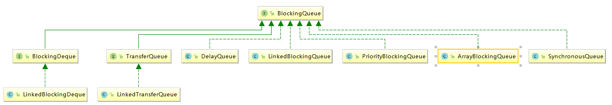
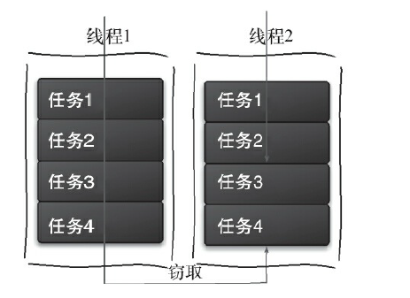

[TOC]

# 一、Java中的阻塞队列

## 1、什么是阻塞队列？

阻塞队列（BlockingQueue）是指一个支持2个附加操作的队列：**支持阻塞的插入 和 支持阻塞的移除** 方法，

1. **支持阻塞的插入**：当队列满时，队列会阻塞插入元素的线程，直到队列出现“空位”。
2. **支持阻塞的移除**：当队列为空时，获取元素的线程会被阻塞，直到队列出现新增元素。

**阻塞队列常用于 生产者/消费者 模型**，这个队列就是 生产者生产元素、消费者消费元素 的容器，在线程池的实现里面常用。

**当阻塞队列不可用时，插入 和 删除 提供了4种处理方式**：

| 方法/处理方式 |  抛出异常   | 返回特殊值 | 一直阻塞 |       超时退出       |
| :-----------: | :---------: | :--------: | :------: | :------------------: |
|   插入方法    |  *add(e)*   | *offer(e)* | *put(e)* | *offer(e,time,unit)* |
|   移除方法    | *remove()*  | *poll()* | *take()* | *poll(time,unit)*   |
|   检查方法    | *element()* |  *peek()*  |    无    |          无          |

**4种处理方式的区别**：

* **抛出异常**：当队列满时，如果插入元素，会抛出IllegalStateException("Queue Full")异常；当队列空时，获取元素会抛出NoSuchElementException异常。
* **返回特殊值**：插入方法，插入成功返回true，否则返回false；移除方法，同理。
* **一直阻塞**：当阻塞队列满时，往队列里put元素，队列会阻塞该线程，直到 **队列可用** 或者 **线程响应中断**退出；当队列空时，从队列里take元素，该线程会被阻塞，直到 队列不为空。使用了Condition对象实现。
* **超时退出**：队列满时，若插入元素，会阻塞该线程一段时间，达到一定时间后，线程就会从该方法返回。

**注意**：前2种处理方式不会阻塞线程，后2种方式会阻塞线程！

## 2、Java提供的阻塞队列

JDK 1.8 一共提供了**7个阻塞队列**，如下所示：



* **ArrayBlockingQueue**: 数组结构 实现的 有界阻塞队列。
* **LinkedBlockingQueue**: 链表结构 实现的 有界阻塞队列。
* **PriorityBlockingQueue**: 支持优先级排序 的 无界阻塞队列。
* **DelayQueue**: 使用 优先级队列 实现的 无界阻塞队列。
* **SynchronousQueue**: 不存储元素 的阻塞队列。
* **LinkedTransferQueue**: 链表结构 实现的 无界阻塞队列。
* **LinkedBlockingDeque**: 链表结构 实现的 双向阻塞队列。

下面做一个大致介绍：

### 2.1 ArrayBlockingQueue

这是一个由 数组结构 实现的有界阻塞队列，按照**FIFO**对元素进行排序。当队列可用时，所有阻塞线程都会被通知，ArrayBlockingQueue支持2种队列访问模式：

1. **线程不公平的访问队列（默认）**：当队列可用时，所有阻塞线程（都被唤醒）都可以争夺访问队列的资格，可能先阻塞的线程最后才访问队列，造成了不公平。
2. **线程公平的访问队列**：线程按照阻塞的顺序 依次访问 队列，**避免“饥饿现象”，保证了公平性，但通常会降低吞吐量**。

ArrayBlockingQueue使用可重入锁实现的，其构造方法如下：

```java
public ArrayBlockingQueue(int capacity, boolean fair) {
    if (capacity <= 0)
        throw new IllegalArgumentException();
    this.items = new Object[capacity];
    lock = new ReentrantLock(fair);//fair = true，表示使用的是公平锁；反之是非公平锁（默认）
    notEmpty = lock.newCondition();
    notFull =  lock.newCondition();
}
```

### 2.2 LinkedBlockingQueue 

是一个由 链表结构 实现的有界阻塞队列，此队列默认和最大长度为Integer.MAX_VALUE，按照FIFO对元素进行排序。只支持 线程不公平的访问队列。

### 2.3 PriorityBlockingQueue

支持优先级的无界阻塞队列，默认采取自然顺序升序排列。（也可以自定义类实现`compareTo()`方法），但是不能保证同优先级元素的顺序。

### 2.4 DelayQueue

支持 **延时获取元素的无界阻塞队列**，队列使用的是 PriorityQueue实现的，队中的元素必须实现Delay接口，元素创建时可以指定多久才能从队列中获取当前元素。

适合于以下场景：

1. **缓存系统的设计**：用DelayQueue保存缓存元素的有效期，使用一个线程循环查询DelayQueue，一旦能从其中获取某元素，说明该元素缓存已经到期。
2. **定时任务调度**：使用DelayQueue保存当天执行的任务 和 执行时间，一旦能从DelayQueue提取到某任务时，就开始执行该任务。

### 2.5 SynchronousQueue

是一个不存储元素的阻塞队列，每一个put操作必须等待一个take操作，否则不能添加元素（只保存了一个元素）。

队列本身不存储任何元素，**非常适合传递性场景**，其吞吐量 > LinkedBlockingQueue 和 ArrayBlockingQueue。

它支持 **公平访问队列** 和 **非公平访问队列（默认）**。

### 2.6 LinkedTransferQueue

由 链表结构 组成的无界阻塞TransferQueue队列，相对于其他，多了 `tryTransfer` 和 `transfer` 方法。

### 2.7 LinkedBlockingDeque

由 链表组成 的 **双向阻塞队列**，双向队列指的是：可以从队列的两端插入和移除元素。相对于其他阻塞队列，多了`addFirst()`、`offerList()`、`offerLast()`、`peekFirst()`和`peekLast()`等方法。

因为多了一个操作队列的入口（双向），因此**多线程同时入队时，可以减少一半的竞争**，**也可以运用在“工作窃取”模式中**。

## 3、阻塞队列的实现原理

**使用等待/通知模式实现**：JDK1.8 的 ArrayBlockingQueue使用了Condition来实现，源码如下：

```java
final ReentrantLock lock;
private final Condition notEmpty;
private final Condition notFull;

public ArrayBlockingQueue(int capacity, boolean fair) {
    //省略一些代码
    lock = new ReentrantLock(fair);
    notEmpty = lock.newCondition();//表示 等待队列有新增元素 的状态
    notFull =  lock.newCondition();//表示 等待队列有”空位“ 的状态
}
//"一直阻塞"的插入操作
public void put(E e) throws InterruptedException {
    checkNotNull(e);
    final ReentrantLock lock = this.lock;
    lock.lockInterruptibly();
    try {
        while (count == items.length)
            notFull.await();//队列满了，阻塞当前线程
        //有空位的情况下，调用enqueue(e)，该方法会通知所有被notEmpty阻塞的线程，通知线程此时队列为notEmpty
        enqueue(e);
    } finally {
        lock.unlock();
    }
}
//"一直阻塞"的释放操作
public E take() throws InterruptedException {
    final ReentrantLock lock = this.lock;
    lock.lockInterruptibly();
    try {
        while (count == 0)
            notEmpty.await();//队列为空，阻塞当前线程
        //队列不为空的情况下，调用dequeue()，该方法会通知所有被notFull阻塞的线程，通知线程此时队列为notFull
        return dequeue();
    } finally {
        lock.unlock();
    }
}

private void enqueue(E x) {
    final Object[] items = this.items;
    items[putIndex] = x;
    if (++putIndex == items.length)
        putIndex = 0;
    count++;
    notEmpty.signal();
}

private E dequeue() {
    final Object[] items = this.items;
    @SuppressWarnings("unchecked")
    E x = (E) items[takeIndex];
    items[takeIndex] = null;
    if (++takeIndex == items.length)
        takeIndex = 0;
    count--;
    if (itrs != null)
        itrs.elementDequeued();
    notFull.signal();
    return x;
}
```


# 二、Fork/Join框架

## 1、什么是Fork/Join框架？

Fork/Join 框架是 JDK1.7 提供的用于 **并行执行任务的框架**，主要有2个步骤：

1. **Fork**：把一个大任务 **切分**为 若干子任务并行的执行。
2. **Join**：**合并** 这些子任务 的结果。

为了减少竞争，会把子任务放在不同的队列里。

**工作窃取算法**：是指某个线程从其他任务队列中窃取任务来执行。如下图是工作窃取运行流程图：



线程1执行完4个任务，此时线程2正准备执行任务3，此时线程1从线程2的任务队列中窃取任务4来执行。

由于存在多个线程访问一个队列，因此**队列一般使用双端队列，来减少竞争**。

**优点**：**重复利用线程进行并行计算**，而且使用了双端队列，**减少了竞争**。

**缺点**：**消耗了更多的系统资源**，如创建多个线程 和 多个双端队列；某些情况下（如双端队列中只有一个线程），还是会存在竞争。

## 2、Java的Fork/Join框架的设计

 **如果自己设计一个Fork/Join框架，应该如何设计？**

* **步骤1：分割任务**。设计一个Fork类把大任务分割成子任务，有可能子任务还是很大，还需要继续分割直到足够小（也就是需要一个阈值判断）。
* **步骤2：执行任务 并 合并结果**。分割的子任务 分别放在 双端队列里，然后几个线程分别从队列获取任务执行。子任务执行完毕之后的结果，全部放在一个队列里，启动一个线程从队列里拿数据，然后合并这些数据。

**Java中主要用了2个类来完成上述2个步骤**：

* **ForkJoinTask**：这是一个抽象类，提供在任务中执行`fork()` 和 `join()`操作的机制。通常，我们只需继承它的2个抽象子类来使用即可：
  * **RecursiveAction**：用于 **没有返回结果** 的任务。
  * **RecursiveTask**：用于 **有返回结果** 的任务。
* **ForkJoinPool**：ForkJoinTask 需要通过 ForkJoinPool 来执行。

**注意**：

1. 子任务会被添加到当前工作线程所维护的双端队列的**头部**。
2. 当一个工作线程的队列里没有任务时，会随机从其他工作线程队列的**尾部**获取一个任务（工作窃取）。

## 3、如何使用Fork/Join框架？

简单实现一个需求：计算1 + 2 + 3 + 4 的结果。假设要求fork成2个子任务，分别计算1+2 和 3+4。代码如下：

```java
public class CountTask extends RecursiveTask<Integer> {

    private static final int THRESHOLD = 2; // 阈值
    private int              start;
    private int              end;

    public CountTask(int start, int end) {
        this.start = start;
        this.end = end;
    }

    @Override
    protected Integer compute() {
        int sum = 0;

        // 如果任务足够小就计算任务
        boolean canCompute = (end - start) <= THRESHOLD;
        if (canCompute) {
            //假设一个能运行的最小任务要运行5s
            try {
                TimeUnit.SECONDS.sleep(5);
            } catch (InterruptedException e) {
                e.printStackTrace();
            }
            for (int i = start; i <= end; i++) {
                sum += i;
            }
        } else {
            // 如果任务大于阈值，就分裂成两个子任务计算
            int middle = (start + end) / 2;
            CountTask leftTask = new CountTask(start, middle);
            CountTask rightTask = new CountTask(middle + 1, end);
            //执行子任务
            leftTask.fork();
            rightTask.fork();
            //等待子任务执行完，并得到其结果
            int leftResult = leftTask.join();
            int rightResult = rightTask.join();
            //合并子任务
            sum = leftResult + rightResult;
        }
        return sum;
    }

    public static void main(String[] args) {
        //也可以指定线程池的线程数量，这里未指定，默认一个子任务一个线程
        ForkJoinPool forkJoinPool = new ForkJoinPool();
        long start = System.currentTimeMillis();
        // 生成一个计算任务，负责计算1+2+3+4
        CountTask task = new CountTask(1, 4);
        // 执行一个任务
        Future<Integer> result = forkJoinPool.submit(task);
        try {
            System.out.println("子任务合并的结果为：" + result.get());
            long end = System.currentTimeMillis();
            System.out.println("程序运行了：" + (end - start) / 1000 + "s");
        } catch (InterruptedException e) {
        } catch (ExecutionException e) {
        }
    }

}
```

运行在4核CPU下，运行时间为 5s，

* 改成CountTask(1, 8)，分割成4个任务，运行时间为5s；
* 改成CountTask(1, 16)，分割成8个任务，运行时间为10s。

