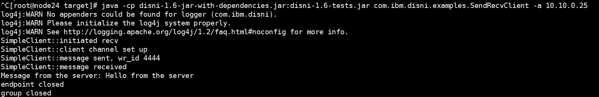
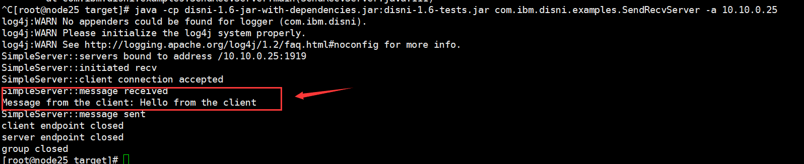

## 1、DISINI安装

1. git clone https://github.com/zrlio/disni

2. cd disni

3. sudo apt install maven

4. mvn -DskipTests install

5. cd libdisni

6. ./autoprepare.sh

7. configure --prefix=/usr/local/lib/libdisni/lib �Cwith-jdk=/opt/java/jdk8(这里是java安装的位置，这里prefix是指定DISNI的安装位置)

8. make install

安装时报了错误，大概就是有个参数找不到，解决方法：

将autoprepare.sh脚本的被提示参数从复数改成单数就好了。

安装完之后可以用`ibv_devinfo`查看信息。

## 2、使用

1、用target文件夹下的来测试disni，执行前需要执行下面这条命令：

***export LD_LIBRARY_PATH=/usr/local/lib/libdisni/lib***

LD_LIBRARY_PATH是Linux环境变量名，主要用于指定查找共享库（动态链接库）时除了默认路径之外的其他路径。（上述操作是一次性的，在/etc/profile末尾添加是永久的）

如果不设置环境变量，那么也可以在运行程序的时候通过指定

***-Djava.library.path=/usr/local/lib/libdisni/lib***


2、在node24、node25安装好RDMA了，（echo $LD_LIBRARY_PATH查看RDMA安装位置）安装路径：/usr/local/lib/libdisni/lib。

在node25运行服务端，ip为10.0.0.25：
***java -cp disni-1.6-jar-with-dependencies.jar:disni-1.6-tests.jar com.ibm.disni.examples.SendRecvServer -a 10.10.0.25***
在node25运行客户端，连接服务器ip：
***java -cp disni-1.6-jar-with-dependencies.jar:disni-1.6-tests.jar com.ibm.disni.examples.SendRecvClient -a 10.10.0.25***

运行结果：





这个程序的功能是client发送消息给server，在server收到消息之后，server发送一条消息给client。从上面的图片我们可以看到运行的过程。

## 3、在IDEA上编写并运行disni程序

### 3.1 DISNI编程模型介绍

DiSNI API 是一种Group/Endpoint 模型，它主要有三个关键的接口：

- DiSNIServerEndpoint: 
  - 表示的是监听的服务器，等待客户端连接
  - 方法bind()用于绑定端口，accept()方法用于监听连接
- DiSNIEndpoint: 
  - 表示的是一个远程（或本地）资源（如RDMA）的连接
  - 提供非阻塞的方法来读取或者写资源，read()、write()
- DiSNIGroup: 
  - client和server endpoint的容器和工厂


### 3.2 IDEA下使用

在IDEA创建MAVEN项目，在pom文件下导入下面代码：

```java
<dependency>
  <groupId>com.ibm.disni</groupId>
  <artifactId>disni</artifactId>
  <version>1.6</version>
</dependency>
```

导入的是依赖的jar包。

