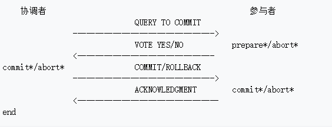
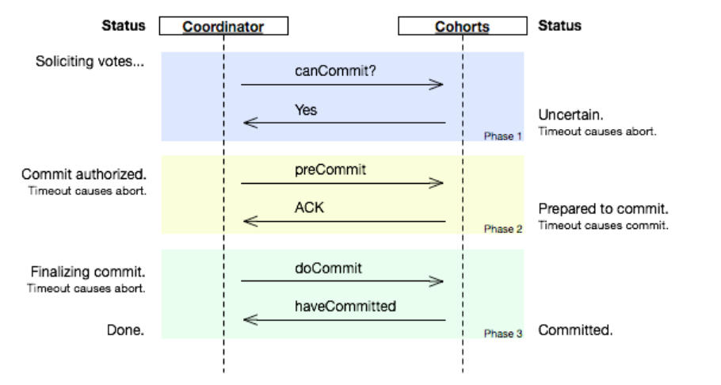

分布式系统网络往往面临着以下问题：

- **消息传递异步无序(asynchronous)**: 现实网络不是一个可靠的信道，存在消息延时、丢失，节点间消息传递做不到同步有序(synchronous)
- **节点宕机(fail-stop)**: 节点持续宕机，不会恢复
- **节点宕机恢复(fail-recover)**: 节点宕机一段时间后恢复，在分布式系统中最常见
- **网络分化(network partition)**: 网络链路出现问题，将N个节点隔离成多个部分
- **拜占庭将军问题(byzantine failure)**:**消息会被篡改** 和 由于硬件或网络造成的**消息不完整**， **即信道不可靠**。**但在设计分布式系统时，往往假设信道是可靠的**。这也能理解，因为分布式系统往往部署在局域网（篡改很罕见），消息不完整可以用校验算法避免。 

一个分布式系统进行架构设计时，往往会在 **可用性** 和 **数据一致性** 之间进行权衡，最著名的一致性协议和算法就是 **二阶段提交协议**、**三阶段提交协议** **和 Paxos算法**。

## 1、2PC 和 3PC

​	在分布式系统中，每个节点都知道自己事务操作结果成功与否，却无法直接获取到其他节点的操作结果。所以，为了保证一个分布式事务的ACID特性，分布式系统往往有两种角色：

1. **协调者(Coordinator)**：统一调度所有分布式节点的执行逻辑，负责调度参与者的行为，并最终决定这些参与者是否将事务真正进行提交。
2. **参与者(Cohorts)：**  被调度的分布式节点。

基于这个思想，衍生出了 **二阶段提交协议** 和 **三阶段提交协议**。

### 1） 2PC协议详解

#### 简介

​	2PC ，Two-Phase Commit，即二阶段提交，为了使所有节点在进行事务处理过程中能够保持 **原子性** 和 **一致性 **而设计的一种算法。通常，2PC协议也被认为是一种一致性协议。

​	目前，**绝大部分的关系型数据库都是采用2PC协议来完成分布式事务处理的**，通过该协议统一决定事务的提交或回滚，从而有效地保证分布式数据一致性。

#### 协议详解

二阶段提交算法的成立**基于以下假设**：

1. 该分布式系统中，存在一个节点作为**协调者**(Coordinator)，其他节点作为**参与者**(Cohorts)。且节点之间可以进行网络通信。
2. 所有节点都采用[预写式日志](https://zh.wikipedia.org/wiki/%E9%A2%84%E5%86%99%E5%BC%8F%E6%97%A5%E5%BF%97)，且日志被写入后即被保持在可靠的存储设备上，即使节点损坏不会导致日志数据的消失。
3. 所有节点不会永久性损坏，即使损坏后仍然可以恢复。

2PC协议主要由两个阶段构成：**提交事务请求**阶段 和 **执行事务提交**阶段。

##### **阶段一：提交事务请求**（投票阶段）

1. 协调者向所有参与者发送事务，询问是否可以执行事务，并等待参与者的响应；
2. 参与者节点执行事务操作，并将Undo和 Redo信息写入日志，如果成功执行反馈给协调者Yes，否则反馈No，会锁定事务资源。

##### **阶段二：提交事务执行**（执行阶段）

在此阶段，协调者根据反馈决定事务是否可以提交（Commit），因此协调者有两种操作：**执行事务提交**、**中断事务**。

**若参与者的反馈都是Yes**，协调者就会执行事务提交，进行如下操作：

1. 协调者向参与者发送Commit请求；
2. 参与者收到请求后，会正式执行事务提交，并在**完成后释放阶段一期间占用的事务资源**；
3. 参与者完成事务提交之后，向协调者发送Ack消息；
4. 协调者收到**所有参与者的Ack消息**后，完成分布式事务。

**若有一个参与者反馈是No**，或者**协调者在等待超时之后仍未收到所有反馈**，那么就会中断事务。

1. 协调者向参与者发送回滚请求（Rollback）；
2. 参与者收到回滚请求之后，利用阶段一记录的Undo进行事务回滚，并释放事务资源；
3. 参与者事务回滚之后，向协调者发送Ack消息；
4. 协调者收到**所有参与者的Ack消息**后，完成分布式事务的中断。

#### 算法示意图

带有"*"的操作是指：此类操作必须记录在稳固存储上。

#### 优缺点

**优点**：原理简单、实现方便。

**缺点**：存在4个问题，同步阻塞、单点问题、脑裂、太过保守。

**同步阻塞**：2PC最大的一个问题就是**它是一个阻塞协议**，如果参与者发送提交请求的反馈，该参与者会被阻塞直到收到COMMIT/ROLLBACK消息，如果此时协调者故障无法发送这些消息，会造成参与者一直在等待（3PC只要进入最后一阶段，要是超时参与者一定会提交事务）；或者在第二阶段所有参与者都已经正式提交事务了，但是由于网络原因，协调者没有收到所有参与者ack，则会一直等待。

**单点问题**：由于协调者占据主导地位，一旦协调者出现问题，会导致事务无法完成。尤其是在阶段二中出现问题（发送Commit前就宕机了），该分布式事务就无法执行了，除非协调者恢复过来。

**数据不一致**：如果分布式节点出现网络分区，或者在未完全发送完Commit请求之前协调者宕机了，导致部分参与者完成事务提交，其他未收到Commit的节点无法进行事务提交，导致数据不一致。

**太过保守**：在阶段一中，任何一个节点反馈No都会导致整个分布式事务的失败，这是一个较为完善的容错机制，但太过保守，影响性能。

2PC的处理分布式事务的时延是2个RTT（propose+commit），时延还是较少的。

### 2） 3PC协议详解

//需要重写，书上的理解是错的

[三阶段协议](https://en.wikipedia.org/wiki/Three-phase_commit_protocol)

[二阶段协议英文](https://en.wikipedia.org/wiki/Two-phase_commit_protocol)

[二阶段协议中文](https://zh.wikipedia.org/wiki/%E4%BA%8C%E9%98%B6%E6%AE%B5%E6%8F%90%E4%BA%A4)

#### 简介

**3PC是一个非阻塞的协议**，因为其每个阶段每个角色都有超时机制判断是否做状态转换。

**考虑2PC的2个问题**：

- **问题一：**如果在阶段一协调者发送完事务之后就宕机了，假设在协调者恢复之前，有一个参与者宕机了，那么在协调者恢复之后，其他参与者即不能Commit事务（协调者有一个参与者的Commit反馈收不到），也不能Rollback事务（因为协调者收不到所有参与者的Rollback的反馈信息），造成了阻塞，直到那个参与者从宕机中恢复.。这**限制了分布式系统的性能**。
- **问题二：**分布式节点出现网络分区，或者在未完全发送完Commit请求之前协调者宕机了，导致部分参与者完成事务提交，其他未收到Commit的节点无法进行事务提交，导致数据不一致。

3PC是在2PC协议基础上进行改进而提出的，主要解决了上述两个问题，**将2PC的阶段一过程一分为二**，形成了**CanCommit**、**PreCommit**和**doCommit**三个阶段，在阶段三中增加了等待超时后参与者仍然提交事务的机制，保证了事务在问题二的情况下一定能被提交，但也带来了新的数据一致性问题（之后会介绍）。

#### 协议详解

- **阶段一**：**CanCommit（能否提交）**

  1. 协调者收到一个事务请求，如果此时发生错误，协调者将会中止事务（协调者恢复过来后会考虑被中止的事务）。否则，协调者向参与者发送一个CanCommit请求（包含事务内容），询问是否可以执行事务提交操作，并等待反馈，并进入等待态（waiting state）。
  2. 参与者收到CanCommit请求后，如果认为可以顺利执行事务，反馈Yes（随后进入Prepare状态），否则反馈No，并中止事务。如果发生故障，它将进入中止状态（abort state）。

- **阶段二**：**PreCommit（预提交）**

  阶段二中，协调者根据阶段一的反馈来决定是否进行事务的PreCommit操作，有两种可能：

  **情况一：『执行事务』**

  **若协调者收到的反馈都是Yes**，那么进行以下步骤：

  1. 协调者向参与者发送PreCommit请求，并进入Prepare阶段；
  2. 参与者收到PreCommit请求后，执行事务操作，**会锁定事务资源**，并记录Undo和Redo信息；
  3. 参与者成功执行事务操作之后，会反馈一个Ack响应，否则反馈No响应，并等待最终指令：提交（commit）或中止（abort）。

  **情况二：『中断事务』**

  **若有参与者反馈No 或者 等待超时之后协调者未收到响应**，协调者就会中断事务：

  1. 协调者向参与者发送中止（abort）请求；
  2. **参与者收到中止请求** 或者 **在等待协调者发送请求过程中出现超时（相对于2PC的改进）**，都会中断事务。

- **阶段三**：**doCommit（真正提交）**，这部分书上是错的

  该阶段真正进行事务提交，会有两种情况：

  **情况一：『真正提交事务』**

  **若协调者处于正常工作状态，且收到所有的Ack响应，会从Prepare状态转变成Commit状态**：

  1. 协调者向参与者发送doCommit请求；
  2. 参与者收到doCommit请求后，会正式进行事务提交，并释放事务资源；
  3. 参与者完成事务提交后，反馈协调者Ack响应；
  4. 协调者**收到所有的参与者的Ack后**，完成分布式事务。

  **情况二：『中断事务』**

  **若协调者处于正常工作状态，但有参与者反馈No响应**，或者**等待超时后，协调者没有收到所有参与者的响应**，进行如下操作：

  1. 协调者向所有参与者发送中止请求；
  2. 参与者收到中止请求后，利用阶段二记录的Undo信息进行事务回滚，并释放资源；
  3. 参与者进行事务回滚之后，反馈Ack；
  4. 协调者**收到所有参与者的Ack**后，中断事务。

  **注意**：此阶段还增加了一种机制（**相对于2PC的改进**），若 **协调者宕机** 或者 **协调者与参与者出现网络故障**，都会导致参与者无法及时收到doCommit请求 或者 abort请求，**在这种异常下，参与者会在等待超时后，继续进行事务提交**。

#### 算法示意图

从上图可以看出，3PC在每个阶段每个角色都有超时机制判断是否做状态转换（主要是在Phase3最后一阶段参与者在超时时间内未收到doCommit），这保证了这是一个非阻塞的协议。

#### 优缺点

**优点**：解决了2PC中的阻塞问题  和 保证参与者在等待超时后一定能进行事务提交。

**缺点**：如果在阶段二中参与者收到preCommit消息，执行事务之后，发生了网络分区，此时假设阶段三中协调者本身是要中止这个事务的，而一些参与者由于无法与协调者联系上，等待超时后进行了事务提交，而其他参与者（能正常联系上协调者的）收到abort请求后中止事务，这就造成了分布式节点的数据不一致的问题。

## 2、Paxos算法详解

​	我们已经了解到2PC和3PC的特点和解决的一些问题，但它们都会有一个问题，那就是无法保证分布式系统中的数据一致性。

​	拜占庭将军问题的结论： **试图在分布式系统和不可靠信道上来达到一致性状态是不可能的**。不可靠信道指的是消息可能被篡改 或者 由于硬件或者网络造成的消息不完整。**因此，在设计分布式系统时，往往假设信道是可靠的**。

​	Paxos算法是 **基于消息传递** 且 **具有高度容错性**的一致性算法，它要解决的问题就是：快速且正确地在集群内部对某个数据的值达成一致，并保证不管是发生机器宕机还是网络异常，都不会破坏分布式系统的一致性。**Paxos算法是假设不存在拜占庭问题的情况下保证一致性问题的，即假设所有消息都是完整的，没有被篡改的**。

### 1）问题和假设

​	分布式系统中的节点通信存在两种模型：共享内存（Shared memory）和消息传递（Messages passing）。基于消息传递通信模型的分布式系统，**不可避免的会发生以下错误：进程可能会慢、被杀死或者重启，消息可能会延迟、丢失、重复**，在基础 Paxos 场景中，先不考虑可能出现消息篡改即[拜占庭错误](https://zh.wikipedia.org/wiki/%E6%8B%9C%E5%8D%A0%E5%BA%AD%E5%B0%86%E5%86%9B%E9%97%AE%E9%A2%98)的情况。Paxos 算法解决的问题是在一个可能发生上述异常的分布式系统中如何就某个值达成一致，保证不论发生以上任何异常，都不会破坏决议的一致性。

​	一个典型的场景是，在一个分布式数据库系统中，如果各节点的初始状态一致，每个节点都执行相同的操作序列，那么他们最后能得到一个一致的状态。为保证每个节点执行相同的命令序列，需要在每一条指令上执行一个“一致性算法”以保证每个节点看到的指令一致。一个通用的一致性算法可以应用在许多场景中，是分布式计算中的重要问题。 [摘自维基百科](https://zh.wikipedia.org/zh-cn/Paxos%E7%AE%97%E6%B3%95#Progress%E7%9A%84%E4%BF%9D%E8%AF%81)

### 2）Paxos算法

#### 2.1）算法提出的场景和问题定义

**场景：**

​	为描述 Paxos 算法，Lamport 虚拟了一个叫做 Paxos 的希腊城邦，这个岛按照议会民主制的政治模式制订法律，但是没有人愿意将自己的全部时间和精力放在这种事情上。所以无论是议员，议长或者传递纸条的服务员都不能承诺别人需要时一定会出现，也无法承诺批准决议或者传递消息的时间。但是这里假设没有拜占庭将军问题Byzantine failure，即虽然有可能一个消息被传递了两次，但是绝对不会出现错误的消息）；**只要等待足够的时间，消息就会被传到**。另外，Paxos 岛上的议员是不会反对其他议员提出的决议的。 

​	对于一个分布式系统，议员对应着各个节点，制定的法律对应系统的状态，各个节点需要进入一个一致的状态。一致性要求对应于法律条文只能有一个版本。议员和服务员的不确定性对应于节点和消息传递通道的不可靠性。 

**问题定义**：

​	首先将议员的角色分为 proposers，acceptors，和 learners（允许身兼数职） 。三个角色的职责如下：

- **proposers**：提出提案，提案 = 提案编号 + 提案的内容value。
- **acceptors**：acceptor收到提案后可以**接受（accept）**提案，若提案获得多数acceptors的接受，则称提案获得了多数acceptors的支持，允许该提案被**批准（chosen）**。
- **learners**：learner只能够“学习”被**批准**的提案。

划分角色后，我们将上述场景的问题进行如下**精确定义**：

- **约束1**：决议（value，**注意不是提案**，只需要保证决议的数据一致性即可）只有在被 proposers 提出后才能被批准（未经批准的决议称为“提案（proposal）”）；

- **约束2**：在一次 Paxos 算法的执行实例中，只批准（chosen）一个 value；

- **约束3**：learners 只能获得被批准（chosen）的 value。

那么如何实现一个算法保证上述三个约束，就是Paxos算法解决的问题。

#### 2.2）算法的推导过程

原文链接：[Paxos Made Simple](http://research.microsoft.com/users/lamport/pubs/paxos-simple.pdf) 

如果只有一个acceptor，那么约束2很容易实现，但是一旦这个acceptor出现问题，整个系统就无法工作了。所以我们考虑的应该是多个acceptor存在的情况。

批准value的过程，首先 proposers 将 value 发送给 acceptors，之后 acceptors 对 value 进行接受（accept），那么为了保证只有一个value被批准的约束，则要求经**多数派（majority）**接受的value成为正式的决议（称为“批准”协议）。

**为什么是多数派？**，假设一个value被chosen了，则有一个多数派是全部接收该value的，任意两个多数派的交集肯定有该value，那么learners 就可以从一个多数派中进行学习。

如果只有一个value被提出（不考虑消息丢失和节点失败的情况下），为了保证该value被批准，需要产生一个新约束P1，此时的提案指的只有value，即提案=value：

> P1：一个 acceptor 必须接受（accept）第一次收到的提案。

但是，仅仅只有P1还是不能保证一个value能被批准。比如**情况一**：Acceptor1-2接受了V1，而Acceptor3-5接受了V2，本来正常情况下acceptors是能够知道V2被批准的，但是此时Acceptor5宕机了，则导致存活的acceptors都无法确定是哪个提案被批准了。 因此，**P1是不完备的**。那么如何保证在Acceptor出现问题时，如何保证一个value被批准？我们可以使『**提案 = 提案编号+提案内容**』，此时允许多个提案被批准，那么就可以使存活的acceptors继续接收提案，来保证一定有value被批准，如Acceptor1-4此时又接受了一个内容为V3的提案，那么接受V3的acceptors构成多数派，该V3的提案被批准。

我们允许多个提案被批准（chosen），为了保证所有被批准的提案拥有相同的value，于是可以产生约束P2：

> P2：一旦一个具有 value v 的提案被批准（chosen），那么之后批准（chosen）的提案必须具有 value v。

**注意**：通过某种方法可以为每个提案分配一个编号，在提案之间建立一个全序关系，所谓“之后”都是指所有编号更大的提案。 

因为提案编号是全序的，所以P2约束保证了只有一个value被批准。

一个提案被批准，就意味着多个 acceptor 接受（accept）了该 value。 因此，可以用P2a来满足约束P2：

> P2a：一旦一个具有 value v 的提案被批准（chosen），那么之后任何 acceptor 再次接受（accept）的提案必须具有 value v。

但是P2a与P1是会发生冲突的：如果一个 value 被批准后，一个 proposer 和一个 acceptor 从休眠中苏醒，前者提出一个具有新的 value 的提案。根据 P1，后者应当接受，根据 P2a，则不应当接受，这中场景下 P2a 和 P1 有矛盾。 

P2a虽然能使P2满足，但与P1可能发生冲突，因此我们可以转换思路，不对acceptor 做限制，转而对proposer 进行约束，于是产生约束P2b：

> P2b：一旦一个具有 value v 的提案被批准（chosen），那么以后任何 proposer 提出的提案必须具有 value v。

由于 acceptor 能接受的提案都必须由 proposer 提出，所以 P2b 蕴涵了 P2a，且不会与P1冲突，是一个更强的约束。 

由于P2b难以提出实现手段，所以进一步加强P2b，产生约束P2c：

> P2c：如果一个编号为 n 的提案具有 value v，那么一定存在一个多数派，a) 要么他们中所有人都没有接受（accept）编号小于 n 的任何提案；b) 要么他们已经接受（accept）的所有编号小于 n 的提案中编号最大的那个提案具有 value v。

P2c 蕴涵了 P2b，需要在P2c的条件下，P2b一定成立（证明略）。

​	要满足P2c的约束，proposer提出一个提案前，首先要和足以形成多数派的acceptors进行通信，获得他们进行的最近一次接受（accept）的提案（prepare过程），之后根据回收的信息决定这次提案的value，形成提案开始投票。当获得多数acceptors接受（accept）后，提案获得批准（chosen），由proposer将这个消息告知learner。这个简略的过程经过进一步细化后就形成了Paxos算法。 

​	如果一个没有chosen过任何proposer提案的acceptor在prepare过程中回答了一个proposer针对提案n的问题，但是在开始对n进行投票前，又接受（accept）了编号小于n的另一个提案（例如n-1），如果n-1和n具有不同的value，这个投票就会违背P2c。因此在prepare过程中，acceptor进行的回答同时也应包含承诺：不会再接受（accept）编号小于n的提案。这是对P1的加强： 

> P1a：当且仅当acceptor没有回应过编号大于n的prepare请求时，acceptor接受（accept）编号为n的提案。

约束P1a 和 P2c保证了一致性。

#### 2.3）算法的内容

通过一个决议分为两个阶段： 

1. prepare阶段： 
   1. proposer选择一个提案编号n并将prepare请求发送给acceptors中的一个多数派；
   2. acceptor收到prepare消息后，如果提案的编号大于它已经回复的所有prepare消息(回复消息表示接受（accept）)，则acceptor将自己上次接受的提案回复给proposer，并承诺不再回复小于n的提案；
2. 批准阶段： 
   1. 当一个proposer收到了多数acceptors对prepare的回复后，就进入批准阶段。它要向回复prepare请求的acceptors发送accept请求，包括编号n和根据P2c决定的value（如果根据P2c没有已经接受的value，那么它可以自由决定value）。
   2. 在不违背自己向其他proposer的承诺的前提下，acceptor收到accept请求后即批准这个请求。

这个过程在任何时候中断都可以保证正确性。例如如果一个proposer发现已经有其他proposers提出了编号更高的提案，则有必要中断这个过程。因此为了优化，在上述prepare过程中，如果一个acceptor发现存在一个更高编号的提案，则需要通知proposer，提醒其中断这次提案。 

## 3、小结

二阶段提交协议：主要解决了分布式事务的原子性问题，但存在同步阻塞、无限期等待（协调者单点问题造成分布式事务无限等待）和“脑裂”的问题。

三阶段提交协议：基于2PC的改进，引入了一个PreCommit阶段，并引入了“超时机制“，解决了无限期等待的问题，但无法解决”脑裂“的问题（从而造成数据不一致）。

Paxos：是目前最优秀的分布式一致性协议之一，解决了无限期等待和脑裂问题。