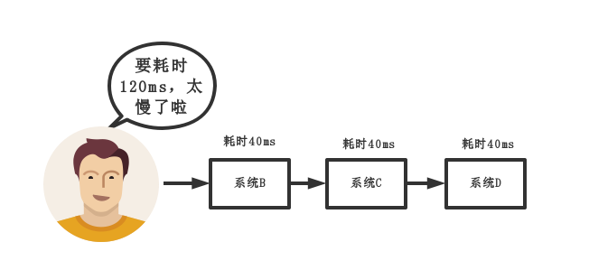
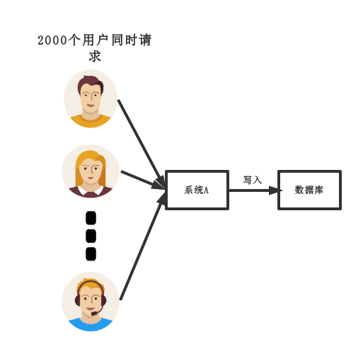
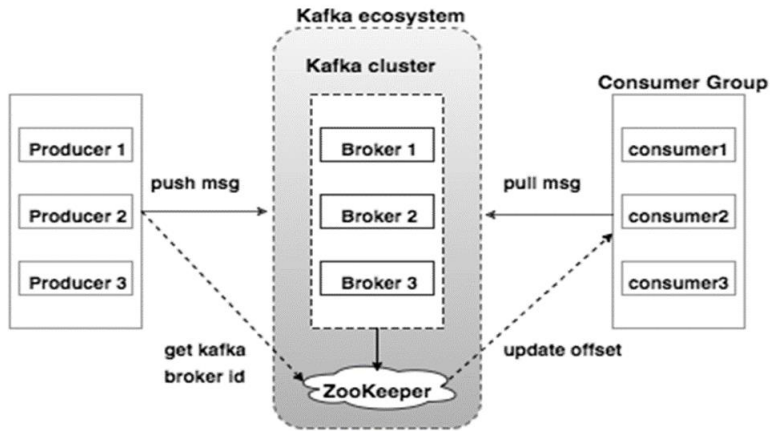

# 复习要点

本文大概围绕如下几点进行阐述:

1. 为什么使用消息队列？
2. 使用消息队列有什么缺点?
3. 消息队列如何选型?
4. 如何保证消息队列是高可用的？
5. 如何保证消息不被重复消费?
6. 如何保证消费的可靠性传输?
7. 如何保证消息的顺序性？

注意：本文只是提供一个分布式消息队列的复习思路，主要围绕上述七点阐述。

# 1、为什么使用消息队列？

其实这个问题只需要回答三个主要的应用场景，即：**解耦、异步、削峰**。

## （1）解耦

**传统模式:**

**传统模式的缺点**：

- 系统间耦合性太强，如上图所示，系统A在代码中直接调用系统B和系统C的代码，如果将来D系统接入，系统A还需要修改代码，过于麻烦！

**中间件模式:**

中间件模式的的优点：

- 将消息写入消息队列，需要消息的系统自己从消息队列中订阅，从而系统A不需要做任何修改。

## （2）异步

**传统模式:**

系统C和系统D业务逻辑是异步的，但是却以同步的方式运行。

**传统模式的缺点**：

- 一些非必要的业务逻辑以同步的方式运行，太耗费时间。

**中间件模式:**

**中间件模式的的优点：**

- 将消息写入消息队列，非必要的业务逻辑以异步的方式运行，加快响应速度

## （3）削峰

**传统模式**

**传统模式的缺点：**

- 并发量大的时候，所有的请求直接怼到数据库，造成数据库连接异常

**中间件模式:**

**中间件模式的的优点：**

- 系统A慢慢的按照数据库能处理的并发量，从消息队列中慢慢拉取消息。在生产中，这个短暂的高峰期积压是允许的。

# 2、使用消息队列有什么缺点?

主要考虑两个问题：

- **系统可用性降低**:你想啊，本来其他系统只要运行好好的，那你的系统就是正常的。现在你非要加个消息队列进去，那消息队列挂了，你的系统不是呵呵了。因此，系统可用性降低
- **系统复杂性增加**:要多考虑很多方面的问题，比如一致性问题、如何保证消息不被重复消费，如何保证保证消息可靠传输。因此，需要考虑的东西更多，系统复杂性增大。

# 3、消息队列如何选型?

主要以ActiveMQ,RabbitMQ,RocketMQ,Kafka这四种MQ进行回答。

**分析**:既然在项目中用了MQ，肯定事先要对业界流行的MQ进行调研，如果连每种MQ的优缺点都没了解清楚，就拍脑袋依据喜好，用了某种MQ，还是给项目挖坑。

**回答**:首先，咱先上[ActiveMQ的社区](http://activemq.apache.org/)，看看该MQ的更新频率:

> Apache ActiveMQ 5.15.3 Release
> Christopher L. Shannon posted on Feb 12, 2018
> Apache ActiveMQ 5.15.2 Released
> Christopher L. Shannon posted on Oct 23, 2017
> Apache ActiveMQ 5.15.0 Released
> Christopher L. Shannon posted on Jul 06, 2017
> 省略以下记录
> ...

我们可以看出，ActiveMq几个月才发一次版本，据说研究重心在他们的下一代产品Apollo。 接下来，我们再去[RabbitMQ的社区](http://www.rabbitmq.com/)去看一下,RabbitMQ的更新频率：

> RabbitMQ 3.7.3 release  30 January 2018
> RabbitMQ 3.6.15 release  17 January 2018
> RabbitMQ 3.7.2 release23 December 2017
> RabbitMQ 3.7.1 release21 December 2017
> 省略以下记录
> ...

我们可以看出，RabbitMQ版本发布比ActiveMq频繁很多。至于RocketMQ和kafka就不带大家看了，总之也比ActiveMQ活跃的多。详情，可自行查阅。

再来一个**性能对比表**：

| 特性       | ActiveMQ                                                     | RabbitMQ                                                     | RocketMQ                 | kafka                                                        |
| ---------- | ------------------------------------------------------------ | ------------------------------------------------------------ | ------------------------ | ------------------------------------------------------------ |
| 开发语言   | java                                                         | erlang                                                       | java                     | scala                                                        |
| 单机吞吐量 | 万级                                                         | 万级                                                         | 10万级                   | 10万级                                                       |
| 时效性     | ms级                                                         | us级                                                         | ms级                     | ms级以内                                                     |
| 可用性     | 高(主从架构)                                                 | 高(主从架构)                                                 | 非常高(分布式架构)       | 非常高(分布式架构)                                           |
| 功能特性   | 成熟的产品，在很多公司得到应用；有较多的文档；各种协议支持较好 | 基于erlang开发，所以并发能力很强，性能极其好，延时很低;管理界面较丰富 | MQ功能比较完备，扩展性佳 | 只支持主要的MQ功能，像一些消息查询，消息回溯等功能没有提供，毕竟是为大数据准备的，在大数据领域应用广。 |

综合上面的材料得出以下两点:

 (1)中小型软件公司，建议选RabbitMQ.一方面，erlang语言天生具备高并发的特性，而且他的管理界面用起来十分方便。正所谓，成也萧何，败也萧何！他的弊端也在这里，虽然RabbitMQ是开源的，然而国内有几个能定制化开发erlang的程序员呢？所幸，RabbitMQ的社区十分活跃，可以解决开发过程中遇到的bug，这点对于中小型公司来说十分重要。不考虑rocketmq和kafka的原因是，一方面中小型软件公司不如互联网公司，数据量没那么大，选消息中间件，应首选功能比较完备的，所以kafka排除。不考虑rocketmq的原因是，rocketmq是阿里出品，如果阿里放弃维护rocketmq，中小型公司一般抽不出人来进行rocketmq的定制化开发，因此不推荐。

 (2)大型软件公司，根据具体使用在rocketMq和kafka之间二选一。一方面，大型软件公司，具备足够的资金搭建分布式环境，也具备足够大的数据量。针对rocketMQ,大型软件公司也可以抽出人手对rocketMQ进行定制化开发，毕竟国内有能力改JAVA源码的人，还是相当多的。至于kafka，根据业务场景选择，如果有日志采集功能，肯定是首选kafka了。具体该选哪个，看使用场景。

# 4、如何保证消息队列是高可用的？

**分析**: 在第二点说过了，引入消息队列后，系统的可用性下降。**在生产中，没人使用单机模式的消息队列**。因此，作为一个合格的程序员，应该对消息队列的高可用有很深刻的了解。

**回答**: 这问题，其实要对消息队列的集群模式要有深刻了解，才好回答。

下面以rocketM和kafka的集群架构为例。

### 4.1 rocketMQ集群架构

rocketMQ的集群模式有：**多master模式**（一个集群无Slave，全是Master）、**多master多slave异步复制模式**、**多 master多slave同步双写模式**。上图是多master多slave模式的架构图。

**Producer：**Producer 与 NameServer集群中的其中一个节点（随机选择）建立长连接，定期从 NameServer 获取 Topic 路由信息，并向提供 Topic 服务的 Broker Master 建立长连接，且定时向 Broker 发送心跳。Producer 只能将消息发送到 Broker master。

**Consumer：**它同时和提供 Topic 服务的 Master 和 Slave建立长连接，既可以从 Broker Master 订阅消息，也可以从 Broker Slave 订阅消息。

### 4.2 kafka集群架构

- 一个典型的Kafka集群中包含：**若干Producer**（可以是web前端产生的Page View，或者是服务器日志，系统CPU、Memory等），**若干broker**（Kafka支持水平扩展，一般broker数量越多，集群吞吐率越高），**若干Consumer Group**，以及**一个Zookeeper集群**。

- Kafka通过Zookeeper管理集群配置，选举leader，以及在Consumer Group发生变化时进行rebalance。

- Producer使用push模式将消息发布到broker，Consumer使用pull模式从broker订阅并消费消息。

**至于rabbitMQ,也有普通集群和镜像集群模式**。

# 5、如何保证消息不被重复消费?

**分布式系统的幂等性：**指一次和多次请求某一个资源应该具有同样的副作用。

举个最简单的例子，那就是支付，用户购买商品使用支付，支付扣款成功，但是返回结果的时候网络异常，此时钱已经扣了，用户再次点击按钮，此时会进行第二次扣款，返回结果成功，用户查询余额返发现多扣钱了，流水记录也变成了两条，这就**违反了幂等性**。

**分析**:这个问题其实换一种问法就是，如何保证消息队列的幂等性?这个问题可以认为是消息队列领域的基本问题。换句话来说，是在考察你的设计能力，这个问题的回答可以根据具体的业务场景来答，没有固定的答案。

**回答**:**先来说一下为什么会造成重复消费?**其实无论是那种消息队列，造成重复消费原因其实都是类似的。

- **正常情况下**，消费者在消费消息时候，消费完毕后，会发送一个确认信息给消息队列，消息队列就知道该消息被消费了，就会将该消息从消息队列中删除。只是不同的消息队列发送的确认信息形式不同,例如RabbitMQ是发送一个ACK确认消息，RocketMQ是返回一个CONSUME_SUCCESS成功标志，kafka实际上有个offset的概念,就是每一个消息都有一个offset，kafka消费过消息后，需要提交offset，让消息队列知道自己已经消费过了。
- **那造成重复消费的原因?**，就是因为网络传输等等故障，确认信息没有传送到消息队列，导致消息队列不知道自己已经消费过该消息了，再次将该消息分发给其他的消费者。

**如何解决？**

1. 比如，你拿到这个消息做数据库的insert操作。那就容易了，给这个消息做一个唯一主键，那么就算出现重复消费的情况，就会导致主键冲突，避免数据库出现脏数据。
2. 再比如，你拿到这个消息做redis的set的操作，那就容易了，不用解决，因为你无论set几次结果都是一样的，set操作本来就算幂等操作。
3. 如果上面两种情况还不行，上大招。准备一个第三方介质,来做消费记录。以redis为例，给消息分配一个全局id，只要消费过该消息，将<id,message>以K-V形式写入redis。那消费者开始消费前，先去redis中查询有没消费记录即可。

# 6、如何保证消费的可靠性传输?

**分析**:我们在使用消息队列的过程中，应该做到消息不能多消费，也不能少消费。如果无法做到可靠性传输，可能给公司带来千万级别的财产损失。

**回答**:其实这个可靠性传输，每种MQ都要从三个角度来分析:**生产者弄丢数据**、**消息队列弄丢数据**、**消费者弄丢数据**。

## 6.1 kafka的可靠性传输

Producer在发布消息到某个Partition时，先通过ZooKeeper找到该Partition的Leader。无论topic有多少副本(也即该Partition有多少个Replica)，Producer只将该消息发送到该Partition的Leader。Leader会将该消息写入其本地Log。每个Follower都从Leader中pull数据。

针对上述情况，得出如下分析:

### (1)生产者丢数据

在kafka生产中，基本都有一个leader和多个follwer。follwer会去同步leader的信息。因此，为了避免生产者丢数据，做如下两点配置

1. 第一个配置要在producer端设置acks=all。这个配置保证了，follwer同步完成后，才认为消息发送成功。
2. 在producer端设置retries=MAX，一旦写入失败，这无限重试.

### (2)消息队列丢数据

针对消息队列丢数据的情况，无外乎就是，数据还没同步，leader就挂了，这时zookpeer会将其他的follwer切换为leader,那数据就丢失了。针对这种情况，应该做两个配置。

1. replication.factor参数，这个值必须大于1，即要求每个partition必须有至少2个副本
2. min.insync.replicas参数，这个值必须大于1，这个是要求一个leader至少感知到有至少一个follower还跟自己保持联系

这两个配置加上上面生产者的配置联合起来用，基本可确保kafka不丢数据.

### (3)消费者丢数据

这种情况一般是自动提交了offset，然后你处理程序过程中挂了，kafka以为你处理好了。

再强调一次offset是干嘛的 **offset**：指的是kafka的topic中的每个消费组消费的下标。简单的来说就是一条消息对应一个offset下标，每次消费数据的时候如果提交offset，那么下次消费就会从提交的offset加一那里开始消费。 比如一个topic中有100条数据，我消费了50条并且提交了，那么此时的kafka服务端记录提交的offset就是49(offset从0开始)，那么下次消费的时候offset就从50开始消费。 

**解决方案也很简单，改成手动提交offset即可**。

# 7、如何保证消息的顺序性？

**分析**:其实并非所有的公司都有这种业务需求，但是还是对这个问题要有所复习。

 **回答**:针对这个问题，通过某种算法，将需要保持先后顺序的消息放到同一个消息队列中(kafka中就是partition,rabbitMq中就是queue)。然后只用一个消费者去消费该队列。

有的人会问:**那如果为了吞吐量，有多个消费者去消费怎么办？** 

这个问题，没有固定回答的套路。比如我们有一个微博的操作，发微博、写评论、删除微博，这三个异步操作。如果是这样一个业务场景，那只要重试就行。比如你一个消费者先执行了写评论的操作，但是这时候，微博都还没发，写评论一定是失败的，等一段时间。等另一个消费者，先执行写微博的操作后，再执行，就可以成功。

 总之，针对这个问题，我的观点是保证入队有序就行，出队以后的顺序交给消费者自己去保证，没有固定套路。

总结自：https://www.cnblogs.com/rjzheng/p/8994962.html