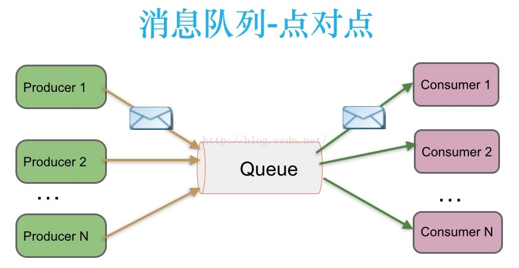
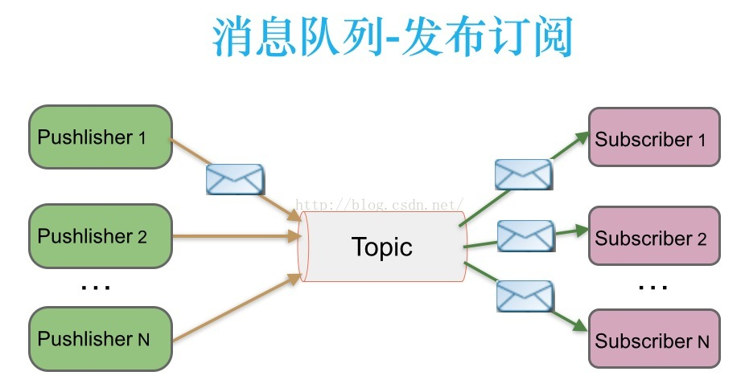
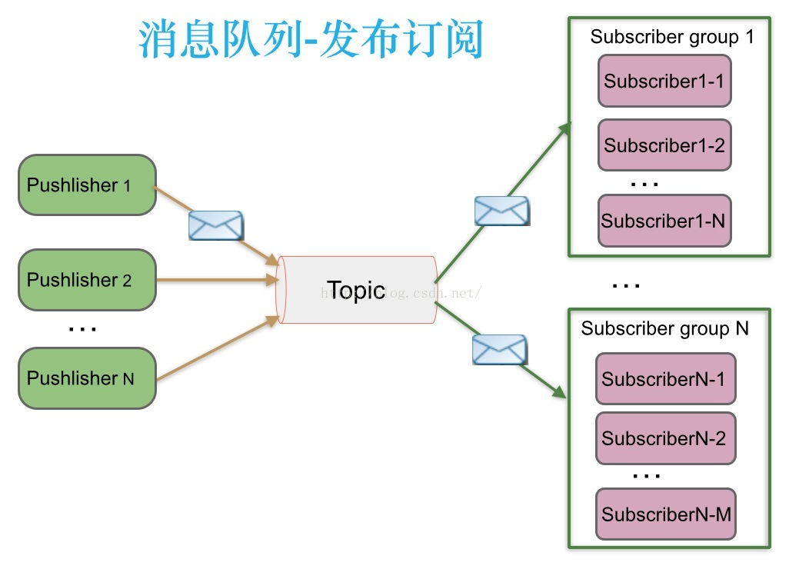

	最基础的分布式队列编程抽象模型是点对点模型，其他抽象构架模型居于改基本模型上各角色的数量和交互变化所导致的不同拓扑图。具体而言，不同数量的发送者、分布式队列以及接收者组合形成了不同的分布式队列编程模型。消息中间件的主要功能是**消息的路由(Routing)和缓存(Buffering)**。

	Java Message Service，**JMS**，指的是面向消息中间件（MOM），用于在两个应用程序之间，或分布式系统中发送消息，进行异步通信。JMS中定义了两种消息模型：**点对点**（point to point， queue）和**发布/订阅**（publish/subscribe，topic），主要区别就是是否能重复消费。

## 1、点对点：Queue，不可重复消费

> 1、消息生产者生产消息发送到queue中，然后消息消费者从queue中取出并且消费消息。
> 2、消息被消费以后，queue中不再有存储，所以消息消费者不可能消费到已经被消费的消息。
> Queue支持存在多个消费者，但是对一个消息而言，只会有一个消费者可以消费。
> 注：Kafka不遵守JMS协议，所以Kafka实际应用中，很可能会需要ack，然后多个消费者能够会同时消费。。需要具体看。

## 2、发布/订阅：Topic，可以重复消费

> 消息生产者（发布）将消息发布到topic中，同时有多个消息消费者（订阅）消费该消息。
>
>  和点对点方式不同，发布到topic的消息会被所有订阅者消费。

**基于订阅组的发布订阅模式**

> 发布订阅模式下，当发布者消息量很大时，显然单个订阅者的处理能力是不足的。 
>
> 实际上现实场景中是多个订阅者节点组成一个订阅组负载均衡消费topic消息即分组订阅，这样订阅者很容易实现消费能力线性扩展。

## 3、推、拉模型

对于消费者而言有两种方式从消息中间件获取消息：

- **Push方式**：由消息中间件主动地将消息推送给消费者；
- **Pull方式：**由消费者主动向消息中间件拉取消息。

**两种方式比较**：

- 采用Push方式，可以尽可能快地将消息发送给消费者，缺点是如果消费者的处理消息的能力很弱(一条消息需要很长的时间处理)，而消息中间件不断地向消费者Push消息，消费者的缓冲区可能会溢出。
- 而采用Pull方式，虽然能解决Push方式的缺点，但会增加消息的延迟，即消息到达消费者的时间有点长。

例如：Kafka的消费端就是采用Pull方式，而RabbitMQ的消费端采用的是Push模式。

参考：https://www.cnblogs.com/charlesblc/p/6045238.html