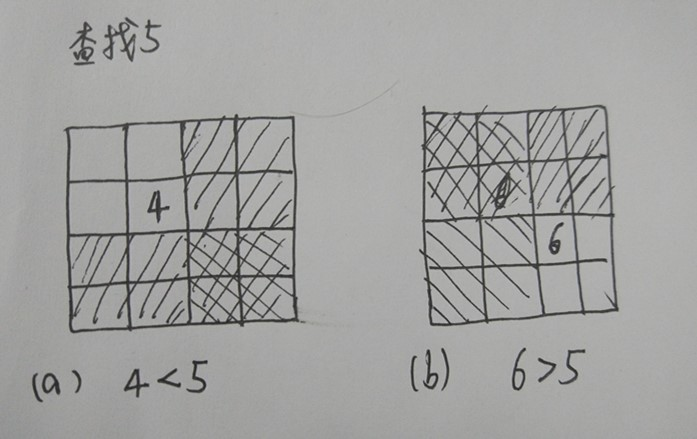

# 3. 数组中重复的数字

[nowcoder](https://www.nowcoder.com/practice/623a5ac0ea5b4e5f95552655361ae0a8?tpId=13&tqId=11203&tPage=1&rp=1&ru=/ta/coding-interviews&qru=/ta/coding-interviews/question-ranking)

## 题目描述

在一个长度为 n 的数组里的所有数字都在 0 到 n-1 的范围内。数组中某些数字是重复的，但不知道有几个数字是重复的，也不知道每个数字重复几次。请找出数组中任意一个重复的数字。

```html
Input:
{2, 3, 1, 0, 2, 5}

Output:
2
```

## 解题思路

**思路一：**

将输入的数组排序，然后从排序的数组中找重复数组，排序时间复杂度为O(nlogn)。

**思路二：**

利用哈希表，用空间换时间。从头到尾扫描数组，每扫描一个数字，用O(1)判断哈希表中是否有该数字，若没有，将这个数字加入哈希表，否则输出这个重复数字。

空间复杂度：O(n)，时间复杂度O(n)。

**思路三**：

从题目中找出特点：数组里的所有数字都在 **0 到 n-1 的范围**内。

- 如果数组没有重复的数字，排序之后数字 i 将出现在下标为 i 的位置；
- 若存在重复数字，排序之后有些下标i就没有数字 i 。我们重排这个数组，从头扫描数组中的每个数字。当扫描到下标为 i 的数字，比较这个数字 m 是否等于 i ，
  - 如果等于，则接着扫描下一个数字；
  - 如果不等于，则拿它与第 m 个数字进行比较，
    - 如果它与第 m 个数字相等，就找到第一个重复的数字了；
    - 如果不相等，将 第 i 个数字 和 第 m 个数字 进行交换。接下来重复第i个数字的比较、交换的过程。

其实，思路很简单，就是一句话，将数字 i 放在下标为 i 的位置，如果发现下标为 i 的位置已经有数字 i 了，就说明有重复数字。 

时间复杂度为 O(N), 空间复杂度为 O(1)

**举例演示算法流程**

如{2,3,1,0,2,5,3}，第一次扫描下标为0的数字，

会经过以下变换：{1,3,2,0,2,5,3} -> {3,1,2,0,2,5,3} -> {0,1,2,3,2,5,3}，此时下标为 0 的数字为 0 ，扫描数组的下一个下标的数字。

```java
    public static boolean duplicate(int numbers[],int length,int [] duplication) {
        if(numbers == null || numbers.length <= 0){
            return false;
        }
        //从头扫描数组中的每个数字
        for(int i = 0; i < length; i++){
            //当扫描到下标为 i 的数字，比较这个数字m是否等于i,如果等于，则接着扫描下一个数字
            while(numbers[i] != i){
                //若不等于，则拿它与第 m 个数字进行比较
                if(numbers[i] == numbers[numbers[i]]){
                    //若相等，说明有重复数字
                    duplication[0] = numbers[i];
                    return true;
                }
                //若不等于，将第i个数字 和 第m个数字 进行交换，重复下标i的比较、交换
                int temp = numbers[i];
                numbers[i] = numbers[temp];
                numbers[temp] = temp;
            }
        }
        //若输入数组没有重复，返回false
        return false;
    }
```

# 4. 二维数组中的查找

[nowcoder](https://www.nowcoder.com/practice/abc3fe2ce8e146608e868a70efebf62e?tpId=13&tqId=11154&tPage=1&rp=1&ru=/ta/coding-interviews&qru=/ta/coding-interviews/question-ranking)

## 题目描述

在一个二维数组中（每个一维数组的长度相同），每一行都按照从左到右递增的顺序排序，每一列都按照从上到下递增的顺序排序。请完成一个函数，输入这样的一个二维数组和一个整数，判断数组中是否含有该整数。 

如：

```html
1 2 8 9
2 4 9 12
4 7 10 13
6 8 11 15
//例如查找数字7，返回true
```

## 解题思路

**思路一**：直接遍历整个数组，不可取，时间复杂度O(m*n)。

**思路二**：一般都会这么想，在数组中选一个数字，分三种情况来分析查找的过程：



基于这种分析，会显得十分复杂，因为选取的位置可能在两个区域出现，而且两个区域还有重叠。

**思路三：**具体问题入手，寻找普遍的规律。

我们首先选取**数组中右上角**的数字，

- 如果该数字 = 要查找的数字，则查找结束；
- 如果该数字 > 要查找的数字，则剔除这个数字所在的列；
- 如果该数字 < 要查找的数字，剔除这个数字所在的行。

复杂度：O(M + N) + O(1)

实例分析，假设查找数字7，过程如下：


```java
    public static boolean Find(int target, int [][] array) {
        if(array == null || array.length <= 0 || array[0].length < 0)
            return false;
        //记录数组的行数和列数
        int rows = array.length;
        int columns = array[0].length;
        //记录数组右上角的数字的下标
        int row = 0;
        int column = columns - 1;
        while(row < rows && column >= 0){
            if(array[row][column] == target){
                return true;
            }else if(array[row][column] > target){
                //如果该数字 > 要查找的数字，则剔除这个数字所在的列
                column--;
            }else {
                //如果该数字 < 要查找的数字，剔除这个数字所在的行
                row++;
            }
        }
        return false;
    }
```

# 5. 替换空格

# 6. 从尾到头打印链表

[nowcoder](https://www.nowcoder.com/practice/d0267f7f55b3412ba93bd35cfa8e8035?tpId=13&tqId=11156&tPage=1&rp=1&ru=%2Fta%2Fcoding-interviews&qru=%2Fta%2Fcoding-interviews%2Fquestion-ranking)

## 题目描述

输入链表的第一个节点，从尾到头反过来打印出每个结点的值。

## 解题思路

**使用栈**

```java
    public static ArrayList<Integer> printListFromTailToHead(ListNode listNode) {
        Deque<ListNode> stack = new ArrayDeque<ListNode>();
        ListNode curNode = listNode;
        while(curNode != null){
            stack.offerFirst(curNode);
            curNode = curNode.next;
        }

        ArrayList<Integer> result = new ArrayList<Integer>();

        while(!stack.isEmpty()){
            curNode = stack.pollFirst();
            result.add(curNode.val);
        }
        return result;
    }
```

**使用递归**

```java
    public static ArrayList<Integer> printListFromTailToHead_Recursively(ListNode listNode){
        //递归出口：listNode为null
        if(listNode != null){
            if(listNode.next != null){
                printListFromTailToHead_Recursively(listNode.next);
            }
            result.add(listNode.val);
        }
        return result;
    }
```

# 7. 重建二叉树

[nowcoder](https://www.nowcoder.com/practice/8a19cbe657394eeaac2f6ea9b0f6fcf6?tpId=13&tqId=11157&tPage=1&rp=1&ru=/ta/coding-interviews&qru=/ta/coding-interviews/question-ranking)

## 题目描述

根据二叉树的前序遍历和中序遍历的结果，重建出该二叉树。假设输入的前序遍历和中序遍历的结果中都不含重复的数字。

## 解题思路

前序遍历的第一个值为根节点的值，使用这个值将中序遍历结果分成两部分，左部分为树的左子树中序遍历结果，右部分为树的右子树中序遍历的结果。

```java
public TreeNode reConstructBinaryTree(int [] pre,int [] in) {
    if(pre == null || in == null || pre.length != in.length) {
        return null;
    }
    return reConstructCore(pre, 0, pre.length - 1, in, 0, in.length - 1);
}
public TreeNode reConstructCore(int[] pre, int preStart, int preEnd, int[] in, 
                                int inStart, int inEnd) {
    if(preStart > preEnd || inStart > inEnd) {
        return null;
    }
    //前序遍历的第一个节点是根节点
    int rootValue = pre[preStart];
    TreeNode root = new TreeNode(rootValue);
    //在数组in遍历，找到与pre的第一个节点相同的数字
    for(int i = inStart; i <=inEnd; i++) {
        if(in[i] == pre[preStart]) {
            //说明in[i]是中序遍历的根节点
            root.left = reConstructCore(pre, preStart + 1, preStart + i - inStart,
                                        in, inStart, i - 1);
            root.right = reConstructCore(pre, preStart + i - inStart + 1, preEnd,
                                         in, i + 1, inEnd);
            break;
        }
    }
    return root;
}
```

# 14. 剪绳子

[leetcode](https://leetcode.com/problems/integer-break/description/)

## 题目描述

将一段绳子剪成多段，使得每段长度的乘积最大，返回这个最大的乘积。至少剪成两段。

```html
Input: 10
Output: 36
Explanation: 10 = 3 + 3 + 4, 3 × 3 × 4 = 36.
```

## 解题思路

**动态规划**

定义 f(n) 为把长度为 n 的绳子剪成若干段乘积最大值，因此剪第一刀有 n-i 种选择。因此 f(n) = max( f(i) * f(n-i))。先初始化 f(n) = n ，即假设允许绳子不切。当 n >= 4 时，肯定选择 切 比 不切 的策略乘积更大，即结果为  f(n)。

复杂度：O(n^2) + O(n)

```java
    public int integerBreak(int n) {
        if(n < 2)  return 0;
        if(n == 2 || n == 3) return n - 1;	//注意 n = 1,2,3 时，不切策略的乘积更大，但是题目要求至少切一刀
        int[] dp = new int[n + 1];
        //假设允许绳子只有一段
        dp[0] = 1;
        for(int i = 1; i <= n; i++){
            dp[i] = i;
            for(int j = 0; j < i; j++){
                dp[i] = Math.max(dp[i], dp[j] * dp[i - j]);
            }
        }
        return dp[n];
    }
```

**贪心算法**

复杂度：O(1) + O(1)

尽可能多剪长度为 3 的绳子，并且不允许有长度为 1 的绳子出现。如果出现了，就从已经切好长度为 3 的绳子中拿出一段与长度为 1 的绳子重新组合，把它们切成两段长度为 2 的绳子。

证明：当 n >= 5 时， 3(n - 3) > n 且 2(n - 2) > n ，但是4(n - 4) 不一定大于n。并且 3(n - 3) - 2(n - 2) = n - 5 >= 0 ，所以在这种情况尽量第一刀切成3.

```java
public int integerBreak(int n) {
    if (n < 2)
        return 0;
    if (n == 2)
        return 1;
    if (n == 3)
        return 2;
    int timesOf3 = n / 3;
    if (n - timesOf3 * 3 == 1)
        timesOf3--;
    int timesOf2 = (n - timesOf3 * 3) / 2;
    return (int) (Math.pow(3, timesOf3)) * (int) (Math.pow(2, timesOf2));
}
```

# 15. 二进制中1的个数

[nowcoder](https://www.nowcoder.com/practice/8ee967e43c2c4ec193b040ea7fbb10b8?tpId=13&tqId=11164&tPage=1&rp=1&ru=/ta/coding-interviews&qru=/ta/coding-interviews/question-ranking)

## 题目描述

输入一个整数，输出该数二进制表示中1的个数。其中负数用补码表示。

## 解题思路

**思路一**：先判断整数（假设是正数）二进制中最右边一位是不是1；然后把输入的整数整体向右移动一位，直到整个整数变成0为止。那么如何判断整数最右边是不是1，只要把整数和1做与操作(&)，看结果是不是0。

```java
public int NumberOf1(int n) {
        //AC不过，因为有死循环
        //未考虑负数的情况，若出现负数，则将会死循环
        int count = 0;
        while(n != 0) {
            if((n & 1) != 0) count++;
            n = n >> 1;
        }
        return count;
}
```

结果：负数将会造成死循环

**思路二**：左移 1 ，而不是移动 数字

```java
public int NumberOf1(int n) {
        //基本思路，既然右移碰见负数会造成死循环，那么想到不右移n，左移1，将1定义成无符号整数，但是java没有无符号整数，怎么办？
        //直接用正数1代替，因为正数的二进制开头一定是0
        int count = 0;
        int flag = 1;
        while(flag != 0) {
            if((n & flag) != 0) count++;
            flag = flag << 1;
        }
        return count;
    }
```

# 21. 调整数组顺序使奇数位于偶数前面

[nowcoder](https://www.nowcoder.com/practice/beb5aa231adc45b2a5dcc5b62c93f593?tpId=13&tqId=11166&tPage=1&rp=1&ru=/ta/coding-interviews&qru=/ta/coding-interviews/question-ranking)

## 题目描述

输入一个整数数组，实现一个函数来调整该数组中数字的顺序，使得所有的奇数位于数组的前半部分，所有的偶数位于数组的后半部分。

## 解题思路

**不保证奇数间、偶数间的相对顺序**

复杂度：O(N) + O(1)

利用两个指针 p1 和 p2 ，分别指向数组的头和尾，若发现 p1 指向的是偶数， p2 指向的是奇数，进行交换。

```java
public void reOrderArray1(int [] array) {
        if(array == null || array.length == 0)  return;
        int p1 = 0, p2 = array.length - 1;
        while(p1 < p2){
            if(array[p1] % 2 == 0){
                if(array[p2] % 2 == 1){	//p1 是偶数，p2 是奇数，交换
                    swap(array, p1, p2);
                }else{					//p1、p2 是偶数
                    p2--;
                }
            }else{
                if(array[p2] % 2 == 0){	//p1 是奇数，p2 是偶数
                    p1++;p2--;
                }else{					//p1 是奇数，p2 是奇数
                    p1++;
                }
            }
        }
    }
    private void swap(int[] arr, int i, int j){
        int temp = arr[i];
        arr[i] = arr[j];
        arr[j] = temp;
    }
```

**保证奇数间、偶数间的相对顺序**

无法保证时间复杂度为O(N)。

基本思路：先找到第一个偶数位置 i ，再从 i 开始找到第一个奇数的位置 j ，将[i ... j-1] 的数字全部后移一位，并将 下标 j 的数字放在下标 i 中，然后将 i++。 循环上述操作，终止条件：从 i 开始中找不到奇数。

```java
    public void reOrderArray(int [] array) {
        if(array == null || array.length == 0)    return;
        int i = 0,j;
        while(true){
            while(i < array.length && isEven(array[i])){    //找到第一个偶数
                i++;
            }
            //从 i 开始找到第一个奇数
            j = i + 1;
            while(j < array.length && !isEven(array[j])){
                j++;
            }
            //找不到奇数，终止循环
            if(j >= array.length)    break;
            else{
                int tmp = array[j];
                for(int k = j; k > i; k--){
                    array[k] = array[k - 1];
                }
                array[i++] = tmp;
            }
        }
    }
    
    private boolean isEven(int num){
        if(num % 2 == 0) return false;
        return true;
    }
```

