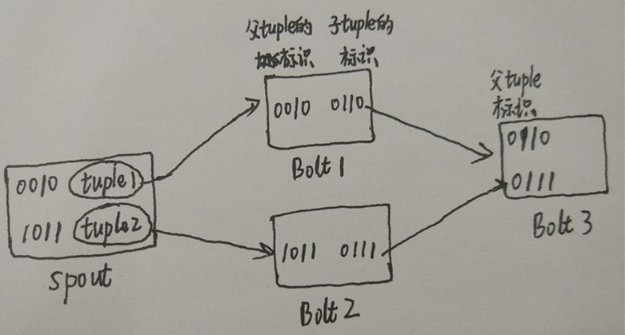

## 1、Storm的ACK机制

​	对于Storm，它提供了一个很重要的特性——可靠性，可以保证一个tuple至少可以被处理一次，要做到这个特性，必须track每个tuple的去向。Storm就是通过**acker机制**来做到这一点的。

​	当一个 tuple 在拓扑中被创建出来的时候， 不管是在 Spout 中还是在 Bolt 中创建的 ， 这个 tuple 都会被配置一个随机的 64 位 id。acker 就是使用这些 id 来跟踪每个 spout tuple 的 tuple DAG（tuple树）。 

在Storm中使用其acker机制的**前提**是，

1. 在spout emit tuple的时候，要指定第3个参数messageid。
2. 在配置中acker数目至少为1（若conf.setNumAckers(0)，Storm会在Spout发射一个Tuple之后马上调用Spout的ack方法 )。
3. 在bolt emit的时候，要加上第二个参数anchor tuple，以保持tracker链路（也可以在Bolt发射这些Tuple的时候不锚定它们，acker就不会跟踪整个tuple树）。

## 2、工作流程

1. 当tuple具有messageid时，spout会把该tuple加到**pending list**里面，并发消息给acker，通知acker开始tracker这条tuple；
2. 然后再后续的bolt的处理逻辑中，你必须显式的ack或fail所有处理的tuple，
   1. 如果这条tuple在整个DAG图上都成功执行了，那么acker会发现该tuple的track异或值为0，于是acker会发ack_message给spout；
   2. 如果在DAG图上任意一个节点bolt上fail，那么acker会认为该tuple fail，于是acker会发fail_message给spout。
3. 当spout收到ack或fail message如何处理？首先是从pending list里面删掉这条tuple，因为无论ack或fail，只要得到结果，这条tuple就没有继续被cache的必要了，然后做的事是调用spout.ack或spout.fail 。
4. 如果一条tuple没有被ack或fail，**最终是会超时的** 。Spout会根据system tick去rotate pending list，对于每个过时的tuple，都调用spout.fail。

**注意**：在Spout中需要在fail函数实现自己的重发逻辑，系统默认是不做任何操作的，包括缓存tuple的队列也要自己定义，

```java
public void fail(Object msgId)//这也就是为什么需要为tuple指定messageid，spout根据这个id进行重发
```

## 3、使用例子

下面用一个例子讲解在Storm中如何使用acker机制，代码如下：

```java
/**
* 发送单词的Spout
*/
public class RandomSentenceSpout extends BaseRichSpout {
    private SpoutOutputCollector _collector;
    private Random _rand;
    private ConcurrentHashMap<UUID, Values> _pending;//自定义缓存用来缓存tuple
 
    public void open(Map map, TopologyContext topologyContext, SpoutOutputCollector spoutOutputCollector) {
        _collector = spoutOutputCollector;
        _rand = new Random();
        _pending = new ConcurrentHashMap<UUID, Values>();
    }
 
    public void nextTuple() {
        Utils.sleep(1000);
        String[] sentences = new String[] {
                "I write php",
                "I learning java",
                "I want to learn swool and tfs"
        };
        String sentence = sentences[_rand.nextInt(sentences.length)];
        Values v = new Values(sentence);
        UUID msgId = UUID.randomUUID();
        this._pending.put(msgId, v);//spout对发射的tuple进行缓存
        _collector.emit(v, msgId);//发射tuple时，添加msgId
 
    }
 
    public void declareOutputFields(OutputFieldsDeclarer outputFieldsDeclarer) {
        outputFieldsDeclarer.declare(new Fields("world"));
    }
 
    public void ack(Object msgId) {
        this._pending.remove(msgId);//对于成功处理的tuple从缓存队列中删除
 
    }
 
    public void fail(Object msgId) {
        this._collector.emit(this._pending.get(msgId), msgId);//当消息处理失败了，重新发射，当然也可以做其他的逻辑处理
    }
}
 
public class SplitSentence extends BaseRichBolt {
    OutputCollector _collector;
 
    public void prepare(Map map, TopologyContext topologyContext, OutputCollector outputCollector) {
        _collector = outputCollector;
    }
 
    public void execute(Tuple tuple) {
        String sentence = tuple.getString(0);
        for (String word : sentence.split(" "))
            _collector.emit(tuple, new Values(word));//发射tuple时进行锚定
 
        _collector.ack(tuple);//对处理完的tuple进行确认
 
    }
 
    public void declareOutputFields(OutputFieldsDeclarer outputFieldsDeclarer) {
        outputFieldsDeclarer.declare(new Fields("word"));
    }
}
```

### 3.1 bolt使用锚定

除了在Spout中指定了msgid，Bolt中也需要对tuple进行**“锚定”**（anchor），如上述代码所示：

```java
for (String word : sentence.split(" "))
    //通过将输入 tuple 指定为 emit 方法的第一个参数，每个单词 tuple 都被“锚定”了
    _collector.emit(tuple, new Values(word));

//对处理完的输入tuple进行确认
_collector.ack(tuple);
```

### 3.2 bolt使用非锚定

Bolt中也可以使用“非锚定”的发送tuple方式，

```java
_collector.emit(new Values(word));
```

在这种情况下，下游的 tuple 处理失败不会触发原始 tuple 的任何处理操作。

### 3.3 bolt使用多锚定

​	一个输出 tuple 可以被锚定到多个输入 tuple 上，这在流式连接或者聚合操作时很有用。显然，一个多锚定的 tuple 失败会导致 Spout 中多个 tuple 的重新处理。多锚定操作是通过指定一个 tuple 列表而不是单一的 tuple 来实现的，如下面的例子所示： 

```java
List<Tuple> anchors = new ArrayList<Tuple>();
anchors.add(tuple1);
anchors.add(tuple2);
//为父tuple和子tuple建立血缘关系
_collector.emit(anchors, new Values(1, 2, 3));
//当execute处理完业务逻辑的时候，需要告诉storm框架当前阶段的处理状态。
_collector.ack(tuple1);
_collector.ack(tuple2);
```

### 3.4 如何关闭acker

1. **第一种方法是将 Config.TOPOLOGY_ACKERS 设置为0**。在这种情况下，Storm 会在 Spout 发送 tuple 之后立即调用 ack 方法，tuple 树叶就不会被跟踪了。
2. **第二种方法是基于消息本身移除可靠性**。你可以通过在 SpoutOutputCollector.emit 方法中省略消息 id 来关闭 spout tuple 的跟踪功能。
3. **最后，如果你不关心拓扑中的下游 tuple 是否会失败，你可以在发送 tuple 的时候选择发送“非锚定”的（unanchored）tuple。**由于这些 tuple 不会被标记到任何一个 spout tuple 中，显然在他们处理失败的时候不会引起任何 spout tuple 的重新处理（注意，在使用这种方法时，**如果上游有 spout 或 bolt 仍然保持可靠性机制，那么需要在 execute 方法上调用OutputCollector.ack 来立即响应上游的消息，否则上游组件会误认为消息没有发送成功导致所有的消息会被反复发送**）。

## 4、Acker机制的原理

​	在工作流程的第二个步骤中，acker是如何判断一个tuple在整个DAG图上都成功执行的？这就是本节所要了解的。

​	Storm使用了一种巧妙的机制来判断一棵tuple树是否处理完毕，那就是通过tuple的id进行异或运算得到。 在这之前，需要一些**异或的常识**：

```
A^0 = A
A^A = 0
A^B^C^...^C^B^A=0  其中每个算子成对存在
```

​	Storm的Acker其实就是一个bolt任务，用作storm的ack-fail，利用了异或操作进行消息处理，**如果最后异或的值为0，那么证明这个消息被处理成功**。**storm针对任意大的tuple消息，仅仅只需要恒定20个字节就能进行跟踪。**

### 4.1 tuple标识及ack确认

1、在Spout中，系统会为用户指定的message id生成一个对应的64位整数，作为一个root id。 **root id会传递给acker及后续的bolt作为该消息单元的唯一标识**。 

2、同时无论是spout还是bolt每次新生成一个tuple的时候，都会赋予该tuple一个64位的整数的id。 

3、Spout发射完某个message id对应的源tuple之后，会告知acker自己发射的root id及生成的那些源tuple的id。 

4、在Bolt中，每次接受到一个输入tuple处理完之后，也会告知acker自己处理的输入tuple的id及新生成的那些tuple的id。 

而acker的职责就是对这些id做一个简单的异或运算，就能判断出该root id对应的消息单元是否处理完成了。 

下面用一个图例进行讲解：



若这个tuple在整个拓扑成功运行，那么acker进行的异或操作就是（假设rootID是0001）：

```java
rootID = 0001
ack-val = (0010 XOR 1011) XOR (0010 XOR 0010) XOR (1011 XOR 0111) XOR (0110 XOR 0111) = 0
```

可以看到，若tuple成功处理，最终的ack-val一定为0，若有其中一个Bolt的tuple处理失败，则不会发送<父tupleID XOR 所有子tupleID>的消息给acker任务。

如：若Bolt处理标识为0010的tuple失败了，那么acker最终得到是：

```java
rootID = 0001
ack-val = (0010 XOR 1011) XOR (1011 XOR 0111) XOR (0111) != 0
```

ack-val不为0表明rootID=0001的tuple处理失败，acker将通知spout执行fail机制。

参考：

1、https://blog.csdn.net/cm_chenmin/article/details/52925225

2、https://www.cnblogs.com/dongxiao-yang/p/6142356.html

3、https://blog.csdn.net/sheen1991/article/details/52788547

4、https://blog.csdn.net/gogo_yao/article/details/73089828