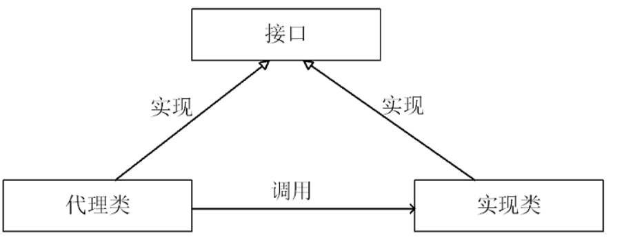
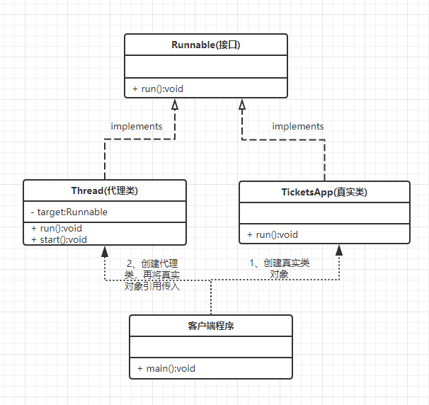

## 1、代理模式

### 1.1 简介

定义：为其他对象提供一种代理以控制这个对象的访问。

**代理模式给某一个对象提供一个代理对象，并由代理对象控制对原对象的引用。**

### 1.2 涉及的3种角色

1. **抽象角色**：声明 真实对象 和 代理对象 的共同接口：**可以是抽象类，也可以是接口**。

2. **代理角色(Proxy)**：代理角色对象 **内部含有真实对象的引用**，从而操控真实对象。同时，代理对象与真实对象有相同的接口，因此**代理对象能代替真实对象**。同时，代理对象可以在执行真实对象操作时，**附加额外操作**。

   **也称为 代理类**。

3. **真实角色**：代理角色实际引用的对象，也叫**被代理角色**。**是真正实现业务逻辑的角色**。

代理模式示意图：



**从上可知**：

1. 代理类 和 实现类 有同样的接口，而代理类中有 真实对象（即实现类）的引用。
2. 代理类的对象本身并不实现服务，而是调用实现类的对象的相关方法，来提供特定的服务。
3. 通过代理类去操作真实对象，那么就可以在代理类中添加一些额外操作。

### 1.3 分类

**根据代理类的创建时期**，分为两种代理模式：

1. **静态代理**：在程序运行前，代理类的.class文件就已经存在。
2. **动态代理**：在程序运行时，运用反射机制动态创建代理类。

## 2、静态代理模式

### 2.1 实现

这里以Thread的使用为例子：



在客户端使用代码如下：

```java
public static void main(String[] args) {
    //真实角色，实现Runnable的真实角色类
    TicketsApp ticket=new TicketsApp();
    //代理角色，将真实角色引用传入，代理角色本身并不执行业务代码
    Thread t1 = new Thread(ticket, "路人甲");
    //启动线程，start方法中调用了run方法
    t1.start();
}
```

完整代码：[Thread静态代理](https://github.com/ZWaston/JavaStudying/blob/master/src/threadstudying/TicketUnsafe.java)

### 2.2 静态代理的优缺点

**优点**：

代理类本身不真正实现服务，而是持有一个真实对象的引用，因此可以在原方法基础上添加额外操作，**即可以做到在不修改目标对象的功能前提下,对目标功能扩展** 。

**缺点**：

1. **代理对象的一个接口只服务于一种类型对象**，如果接口很多则需要为每一个接口进行代理，静态代理在程序规模稍大时就无法胜任了。如上图只是为Runnable类的访问提供了代理，若需要为另外一个接口提供代理，则需添加一个代理类（如果在原来的代理类上增加一个重载的方法传入真实类的引用，打破了开放-封闭原则）。动态代理可以解决。
2. **接口如果新增一个方法，那么需要在 代理类 和 真实类 中实现此方法**，增加了代码维护的复杂度。
3. **如果事先不知道真实角色的实现接口类型，那么静态代理不适用**。可以用动态代理解决。
4. 如果需要在每个代理方法中增加“Before ...”和"After..."的操作，需要为每一个代理方法追加此操作，**会增加代码维护复杂度**。动态代理可以解决此问题。

## 3、动态代理模式

### 3.1 动态代理的特点

动态代理是在运行时，通过反射机制实现的，能够代理各种类型的对象。

**相对于静态代理，有以下特点**：

1. 代理角色，不需要实现接口。
2. 代理角色的对象是利用JDK的API，在程序运行时动态生成代理对象。

**JDK中生成代理对象的API介绍**：

所在类：java.lang.reflect.Proxy 

JDK生成代理对象，需要调用*newProxyInstance()*方法 ,如下所示：

```java
public static Object newProxyInstance(ClassLoader loader,
                                          Class<?>[] interfaces,
                                          InvocationHandler h)
{
    //略...
}
```

该方法是静态方法，3个参数分别是：

1. `ClassLoader loader`：指定当前真实角色的类加载器

2. `Class<?>[] interfaces`：传入真实角色实现的接口类型

3. `InvocationHandler h`：*InvocationHandler*是一个接口，有一个invoke()函数，其中3个参数分别是：

   1. Object proxy：代理类对象
   2. Method method:代理类对象具体调用的方法
   3. Object[] args:方法的参数

   当调用代理类对象的方法时，这个调用会被转送到*InvocationHandler*的*invoke()*方法中，然后在内部我们调用`method.invoke(target, args)`，根据 真实角色 和 参数 进行对应方法的调用。

### 3.2 实现

**步骤一**：创建真实角色

```java
public interface IUserDao {
    void save();
    void print();
}
class UserDao implements IUserDao {
    @Override
    public void save() {
        System.out.println("----已经保存数据!----");
    }

    @Override
    public void print() {
        System.out.println("----打印完毕!----");
    }
}
```

**步骤二**：创建动态代理对象

```java
/**
 * 创建动态代理对象的一个中介类
 * 动态代理不需要实现接口,但是需要指定接口类型
 */
public class ProxyFactory {
    //维护一个目标对象，实现并不知道对象的具体类型
    private Object target;
    public ProxyFactory(Object target){
        this.target=target;
    }

    //给目标对象生成代理对象
    public Object getProxyInstance(){
        return Proxy.newProxyInstance(
                target.getClass().getClassLoader(),
                target.getClass().getInterfaces(),
                new InvocationHandler() {
                    @Override
                    public Object invoke(Object proxy, Method method, Object[] args) throws Throwable {
                        //统一为每一个代理方法追加“Before ...”和"After..."的操作
                        System.out.println("开始事务");
                        //执行目标对象方法，target为真实角色
                        Object returnValue = method.invoke(target, args);
                        System.out.println("提交事务");
                        return returnValue;
                    }
                }
        );
    }

}
```

**步骤3**：使用

```java
public static void main(String[] args) {
    // 目标对象
    IUserDao target = new UserDao();
    // 【打印真实对象的类型 UserDao】
    System.out.println(target.getClass());

    // 给目标对象，创建代理对象
    IUserDao proxy = (IUserDao) new ProxyFactory(target).getProxyInstance();
    // 内存中动态生成的代理对象类型：$Proxy0
    System.out.println(proxy.getClass());

    // 执行方法 【代理对象】
    //代理对象调用save()方法，会转送到invoke方法中，然后反射机制根据传进来的对象，选择真实对象执行该方法save()
    proxy.save();
    System.out.println("");
    proxy.print();
}
```

运行结果：

```java
class UserDao
class com.sun.proxy.$Proxy0
开始事务
----已经保存数据!----
提交事务

开始事务
----打印完毕!----
提交事务
```

**动态代理步骤**：

1. 创建一个实现接口InvocationHandler的类，它必须实现invoke()方法。 
2. 创建被代理的类以及接口。 
3. 通过Proxy的静态方法newProxyInstance(ClassLoader loader, Class<?>[] interfaces, InvocationHandler h)创建一个代理。 
4. 通过代理调用方法。 

### 3.3 动态代理的优缺点

**优点：**

1. 接口InvocationHandler的实现类的内容能够复用，可以给接口A用、也可以给接口B用；同时也可以给同一接口的不同方法复用。解耦合了，并且类少了很多。
2. 最重要的是，用了动态代理，可以在不修改客户端代码的情况下，就在原来代码基础上做额外操作，这就是AOP面向切面编程。

**缺点：**

一个最大的缺点就是，**它只能针对接口生成代理，不能只针对某一个类生成代理** ，`newProxyInstance(ClassLoader loader,Class<?>[] interfaces, InvocationHandler h)`中如果第二个参数传入一个具体类则会报错。

参考：https://www.cnblogs.com/cenyu/p/6289209.html