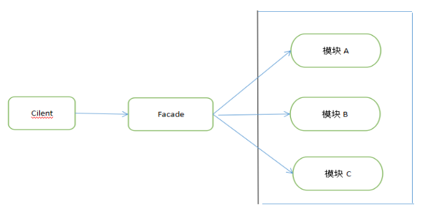
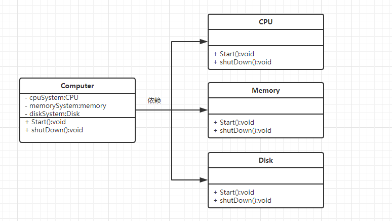

## 1、介绍

​	外观模式（Facade Pattern）隐藏系统的复杂性，并向客户端提供了一个客户端可以访问系统的接口。这种类型的设计模式属于结构型模式，它向现有的系统添加一个接口，来隐藏系统的复杂性。 

**大白话讲**：该模式就是把一些复杂的流程封装成一个接口供给外部用户更简单的使用。 



如上所示，外观模式一共有3种角色：

1. 门面角色：外观模式的核心。它被客户角色调用，它熟悉子系统的功能（持有子系统引用）。内部根据客户角色的需求预定了几种功能的组合。 
2. 子系统角色：实现了子系统的功能。 
3. 客户端角色：通过调用Facede来完成要实现的功能。 

## 2、实现

**实例分析：**

每个Computer都有CPU、Memory、Disk。在Computer开启和关闭的时候，相应的部件也会开启和关闭，所以，使用了该外观模式后，会使用户和部件之间解耦。



**1、子系统类**

```java
/**
 * cpu子系统类
 */
public class CPU 
{
    public void start()
    {
        System.out.println("cpu is start...");
    }
    
    public void shutDown()
    {
        System.out.println("CPU is shutDown...");
    }
}

/**
 * cpu子系统类
 */
public class CPU 
{
    public void start()
    {
        System.out.println("cpu is start...");
    }
    
    public void shutDown()
    {
        System.out.println("CPU is shutDown...");
    }
}

/**
 * Disk子系统类
 */
public class Disk 
{
    public void start()
    {
        System.out.println("Disk is start...");
    }
    
    public void shutDown()
    {
        System.out.println("Disk is shutDown...");
    }
}

/**
 * Memory子系统类
 */
public class Memory 
{
    public void start()
    {
        System.out.println("Memory is start...");
    }
    
    public void shutDown()
    {
        System.out.println("Memory is shutDown...");
    }
}
```

**2、门面类**

```java
/**
 * 门面类（核心）
 */
public class Computer
{
    private CPU cpu;
    private Memory memory;
    private Disk disk;
    public Computer()
    {
        cpu = new CPU();
        memory = new Memory();
        disk = new Disk();
    }
    public void start()
    {
        System.out.println("Computer start begin");
        cpu.start();
        disk.start();
        memory.start();
        System.out.println("Computer start end");
    }
    
    public void shutDown()
    {
        System.out.println("Computer shutDown begin");
        cpu.shutDown();
        disk.shutDown();
        memory.shutDown();
        System.out.println("Computer shutDown end...");
    }
}
```

**3、客户端类**

```java
/**
 * 客户端类
 */
public class Cilent {
    public static void main(String[] args) 
    {
        Computer computer = new Computer();
        computer.start();
        System.out.println("=================");
        computer.shutDown();
    }

}
```

有了这个Facade类，也就是Computer类，用户就不用亲自去调用子系统中的Disk,Memory、CPU类了，不需要知道系统内部的实现细节，甚至都不用知道系统内部的构成。客户端只需要跟Facade交互就可以了。 

## 3、优缺点

**优点**：

1. 减少系统相互依赖。
2. 提高灵活性。
3. 提高了安全性，向用户影藏了模块，只提供了一个同一门面。

**缺点**：

1. 不符合开闭原则，如果要改东西很麻烦，继承重写都不合适。 

## 4、应用场景

1. 为复杂的模块或子系统提供外界访问的模块。 
2. 子系统相对独立。 
3. 预防低水平人员带来的风险。 


例子来源：https://www.cnblogs.com/lthIU/p/5860607.html