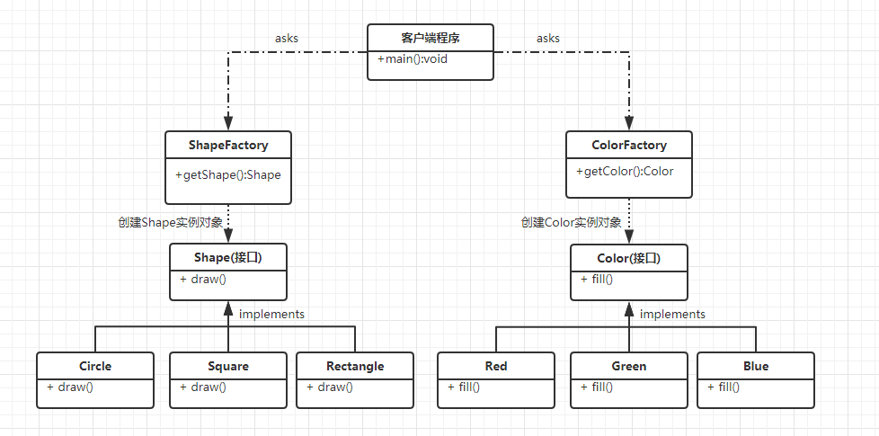
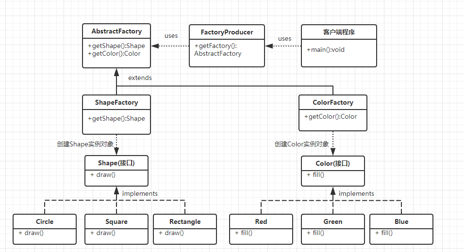

## 1、介绍

**实际问题**：

设计一个画画系统，可以画各种形状，并且可以用各种颜色来填充形状。

**一般做法**：

由于学过[简单工厂模式](./简单工厂模式.md)，则一般会将系统设计为如下模式：



那么在客户端程序就会写如下代码：

```java
public static void main(String[] args) {
    String shapeType = "Circle";
    String colorType = "Red";
    
    //创建形状工厂
    ShapeFactory shapeFactory = new ShapeFactory();
    //创建颜色工厂
    ColorFactory colorFactory = new ColorFactory();

    //获得形状和颜色的对象
    Shape shape = shapeFactory.getShape(shapeType);
    Color color = colorFactory.getColor(colorType);
    
    //画形状并填充颜色
    shape.draw();
    color.fill();
}
```

**存在的问题**：

1. 工厂没有面向接口编程，代码不易复用。
2. 客户端中创建工厂，必须new一个指定工厂类，想实现像简单工厂那样，传入一个字符串就创建相应对象，而不需要在客户端中创建对象。

**高级做法**：

1. 将这些工厂抽象成一个抽象工厂类；
2. 然后创建一个工厂生成类，根据“传进来的工厂类型”创建一个相应的工厂。

## 2、实现

UML类图如下所示：



**步骤一**：创建Shape接口和实现类

略。

**步骤二**：创建Color接口和实现类

略。

**步骤三**：创建抽象工厂类

```java
public abstract class AbstractFactory {
   public abstract Color getColor(String color);
   public abstract Shape getShape(String shape) ;
}
```

**步骤四**：创建Shape和Color的工厂类

```java
public class ShapeFactory extends AbstractFactory {
    
   @Override
   public Shape getShape(String shapeType){
      if(shapeType == null){
         return null;
      }        
      if(shapeType.equalsIgnoreCase("CIRCLE")){
         return new Circle();
      } else if(shapeType.equalsIgnoreCase("RECTANGLE")){
         return new Rectangle();
      } else if(shapeType.equalsIgnoreCase("SQUARE")){
         return new Square();
      }
      return null;
   }
   
   @Override
   public Color getColor(String color) {
      return null;
   }
}
```

```java
public class ColorFactory extends AbstractFactory {
    
   @Override
   public Shape getShape(String shapeType){
      return null;
   }
   
   @Override
   Color getColor(String color) {
      if(color == null){
         return null;
      }        
      if(color.equalsIgnoreCase("RED")){
         return new Red();
      } else if(color.equalsIgnoreCase("GREEN")){
         return new Green();
      } else if(color.equalsIgnoreCase("BLUE")){
         return new Blue();
      }
      return null;
   }
}
```

**步骤五**：创建工厂生成器，通过传递字符串获取相应工厂

```java
public class FactoryProducer {
   public static AbstractFactory getFactory(String choice){
       //忽视大小写
      if(choice.equalsIgnoreCase("SHAPE")){
         return new ShapeFactory();
      } else if(choice.equalsIgnoreCase("COLOR")){
         return new ColorFactory();
      }
      return null;
   }
}
```

**步骤六**：在客户端使用工厂生成器 来获取 一个抽象工厂

```java
public class AbstractFactoryPatternDemo {
   public static void main(String[] args) {
      //获取形状工厂
      AbstractFactory shapeFactory = FactoryProducer.getFactory("SHAPE");
      //获取形状为 Circle 的对象
      Shape shape = shapeFactory.getShape("CIRCLE");
      //调用 Circle 的 draw 方法
      shape.draw();
       
      //获取颜色工厂
      AbstractFactory colorFactory = FactoryProducer.getFactory("COLOR");
      //获取颜色为 Red 的对象
      Color color = colorFactory.getColor("RED");
      //调用 Red 的 fill 方法
      color.fill();
       
       //这样就画了一个填充颜色为红色的CIRCLE形状
   }
}
```


## 3、优缺点

**优点：**

1. 客户端只需传入工厂名称，不需要在客户端代码中创建工厂对象，解耦合。
2. 可以在抽象工厂类中，保证只会使用一种类型的Shape 和 Color对象。

**缺点：**

**产品族的扩展很困难**，但某一系列下的产品增加易扩展。

**注意**：

抽象工厂模式只是有一个超级工厂创建其他工厂，具体工厂怎么实现看具体应用，不一定按照此例子的模式。

## 4、应用场景

1. **生成不同操作系统的程序**。如：创建两个工厂类WindowsFactory和UnixFactory，内部生成对应操作系统的代码，外部则用一个抽象工厂类生成对应工厂。
2. **QQ换皮肤，一整套一起换**。（头饰+衣服+裤子+鞋子就是一个产品族，也就对应一个工厂类）