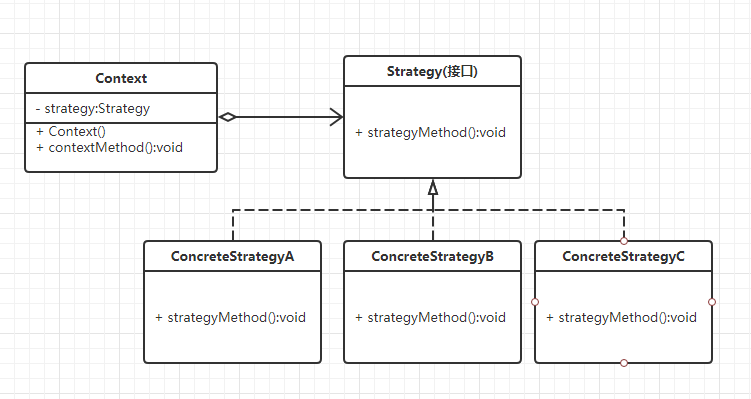

## 1、介绍

​	策略模式定义了一系列的算法，并将每一个算法封装起来，而且使他们可以相互替换，让算法独立于使用它的客户而独立变化。 

**实际问题：**

如果我们有一系列算法，它们是可以相互替换的，区分它们的只是它们直接的行为。此时在客户端使用，就要使用if-else语句来进行算法的选择，不利于维护。

**解决方法**：将这些算法封装成一个一个的类，任意地替换。 

**UML类图**如下所示：



**策略模式有3类角色：**

环境角色(Context)：持有一个Strategy的引用。 

抽象策略角色(Strategy)：这是一个抽象角色，通常由一个接口或抽象类实现。此角色给出所有的具体策略类所需的接口。 

具体策略角色(ConcreteStrategy)：包装了相关的算法或行为。 


这个UML和简单工厂模式的很像，但是抽象工厂的工厂并没有持有引用，而是在方法中创建并返回一个对象引用。

## 2、实现

**抽象策略类** 

```java
public interface Strategy {
    //策略方法
    public void strategyMethod();
}
```

**具体策略类** 

```java
public class ConcreteStrategyA implements Strategy {

    @Override
    public void strategyMethod() {
        //相关的业务
        System.out.println("调用了策略A！！！");
    }

}

public class ConcreteStrategyB implements Strategy {

    @Override
    public void strategyMethod() {
        //相关的业务
        System.out.println("调用了策略B！！！");
    }

}
```

**环境角色类** 

```java
public class Context {
    //持有一个具体策略的对象
    private Strategy strategy;
    
    //构造函数，传入一个具体策略对象
    public Context(Strategy strategy){
        this.strategy = strategy;
    }
    
    //策略方法
    public void contextMethod(){
        strategy.strategyInterface();
    }

}
```

**客户端**

```java
public static void main(String[] args) {
    //使用策略A构造一个上下文
    Context context = new Context(new ConcreteStrategyA); 
    //调用上下文的方法，以调用对应的策略方法
    context.contextMethod();
}
```

输出结果：

```java
调用了策略A！！！
```


## 3、使用场景

1. 针对同一类型问题的多种处理方式，仅仅是具体行为有差别时； 
2. 需要安全地封装多种同一类型的操作时；  
3. 出现同一抽象类有多个子类，而又需要使用 if-else 或者 switch-case 来选择具体子类时。 

参考：https://blog.csdn.net/u012124438/article/details/70039943/