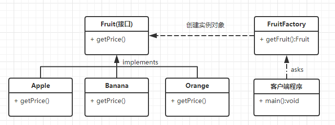

## 1、介绍

**实际问题**：

水果店卖水果，但每种水果的价钱不一样，所以需要这样一个软件：输入水果的类型，就能知道水果的价钱。

**一般做法**：

```java
public static void main(String[] args) {
    Scanner sc = new Scanner(System.in);
    String input = sc.nextLine();
    double price = 0.0;
    switch (input){
        case "Apple": price = 2.0;break;
        case "Orange":price = 3.0;break;
        case "Banana":price = 4.0;break;
        default:break;
    }
    System.out.println("该水果的价钱为：" + price);
}
```

**带来的问题**：

1. 若增加新的水果，需要修改这段代码，就**打破了“开放-封闭原则”**。
2. **代码不易复用**。在其它地方需要计算水果价钱，只能将这段代码直接复制过去；而且，如果水果价钱改变了，需要更改两个地方的代码。

**高级做法**：

1. 将这些水果抽象成一个类，方便代码复用；
2. 将对水果类型判断从客户程序中转移到工厂类中，从而降低客户程序代码的复杂度。

## 2、实现

创建一个 *Fruit接口*  和 实现 *Fruit接口* 的实体类，然后定义一个*水果工厂类 FruitFactory* 和 客户端。

其UML类图设计如下：



**步骤一：创建接口和实现类**

```java
//水果抽象成一个接口类
public interface Fruit {
    double getPrice();
}

//以下都是实现类

class Apple implements Fruit{
    @Override
    public double getPrice() {
        return 2.0;
    }
}

class Orange implements Fruit{
    @Override
    public double getPrice() {
        return 3.0;
    }
}

class Banana implements Fruit{
    @Override
    public double getPrice() {
        return 4.0;
    }
}
```

**步骤二：创建工厂类**

```java
public class FruitFactory {
    //使用getFruit方法获得水果的实例对象
    public Fruit getFruit(String fruitType){
        if(fruitType == null) return null;
        
        if(fruitType.equals("Apple")){
            return new Apple();
        }else if(fruitType.equals("Orange")){
            return new Orange();
        }else if(fruitType.equals("Banana")){
            return new Banana();
        }
        
        return null;
    }
}
```

**步骤三：客户端使用工厂类，获取实体类对象**

```java
public class FactoryUseDemo {
    public static void main(String[] args) {
        //创建水果工厂
        FruitFactory fruitFactory = new FruitFactory();

        //获取Apple对象，并调用它的getPrice()方法
        Fruit fruit = fruitFactory.getFruit("Apple");
        double price = fruit.getPrice();

        System.out.println("该水果价钱是" + price);
    }
}
```

**工厂类的作用**：

工厂是用来创建接口实现类的实体对象。

## 3、优缺点

**优点**：

1. 扩展性高，如果想增加一个产品，只需要扩展工厂类和增加一个产品类即可。
2. 屏蔽了产品的具体实现，调用者只需关心产品的接口。
3. 降低了客户端与服务端耦合度。工厂模式将“客户端对创建何种类型的判断和创建对象”转移到了工厂类中，从而减少客户端代码的复杂度。
4. 调用者想创建一个对象，只需要知道其名称就可以了。

**缺点**：

1. 每增加一个产品，需要 **增加一个具体类实现** 和 **对象实现工厂**，使得类数量成倍增加，使得系统复杂度增加。
2. 而且工厂类还是需要增加代码，没有满足“开放-封闭”原则（实际开发中也没有必要一定要满足这条）。

**注意事项**：

1. **复杂对象适合使用工厂模式来创建**。如该对象在运行时才知道类型，就是一个复杂对象。
2. **简单对象直接用new来创建即可**。明确对象类型，则不需要使用工厂模式，使用反而会引用一个工厂类对象，增加系统复杂度。

## 4、使用场景

1. **数据库访问**。如在JDBC中，不知道使用的是哪一类数据库，以及数据库可能发生变化。
2. **设计一个连接服务器的框架**，需要3个协议，“POP3”、“HTTP”、“IMAP”，就可以将这3个作为产品类，共同实现一个接口。
3. **日志记录器**。用户选择记录日志记录到什么地方，如本地硬盘、远程服务器等。