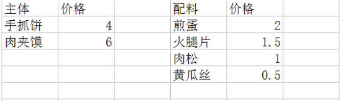
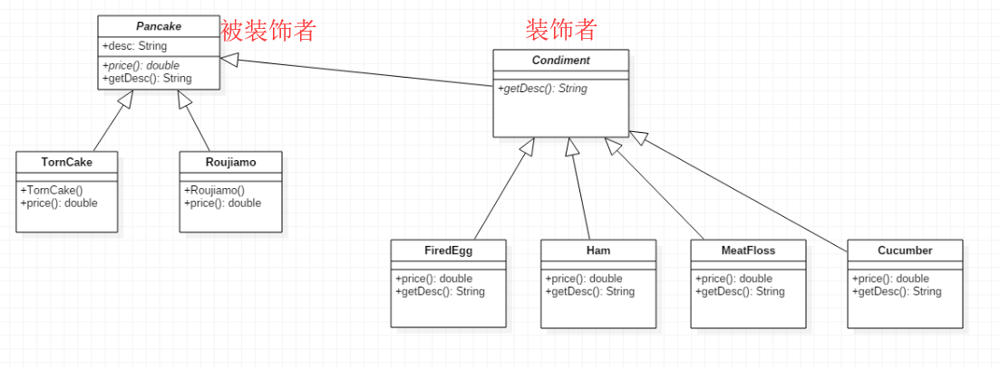

## 1、介绍

**1）大白话介绍**：装饰者模式，**动态地**将责任附加到对象上。 若要扩展功能，装饰者提供了比继承更加有弹性的替代方案。 

平常，我们若要给一个类添加行为往往选择继承，但这样会造成继承类过多而导致代码难以维护，装饰者模式就是选择了组合的方式来代替继承。

**2）组合和继承的区别**：

**继承**：继承是给一个类添加行为的比较有效的途径。通过使用继承，可以使得子类在拥有自身方法的同时，还可以拥有父类的方法。但是使用继承是静态的，在编译的时候就已经决定了子类的行为，我们不便于控制增加行为的方式和时机。 

**组合**：组合即将一个对象嵌入到另一个对象中，由另一个对象来决定是否引用该对象来扩展自己的行为。这是一种动态的方式，我们可以在应用程序中动态的控制（在程序运行的时候将一个对象引用传进去）。

与继承相比，**组合关系的优势就在于不会破坏类的封装性，且具有较好的松耦合性**，可以使系统更加容易维护。但是**它的缺点就在于要创建比继承更多的对象**（既要创建装饰者也要创建被装饰者对象）。

**3）实际问题**

有一个小摊卖手抓饼和肉夹馍，点了手抓饼之后可以在这个基础上增加一些配料，如：煎蛋、火腿片等等，每个配料的价格都不一样，最终的价格是：手抓饼基础价 + 各种所选配料价格的总和。小摊价格单如下：



**需求**：设计一个软件来处理价格计算的问题。

**一般做法**：为每一种搭配创建一个类，导致的问题：类爆炸

**高级做法**：使用装饰者模式

## 2、实现

主体是手抓饼和肉夹馍，配料则是装饰者，UML的设计如下所示：



具体Java代码实现：

**1）、被装饰者的抽象类**

```java
public abstract class Pancake {
    
    public String desc = "我不是一个具体的煎饼";

    public String getDesc() {
        return desc;
    }
    
    public abstract double price();

}
```

**2）、被装饰者的具体实现类**

```java
public class TornCake extends Pancake {

    public TornCake() {
        desc = "手抓饼";
    }

    @Override
    public double price() {
        return 4;
    }

}

public class Roujiamo extends Pancake {

    public Roujiamo() {
        desc = "肉夹馍";
    }

    @Override
    public double price() {
        return 6;
    }

}
```

**3）、装饰者的抽象类**

```java
public abstract class Condiment extends Pancake {

    public abstract String getDesc();

}
```

**4）、装饰者的具体类**

```java
public class FiredEgg extends Condiment {
    private Pancake pancake;
    
    public FiredEgg(Pancake pancake) {
        this.pancake = pancake;
    }

    @Override
    public String getDesc() {
        return pancake.getDesc() + ", 煎蛋";
    }

    @Override
    public double price() {
        return pancake.price() + 2;
    }

}

public class Ham extends Condiment {
    private Pancake pancake;
    
    public Ham(Pancake pancake) {
        this.pancake = pancake;
    }

    @Override
    public String getDesc() {
        return pancake.getDesc() + ", 火腿片";
    }

    @Override
    public double price() {
        return pancake.price() + 1.5;
    }

}
```

**5）、客户端使用**

```java
public class MyTest {
    
    @Test
    public void test() {
        Pancake tornCake = new TornCake();
        //手抓饼基础价
        System.out.println(String.format("%s ￥%s", tornCake.getDesc(), tornCake.price()));
        
        Pancake roujiamo = new Roujiamo();
        roujiamo = new FiredEgg(roujiamo);
        roujiamo = new FiredEgg(roujiamo);
        roujiamo = new Ham(roujiamo);
        roujiamo = new MeatFloss(roujiamo);
        roujiamo = new Cucumber(roujiamo);
        //加各种配料之后的价格
        System.out.println(String.format("%s ￥%s", roujiamo.getDesc(), roujiamo.price()));
    }

}
```

输出结果：

```
手抓饼 ￥4.0
肉夹馍，煎蛋，煎蛋，火腿片，肉松，黄瓜丝 ￥13.0
```

## 3、优缺点

**优点：**

1. 装饰者模式可以提供比继承更多的灵活性 。
2. 可以通过一种动态的方式来扩展一个对象的功能，在运行时选择不同的装饰器，从而实现不同的行为。 
3. 通过使用不同的具体装饰类以及这些装饰类的排列组合，可以创造出很多不同行为的组合。可以使用多个具体装饰类来装饰同一对象，得到功能更为强大的对象。 
4. 具体构件类与具体装饰类可以独立变化，用户可以根据需要增加新的具体构件类和具体装饰类，在使用时再对其进行组合，原有代码无须改变，符合“开闭原则”。 

**缺点：**

1. 会产生很多的小对象，增加了系统的复杂性 。
2. 这种比继承更加灵活机动的特性，也同时意味着装饰模式比继承更加易于出错，排错也很困难，对于多次装饰的对象，调试时寻找错误可能需要逐级排查，较为烦琐。 

## 4、使用场景

1. 在不影响其他对象的情况下，以动态、透明的方式给单个对象添加职责。 
2. 需要动态地给一个对象增加功能，这些功能也可以动态地被撤销。  当不能采用继承的方式对系统进行扩充或者采用继承不利于系统扩展和维护时。 

具体例子有：Java IO的设计就是使用了装饰者模式。

参考：

https://www.cnblogs.com/stonefeng/p/5679638.html

http://www.cnblogs.com/xinye/p/3909401.html