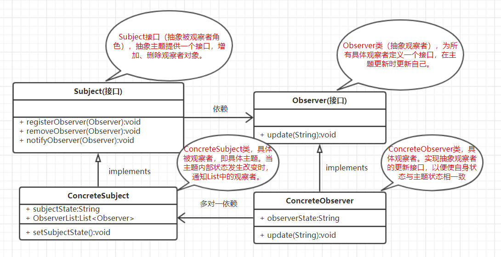
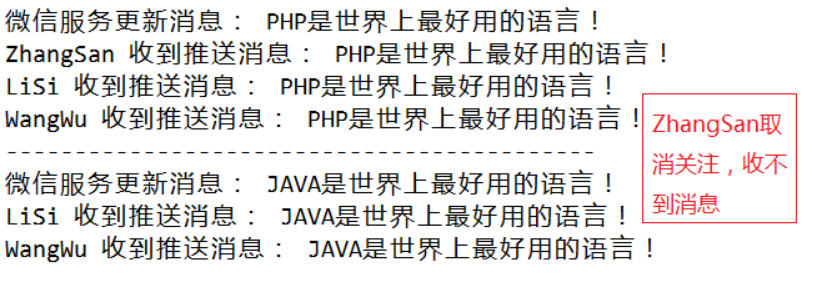

## 1、介绍

**官方定义：**在对象之间定义了一对多的依赖，这样一来，当一个对象改变状态，依赖它的对象会收到通知并自动更新。 

**大白话讲**：其实就是发布订阅模式，发布者发布信息，订阅者获取信息，订阅了就能收到信息，没订阅就收不到信息。 


怎么解决的：使用一个ArrayList来维护订阅者集合，进行主题的订阅和取消订阅。

其UML类图如下所示：



可以看到，该模式有4个角色：

- **抽象被观察者角色**：也就是一个抽象主题，它把所有对观察者对象的引用保存在一个集合中，每个主题都可以有任意数量的观察者。抽象主题提供一个接口，可以增加和删除观察者角色。一般用一个抽象类和接口来实现。
- **具体被观察者角色**：也就是一个具体的主题，在集体主题的内部状态改变时，所有登记过的观察者发出通知。
- **抽象观察者角色**：为所有的具体观察者定义一个接口，在得到主题通知时更新自己。
- **具体观察者角色**：实现抽象观察者角色所需要的更新接口，使本身的状态与主题的状态相协调。


**使用场景例子**：

有一个微信公众号服务，不定时发布一些消息，关注公众号就可以收到推送消息，取消关注就收不到推送消息。 

## 2、具体实现

**1、定义一个抽象主题的接口**

```java
/***
 * 抽象被观察者接口，即抽象主题
 * 声明了添加、删除、通知观察者方法
 */
public interface Observerable {
    
    public void registerObserver(Observer o);
    public void removeObserver(Observer o);
    public void notifyObserver();
    
}
```

**2、定义一个订阅者的接口**

```java
/***
 * 抽象观察者
 * 定义了一个update()方法，当被观察者调用notifyObservers()方法时，观察者的update()方法会被回调。
 */
public interface Observer {
    public void update(String message);
}
```

**3、定义具体主题类**

```java
import java.util.ArrayList;
import java.util.List;

/**
 * 被观察者，也就是微信公众号服务
 * 实现了Observerable接口，对Observerable接口的三个方法进行了具体实现
 */
public class WechatServer implements Observerable {
    
    //注意到这个List集合的泛型参数为Observer接口，设计原则：面向接口编程而不是面向实现编程
    private List<Observer> list;
    private String message;
    
    public WechatServer() {
        list = new ArrayList<Observer>();
    }
    
    @Override
    public void registerObserver(Observer o) {
        
        list.add(o);
    }
    
    @Override
    public void removeObserver(Observer o) {
        if(!list.isEmpty())
            list.remove(o);
    }

    //遍历
    @Override
    public void notifyObserver() {
        for(int i = 0; i < list.size(); i++) {
            Observer oserver = list.get(i);
            oserver.update(message);//回调具体对象者的update函数
        }
    }
    
    public void setInfomation(String s) {
        this.message = s;
        System.out.println("微信服务更新消息： " + s);
        //消息更新，通知所有观察者
        notifyObserver();
    }

}
```

**4、定义具体订阅者类**

```java
/**
 * 观察者
 * 实现了update方法
 */
public class User implements Observer {

    private String name;
    private String message;
    
    public User(String name) {
        this.name = name;
    }
    
    @Override
    public void update(String message) {
        this.message = message;
        read();
    }
    
    public void read() {
        System.out.println(name + " 收到推送消息： " + message);
    }
    
}
```

**5、测试类**

```java
public class Test {
    
    public static void main(String[] args) {
        WechatServer server = new WechatServer();
        
        Observer userZhang = new User("ZhangSan");
        Observer userLi = new User("LiSi");
        Observer userWang = new User("WangWu");
        
        server.registerObserver(userZhang);
        server.registerObserver(userLi);
        server.registerObserver(userWang);
        server.setInfomation("PHP是世界上最好用的语言！");
        
        System.out.println("----------------------------------------------");
        //此时用户userZhang取消订阅了
        server.removeObserver(userZhang);
        server.setInfomation("JAVA是世界上最好用的语言！");
        
    }
}
```

输出结果：



## 3、优缺点

**优点：**

1. 观察者和被观察者是抽象耦合的，即任何一方发生改变，另一方不会影响（因为面向接口编程）。
2. **定义了一套触发机制**。

**缺点：**

1. 如果一个被观察者对象有很多的直接和间接的观察者的话，将所有的观察者都通知到会花费很多时间。 
2. 观察者和被观察者之间如果有循环依赖，会触发它们之间的循环调用，导致系统崩溃。
3. 观察者模式没有相应的机制让观察者知道所观察的目标对象是怎么发生变化的，而仅仅只是知道观察目标发生了变化。 

**使用注意事项**：

1. JAVA 中已经有了对观察者模式的支持类。 
2. 避免循环引用。
3. 如果顺序执行，某一观察者错误会导致系统卡壳，一般采用异步方式。 

例子来源：https://www.cnblogs.com/luohanguo/p/7825656.html

