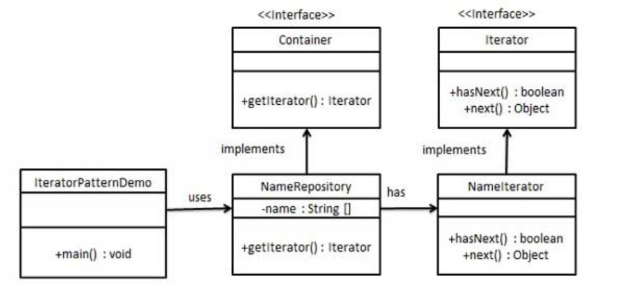

## 1、介绍

​	迭代器模式（Iterator Pattern）是 Java 和 .Net 编程环境中非常常用的设计模式。这种模式用于顺序访问集合对象的元素，不需要知道集合对象的底层表示。 

**意图：**提供一种方法顺序访问一个聚合对象中各个元素, 而又无须暴露该对象的内部表示。

**主要解决：**不同的方式来遍历整个整合对象。

**何时使用：**遍历一个聚合对象。

**如何解决：**把在元素之间游走的责任交给迭代器，而不是聚合对象。

**关键代码：**定义接口：hasNext, next。

## 2、实现

UML图如下所示：



有一个迭代器的接口 *Iterator* 和 容器接口 *Container*，容器接口主要定义一个返回迭代器的接口，迭代器接口主要定义2个函数：hasNext, next。

Java实现如下：

**1、创建接口**

```java
public interface Iterator {
   public boolean hasNext();
   public Object next();
}
```

```java
public interface Container {
   public Iterator getIterator();
}
```

**2、创建实现类**

```java
/**
*  容器实现类，里面有个该类迭代器的内部类
*
**/
public class NameRepository implements Container {
   public String names[] = {"Robert" , "John" ,"Julie" , "Lora"};
 
    //返回一个迭代器对象
   @Override
   public Iterator getIterator() {
      return new NameIterator();
   }
 
    //内部类，该迭代器用来访问容器NameRepository
   private class NameIterator implements Iterator {
 
      int index;
 
      @Override
      public boolean hasNext() {
         if(index < names.length){
            return true;
         }
         return false;
      }
 
      @Override
      public Object next() {
         if(this.hasNext()){
            return names[index++];
         }
         return null;
      }     
   }
}
```

**3、客户端类**

```java
public class IteratorPatternDemo {
   
   public static void main(String[] args) {
      NameRepository namesRepository = new NameRepository();
 
      for(Iterator iter = namesRepository.getIterator(); iter.hasNext();){
         String name = (String)iter.next();
         System.out.println("Name : " + name);
      }  
   }
}
```

## 3、优缺点

**优点：**

1. 它支持以不同的方式遍历一个聚合对象。 
2. 迭代器简化了聚合类。 
3. 在同一个聚合上可以有多个遍历。 
4. 在迭代器模式中，增加新的聚合类和迭代器类都很方便，无须修改原有代码。 

**缺点：**

1. 由于迭代器模式将存储数据和遍历数据的职责分离，增加新的聚合类需要对应增加新的迭代器类，类的个数成对增加，这在一定程度上增加了系统的复杂性。 

## 4、使用场景

1、访问一个聚合对象的内容而无须暴露它的内部表示。 

2、需要为聚合对象提供多种遍历方式。 

3、为遍历不同的聚合结构提供一个统一的接口。 

实际应用的场景：JAVA 中的 iterator。 