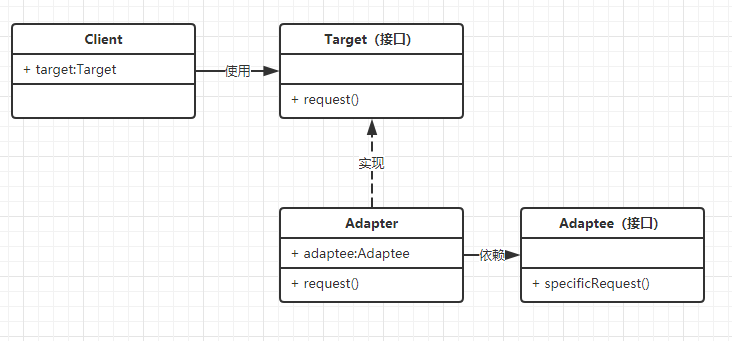

## 1、简介

**官方定义**：

将一个与当前类无法兼容的接口转换成能够兼容当前类的接口。

**大白话理解**：

有一个第三方类，我们需要调用其中的方法，但是第三方类提供给我们的接口与我们程序的接口不匹配，这时就需要我们写一个适配器类，将第三方不匹配的接口转换成我们程序调用的接口。

**适配器模式类图**：

**需求是**：

客户端（Client）想调用第三方库（Adaptee）的specificRequest()方法，但是我们程序使用的是request()这个方法。因此，需要一个适配器类（Target）来完成一个转换。

**具体做法**：

1. 创建一个Adapter类，并将第三方库Adaptee作为成员变量，并实现Target接口；
2. 在客户端使用，`Target target = new Adapter()；target.request();` 就可以使用程序的接口调用第三方库了。

## 2、使用场景

1. 在软件开发过程中，需要调用第三方类库的时候，如果第三方类库提供的接口和我们设计的接口不一致，此时可以使用适配器模式，将第三方类库的接口转换成我们所需要的接口。 例如：Java中的JDBC，有多个数据库第三方库，但是提供的接口是一样的。
2. 在软件开发后期或是开发结束之后，被调用的一些接口需要换掉，为了不需改已经开发好的代码，可以增加一个适配器，起到连接新接口和旧调用的桥梁。 

**注意：**

1. 在调用方 和 被调用方 都不易修改代码时使用适配器模式；
2. 能重构代码，就尽量不使用适配器模式。