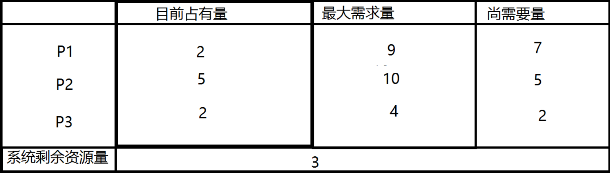
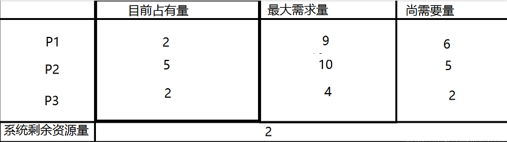

# **什么是死锁？**

　　死锁是指两个或两个以上的进程在执行过程中，由于竞争资源或者由于彼此通信而造成的一种阻塞的现象，若无外力作用，它们都将无法推进下去。此时称系统处于死锁状态或系统产生了死锁，这些永远在互相等待的进程称为死锁进程。

　　例如，在某个计算机系统中只有一台打印机和一台输入 设备，进程P1正占用输入设备，同时又提出使用打印机的请求，但此时打印机正被进程P2 所占用，而P2在未释放打印机之前，又提出请求使用正被P1占用着的输入设备。这样两个进程相互无休止地等待下去，均无法继续执行，此时两个进程陷入死锁状态。

 

**死锁产生的原因：**

**1.系统资源的竞争**

　　当系统中供多个进程共享的资源如打印机、公用队列的等，其数目不足以满足诸进程的需要时，会引起诸进程对资源的竞争而产生死锁。

**2.进程运行推进顺序不当引起死锁**

　　**● 进程推进顺序合法**

　　当进程P1和P2并发执行时，如果按照下述顺序推进：P1：Request（R1）； P1：Request（R2）； P1: Relese（R1）；P1: Relese（R2）； P2：Request（R2）； P2：Request（R1）； P2: Relese（R2）；P2: Relese（R1）；这两个进程便可顺利完成，这种不会引起进程死锁的推进顺序是合法的。

　　**● 进程推进顺序非法**

　　若P1保持了资源R1,P2保持了资源R2，系统处于不安全状态，因为这两个进程再向前推进，便可能发生死锁。例如，当P1运行到P1：Request（R2）时，将因R2已被P2占用而阻塞；当P2运行到P2：Request（R1）时，也将因R1已被P1占用而阻塞，于是发生进程死锁。

 

# **产生死锁的四个必要条件：**

　　**● 互斥条件**：指进程对所分配到的资源进行排它性使用，即在一段时间内某资源只由一个进程占用。如果此时还有其它进程请求资源，则请求者只能等待，直至占有资源的进程用毕释放。

　　**● 请求与保持条件**：进程已经保持了至少一个资源，但又提出了新的资源请求，而该资源 已被其他进程占有，此时请求进程被阻塞，但对自己已获得的资源保持不放。

　　**● 不可剥夺条件**：进程所获得的资源在未使用完毕之前，不能被其他进程强行夺走，即只能 由获得该资源的进程自己来释放（只能是主动释放)。

　　**● 循环等待条件**：指在发生死锁时，必然存在一个进程——资源的环形链，即进程集合{P0，P1，P2，···，Pn}中的P0正在等待一个P1占用的资源；P1正在等待P2占用的资源，……，Pn正在等待已被P0占用的资源。

　　这四个条件是死锁的必要条件，只要系统发生死锁，这些条件必然成立，而只要上述条件之一不满足，就不会发生死锁。

 

# **死锁的避免与预防**

**死锁避免的基本思想：**系统对进程发出每一个系统能够满足的资源申请进行动态检查，并根据检查结果决定是否分配资源，如果分配后系统可能发生死锁,则不予分配，否则予以分配。这是一种保证系统不进入死锁状态的动态策略。

　　理解了死锁的原因，尤其是产生死锁的四个必要条件，就可以最大可能地避免、预防和解除死锁。只要打破四个必要条件之一就能有效预防死锁的发生：

　　**● 打破互斥条件**：改造独占性资源为虚拟资源，大部分资源已无法改造。

　　**● 打破不可抢占条件**：当一进程占有一独占性资源后又申请一独占性资源而无法满足，则退出原占有的资源。

　　**● 打破占有且申请条件**：采用资源预先分配策略，即进程运行前申请全部资源，满足则运行，不然就等待，这样就不会占有且申请。

　　**● 打破循环等待条件**：实现资源有序分配策略，对所有设备实现分类编号，所有进程只能采用按序号递增的形式申请资源。

 

**死锁避免和死锁预防的区别：**

　　死锁预防是设法至少破坏产生死锁的四个必要条件之一，严格的防止死锁的出现；而死锁避免则不那么严格的限制产生死锁的必要条件的存在，因为即使死锁的必要条件存在，也不一定发生死锁。死锁避免是在系统运行过程中注意避免死锁的最终发生。

 

 

# **实例演示**

下面通过一个例子对安全状态和不安全状态进行更深的了解 ：
　　

　　如上图所示系统处于安全状态，系统剩余3个资源，可以把其中的2个分配给P3，此时P3已经获得了所有的资源，执行完毕后还能还给系统4个资源，此时系统剩余5个资源所以满足（P2所需的资源不超过系统当前剩余量与P3当前占有资源量之和），同理P1也可以在P2执行完毕后获得自己需要的资源。 
　　如果P1提出再申请一个资源的要求，系统从剩余的资源中分配一个给进程P1，此时系统剩余2个资源，新的状态图如下：那么是否仍是安全序列呢那我们来分析一下 
　　

　　系统当前剩余2个资源，分配给P3后P3执行完毕还给系统4个资源，但是P2需要5个资源，P1需要6个资源，他们都无法获得资源执行完成，因此找不到一个安全序列。此时系统转到了不安全状态。

摘自：https://www.cnblogs.com/Kevin-ZhangCG/p/9038223.html