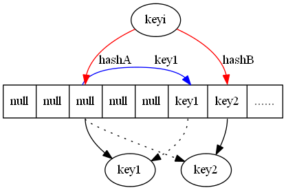

# 一、概念

​	CuckooHash（布谷鸟散列），最早于2001 年由Rasmus Pagh 和Flemming Friche Rodler 提出。是为了解决哈希冲突问题，利用较少的计算换取较大的空间。 [wikipedia - Cuckoo hashing](https://en.wikipedia.org/wiki/Cuckoo_hashing)  

**特点：**占用空间少，查询速度快。 

**来源：**之所以起这个名字是因为布谷鸟生性贪婪，不自己筑巢，而是在别的鸟巢里面鸟蛋孵化，先成长的幼鸟会将别的鸟蛋挤出，这样独享“母爱”，类似于哈希冲突处理过程。 

# 二、算法描述

算法使用hashA 和hashB 计算对应key 的位置。

1. 当两个哈希任意位置为空，则选择一个位置插入。
2. 让两个哈希有位置为空时，则插入到空位置。
3. 当两个哈希位置均不为空时，随机选择两者之一的位置上keyx 踢出，计算踢出的keyx 另一个哈希值对应的位置进行插入，转至2执行（即当再次插入位置为空时插入，仍旧不为空时，踢出这个keyy）

**图解**

1. 插入key1 两个位置均为空,则插入任意位置。

   

   插入之后：

   

   

2. 插入key2 两个位置有一个位置为空,则插入空的位置中 
   
   插入后：
   

3. 新插入keyi 发现对应两个位置均被占据 
   
   采取以下策略：随机选择一个位置提出所在位置的key（key1），将踢出的key 放置在另一个哈希结果对应的位置上 。
   

   如果踢出的key（key1）又占据/踢出了其他key（keyj）的位置，则反复执行上面的过程直到结束 。
   

   

# 三、其他

1. Cockoo hash 有两种变形。一种通过增加哈希函数进一步提高空间利用率；另一种是增加哈希表，每个哈希函数对应一个哈希表，每次选择多个张表中空余位置进行放置。三个哈希表可以达到80% 的空间利用率。
2. Cockoo hash 的过程可能因为反复踢出无限循环下去，这时候就需要进行一次循环踢出的限制，超过限制则认为需要添加新的哈希函数。
3. 在SOSP 11 的SLIT 文章中有使用Cuckoo hash。

​	一个改进的哈希表如下图所示，每个桶（bucket）有4路槽位（slot）。当哈希函数映射到同一个bucket中，在其它三路slot未被填满 之前，是不会有元素被踢的，这大大缓冲了碰撞的几率。笔者自己的简单实现上测过，采用二维哈希表（4路slot）大约80%的占用率（CMU论文数据据说 达到90%以上，应该是扩大了slot关联数目所致）。 

转载：http://blog.foool.net/2012/05/cuckoo-hash-%E5%B8%83%E8%B0%B7%E9%B8%9F%E5%93%88%E5%B8%8C/