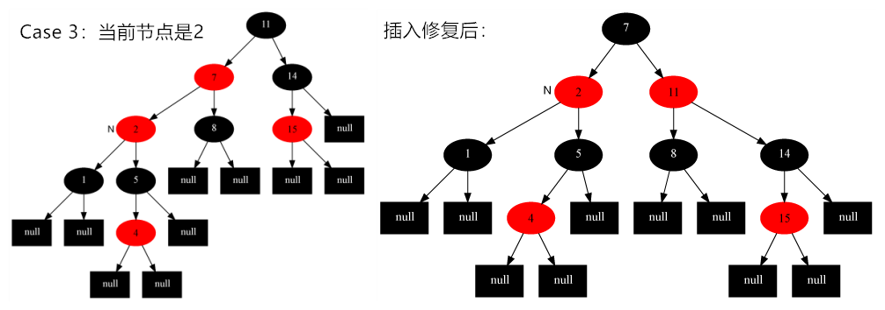

## 1、红黑树简介

**红黑树出现的原因**：

一棵高度为h的二叉搜索树，其查找、插入、删除的时间复杂度均为*O(h)*，如果在最坏情况下，该二叉树可能就是一条直链，这些操作复杂度就会很高。如何解决多次插入节点导致不平衡呢？于是，红黑树应运而生。

**红黑树**（Red-Black Tree，简称R-B Tree），是一种“平衡“二叉树，它保证在最坏情况下其各项操作的时间复杂度为*O(lgn)*。

**红黑树的应用**：红黑树的应用比较广泛，主要是用它来存储有序的数据，它的时间复杂度是O(lgn)，效率非常之高。 例如，JDK中的TreeMap、TreeSet底层就是红黑树实现的，Java 8中HashMap也用到了红黑树。


## 2、红黑树的性质

一棵红黑树是满足下面**红黑性质**的二叉搜索树：

（1）、**每个结点或者是黑色，或者是红色。** 

（2）、**根结点是黑色的。**

（3）、**每个叶子结点（NIL）是黑色的。**

（4）、**如果一个结点是红色的，则它的两个子结点都是黑色的。**

（5）、**对于每个结点，从该结点到其所有后代叶结点的简单路径上，包含相同数量的黑结点。**

红黑树中，每个结点包含5个属性：color、key、left、right和p，其中p是指向父结点的指针。

红黑树的示意图如下：


**注意**：

- 如果一个结点没有子结点或父结点，则该结点对应指针属性值为NIL，**这些NIL我们将其看成是叶结点**。

- 红黑树的上述5条性质，**保证了红黑树没有一条路径（根到叶子的简单路径）会比其他路径长出2倍**，因而是近似于**平衡的**。

  

> 引理1：一棵有n个内部结点的红黑树的高度至多为2lg(n+1)。
>
> 证明略。

上述引理说明了，一棵红黑树作为输入时，其SEARCH操作的时间复杂度为*O(lgn)*。并且其插入、删除操作，不但能保证满足上述5个约束，也保证了其时间复杂度也为*O(lgn)*。这都比二叉搜索树的 *O(h)* 好。

接下来会介绍红黑树是如何使其在插入、删除操作后，仍然是一棵红黑树。

## 3、红黑树的基本操作（一）左旋和右旋

​	红黑树的基本操作是**添加**、**删除**。在对红黑树进行添加或删除之后，都会用到旋转方法。因为在红黑树进行添加、删除结点后，可能会不满足5条约束，需要更改树中某些点的**颜色**以及**指针结构**。

而指针结构的修改是通过旋转， 旋转一共有两种：**左旋** 和 **右旋**。

### 3.1 左旋


**对x进行左旋，意味着"将x变成一个左节点"。** 

《算法导论》的左旋伪代码：参考上图和伪代码，理解左旋操作。

```java
LEFT-ROTATE(T, x)  
 y ← right[x]            // 前提：这里假设x的右孩子为y。下面开始正式操作
 right[x] ← left[y]      // 将 “y的左孩子” 设为 “x的右孩子”，即 将β设为x的右孩子
 p[left[y]] ← x          // 将 “x” 设为 “y的左孩子的父亲”，即 将β的父亲设为x
 p[y] ← p[x]             // 将 “x的父亲” 设为 “y的父亲”
 
 //设置节点y，需要对x是否有父节点、是左还是右孩子进行分类讨论
 if p[x] = nil[T]       
 then root[T] ← y                 // 情况1：如果 “x的父亲” 是空节点，则将y设为根节点
 else if x = left[p[x]]  
           then left[p[x]] ← y    // 情况2：如果 x是它父节点的左孩子，则将y设为“x的父节点的左孩子”
           else right[p[x]] ← y   // 情况3：(x是它父节点的右孩子) 将y设为“x的父节点的右孩子”
 left[y] ← x             // 将 “x” 设为 “y的左孩子”
 p[x] ← y                // 将 “x的父节点” 设为 “y”
```


实例分析：


### 3.2 右旋


**对y进行右旋，意味着“将y变成了一个右节点”。**

《算法导论》的右旋伪代码：参考上图和伪代码，理解右旋操作。

```java
RIGHT-ROTATE(T, y)  
 x ← left[y]             // 前提：这里假设y的左孩子为x。下面开始正式操作
 left[y] ← right[x]      // 将 “x的右孩子” 设为 “y的左孩子”，即 将β设为y的左孩子
 p[right[x]] ← y         // 将 “y” 设为 “x的右孩子的父亲”，即 将β的父亲设为y
 p[x] ← p[y]             // 将 “y的父亲” 设为 “x的父亲”
 if p[y] = nil[T]       
 then root[T] ← x                 // 情况1：如果 “y的父亲” 是空节点，则将x设为根节点
 else if y = right[p[y]]  
           then right[p[y]] ← x   // 情况2：如果 y是它父节点的右孩子，则将x设为“y的父节点的左孩子”
           else left[p[y]] ← x    // 情况3：(y是它父节点的左孩子) 将x设为“y的父节点的左孩子”
 right[x] ← y            // 将 “y” 设为 “x的右孩子”
 p[y] ← x                // 将 “y的父节点” 设为 “x”
```

实例分析：


### 3.3 总结

- 对二叉搜索树，无论是进行左旋还是右旋操作，该树仍然是一棵二叉搜索树。注意：红黑树本身也是一棵二叉搜索树。
- **左旋** 和 **右旋** 的时间复杂度为O(1)

## 4、红黑树的基本操作（二）插入

### 4.1 基本步骤

将一个节点插入到红黑树中，需要执行哪些步骤呢？ 

**第一步: 将红黑树当作一颗二叉查找树，将节点插入。** 

红黑树本身就是一颗二叉查找树，将节点插入后，该树仍然是一颗二叉查找树。也就意味着，树的键值仍然是有序的。 此外旋转之后，其仍然是一棵二叉搜索树。

那么我们接下来需要考虑的问题就是，如何是这棵树仍然保持着红黑树的性质。

**第二步：将插入的节点着色为"红色"。** 

为什么着色成红色，而不是黑色呢？为什么呢？ 

回顾其5条约束，我们可以知道，如果将插入的节点着色为红色，不会违背"特性(5)"！ 即不会违背”**对于每个结点，从该结点到其所有后代叶结点的简单路径上，包含相同数量的黑结点。**“那么可以少未被一条特性，那么只需要考虑其他4条特性就行了。

**第三步: 通过一系列的旋转或着色等操作，使之重新成为一颗红黑树。** 

第二步中，将插入节点着色为"红色"之后，不会违背"特性(5)"。那它到底会违背哪些特性呢？ 

- 对于"特性(1)"，显然不会违背了。因为我们已经将它涂成红色了。 
- 对于"特性(2)"，显然也不会违背。在第一步中，我们是将红黑树当作二叉查找树，然后执行的插入操作。而根据二叉查找数的特点，插入操作不会改变根节点。所以，根节点仍然是黑色。 
- 对于"特性(3)"，显然不会违背了。这里的叶子节点是指的空叶子节点，插入非空节点并不会对它们造成影响。 
- 对于"特性(4)"，是有可能违背的！ 

所以，我们只需要使之满足”特性(4)“，就可以重新构成一棵红黑树了。

### 4.2 伪代码

《算法导论》插入操作的伪代码：

```java
RB-INSERT(T, z)  
 //步骤一：将红黑树当作一颗二叉查找树，将节点z插入
 y ← nil[T]                        // 新建节点“y”，将y设为空节点。
 x ← root[T]                       // 设“红黑树T”的根节点为“x”
 while x ≠ nil[T]                  // 找出要插入的节点“z”在二叉树T中的位置“y”
     do y ← x                      
        if key[z] < key[x]  
           then x ← left[x]  
           else x ← right[x]  
 p[z] ← y                          // 设置 “z的父亲” 为 “y”
 if y = nil[T]                     
    then root[T] ← z               // 情况1：若y是空节点，则将z设为根
    else if key[z] < key[y]        
            then left[y] ← z       // 情况2：若“z所包含的值” < “y所包含的值”，则将z设为“y的左孩子”
            else right[y] ← z      // 情况3：(“z所包含的值” >= “y所包含的值”)将z设为“y的右孩子” 
 left[z] ← nil[T]                  // z的左孩子设为空
 right[z] ← nil[T]                 // z的右孩子设为空。至此，已经完成将“节点z插入到二叉树”中了。
 
 //步骤二：将插入的节点着色为"红色"
 color[z] ← RED                    // 将z着色为“红色”
 //步骤三：通过一系列的旋转或着色等操作，使之重新成为一颗红黑树
 RB-INSERT-FIXUP(T, z)             // 通过RB-INSERT-FIXUP对红黑树的节点进行颜色修改以及旋转，让树T仍然是一颗红黑树
```

步骤一和步骤二比较简单，接下来看**步骤三的伪代码**：

```java
RB-INSERT-FIXUP(T, z)
while color[p[z]] = RED // 若“当前节点(z)的父节点是红色”，则进行以下处理。
    do if p[z] = left[p[p[z]]]  // 若“z的父节点”是“z的祖父节点的左孩子”，则进行以下处理。
          then y ← right[p[p[z]]]// 将y设置为“z的叔叔节点(z的祖父节点的右孩子)”
               if color[y] = RED  // Case 1条件：叔叔是红色
                  then color[p[z]] ← BLACK        //  (01) 将“父节点”设为黑色。
                       color[y] ← BLACK           //  (02) 将“叔叔节点”设为黑色。
                       color[p[p[z]]] ← RED       //  (03) 将“祖父节点”设为“红色”。
                       z ← p[p[z]]                //  (04) 将“祖父节点”设为“当前节点”(红色节点)
                else if z = right[p[z]]// Case 2条件：叔叔是黑色，且当前节点是右孩子
                          then z ← p[z]           //  (01) 将“父节点”作为“新的当前节点”。
                               LEFT-ROTATE(T, z) //  (02) 以“新的当前节点”为支点进行左旋。
                          color[p[z]] ← BLACK // Case 3条件：叔叔是黑色，且当前节点是左孩子。															 (01) 将“父节点”设为“黑色”。
                          color[p[p[z]]] ← RED            //  (02) 将“祖父节点”设为“红色”。
                          RIGHT-ROTATE(T, p[p[z]])        //  (03) 以“祖父节点”为支点进行右旋。
       else (same as then clause with "right" and "left" exchanged) // 若“z的父节点”是“z的祖父节点的右孩子”，将上面的操作中“right”和“left”交换位置，然后依次执行。
color[root[T]] ← BLACK
```

**步骤三总结**：

根据**被插入节点的父节点的情况**，可以将"当节点z被着色为红色节点，并插入二叉树"划分为三种情况来处理。 

- 情况说明：被插入的节点是根节点。 

  处理方法：直接把此节点涂为黑色。 

- 情况说明：被插入的节点的父节点是黑色。     

  处理方法：什么也不需要做。节点被插入后，仍然是红黑树。 

- 情况说明：**被插入的节点的父节点是红色**。 

  处理方法： **那么，该情况与红黑树的“特性(5)”相冲突。** 

所以，我们主要是要处理**”被插入的节点的父节点是红色“**这种情况即可，接下来分析这种情况。

在这种情况下，被插入节点一定存在非空的祖父节点的（即父节点的父节点一定不为空），**进一步说，被插入节点一定存在叔叔节点**（即使叔叔节点为空，我们也视之为存在，空节点本身就是黑色节点)），那么根据”叔叔节点的情况“划分为3种Case：

|        | **现象说明**                                                 | **处理策略**                                                 |
| ------ | ------------------------------------------------------------ | ------------------------------------------------------------ |
| Case 1 | 当前节点的父节点是红色，且当前节点的祖父节点的另一个子节点（叔叔节点）也是红色。 | (01) 将“父节点”设为黑色。 <br />(02) 将“叔叔节点”设为黑色。<br />(03) 将“祖父节点”设为“红色”。 <br />(04) 将“祖父节点”设为“当前节点”(红色节点)，即之后继续对“当前节点”进行操作。 |
| Case 2 | 当前节点的父节点是红色，叔叔节点是黑色，且当前节点是其父节点的右孩子 | (01) 将“父节点”作为“新的当前节点”。 <br />(02) 以“新的当前节点”为支点进行左旋。 |
| Case 3 | 当前节点的父节点是红色，叔叔节点是黑色，且当前节点是其父节点的左孩子 | (01) 将“父节点”设为“黑色”。<br />(02) 将“祖父节点”设为“红色”。<br />(03) 以“祖父节点”为支点进行右旋。 |

### 4.3 处理策略详解

当**”被插入的节点的父节点是红色“**，此时可以根据”叔叔节点的情况“划分为3种Case，接下来对这3种情况进行详解。

#### 1）Case1：叔叔是红色

##### 1.1）现象说明

当前节点(即，被插入节点)的父节点是红色，且当前节点的祖父节点的另一个子节点（叔叔节点）也是红色。 

##### 1.2）处理策略

(01) 将“父节点”设为黑色。

(02) 将“叔叔节点”设为黑色。

(03) 将“祖父节点”设为“红色”，**若此时”祖父节点“是根节点，直接将”祖父节点“设置为黑色**。 

(04) 将“祖父节点”设为“当前节点”(红色节点)；即，之后继续对“当前节点”进行操作。 

##### 1.3）示意图


上图中，N代表当前节点，P是父节点，U是叔叔节点，G是祖父节点。

**须知**：红黑树中，如果父节点是红色，那么其祖父节点一定是黑色。

**通过上图来考虑为什么会采取以上处理策略。**当前节点”和“父节点”都是红色，违背“特性(4)”。

- **最开始想到的策略**： 将“父节点”设置“黑色”以解决这个问题。 这种策略将导致违背”特性(5)“。

- 那么如何解决？放弃上述策略。将“祖父节点”由“黑色”变成红色，同时，将“叔叔节点”、”当前节点“由“红色”变成“黑色”。 这样就”祖父节点“以下的树就满足红黑树的性质了，但是”祖父节点“以上的树不一定。
- 继续考虑，若“祖父节点”颜色发生改变，可能会违背”特性(4)“，因此需要将此”祖父节点“继续进行操作。

#### 2）Case2：叔叔是黑色，且当前节点是右孩子

##### 2.1）现象说明

当前节点(即，被插入节点)的父节点是红色，叔叔节点是黑色，且当前节点是其父节点的右孩子 

##### 2.2）处理策略

(01) 将“父节点”作为“新的当前节点”。 

(02) 以“新的当前节点”为支点进行左旋。 

##### 2.3）示意图


Case 2处理完之后，“当前节点”是2，此时符合Case 3的情况，进行插入修复。

#### 3）Case3：叔叔是黑色，且当前节点是左孩子

##### 3.1）现象说明

当前节点(即，被插入节点)的父节点是红色，叔叔节点是黑色，且当前节点是其父节点的左孩子 

##### 3.2）处理策略

(01) 将“父节点”设为“黑色”。 

(02) 将“祖父节点”设为“红色”。 

(03) 以“祖父节点”为支点进行右旋。 

##### 2.3）示意图




## 5、红黑树的基本操作（三）删除

#### 5.1 基本步骤	

将红黑树内的某一个节点删除。需要执行的操作依次是：首先，将红黑树当作一颗二叉查找树，将该节点从二叉查找树中删除；然后，通过"旋转和重新着色"等一系列来修正该树，使之重新成为一棵红黑树。详细描述如下： 

**第一步：将红黑树当作一颗二叉查找树，将节点删除。** 

概念补充：二叉搜索树中，一个节点的后继节点是指中序遍历中该节点的后继节点。

这和"删除常规二叉查找树中删除节点的方法是一样的"。分3种情况： 

1. 被删除节点没有儿子，即为叶节点。那么，直接将该节点删除就OK了。 
2. 删除节点只有一个儿子。那么，直接删除该节点，并用该节点的唯一子节点顶替它的位置。 
3. 被删除节点有两个儿子。 那么，先找出它的后继节点；然后把“它的后继节点的内容”复制给“该节点的内容”（不复制颜色）；之后，删除“它的后继节点”。 这种情况下，”后继节点“不可能有2个非空子结点，在将一些指针修改完之后，继续删除”后继节点“，需要引入修正删除。

**第二步：通过"旋转和重新着色"等一系列来修正该树，使之重新成为一棵红黑树。** 

​	因为"第一步"中删除节点之后，可能会违背红黑树的特性。所以需要通过"旋转和重新着色"来修正该树，使之重新成为一棵红黑树。

#### 5.2 伪代码

《算法导论》删除操作伪代码：

```java
RB-DELETE(T, z)
if left[z] = nil[T] or right[z] = nil[T]         
   then y ← z                         // 若“z的左孩子” 或 “z的右孩子”为空，则将“z”赋值给 “y”；
   else y ← TREE-SUCCESSOR(z)         // 否则，将“z的后继节点”赋值给 “y”。
if left[y] ≠ nil[T]
   then x ← left[y]                   // 若“y的左孩子” 不为空，则将“y的左孩子” 赋值给 “x”；
   else x ← right[y]                  // 否则，“y的右孩子” 赋值给 “x”。
p[x] ← p[y]                           // 将“y的父节点” 设置为 “x的父节点”
if p[y] = nil[T]                               
   then root[T] ← x                   // 情况1：若“y的父节点” 为空，则设置“x” 为 “根节点”。
   else if y = left[p[y]]                    
           then left[p[y]] ← x        // 情况2：若“y是它父节点的左孩子”，则设置“x” 为 “y的父节点的左孩子”
           else right[p[y]] ← x       // 情况3：若“y是它父节点的右孩子”，则设置“x” 为 “y的父节点的右孩子”
if y ≠ z                                    
   then key[z] ← key[y]               // 若“y的值” 赋值给 “z”。注意：这里只拷贝z的值给y，而没有拷贝z的颜色！！！
        copy y's satellite data into z         
if color[y] = BLACK                            
   then RB-DELETE-FIXUP(T, x)         // 若“y为黑节点”，则调用
return y
```

RB-DELETE-FIXUP(T, x) 恢复与保持红黑性质的工作 :

```java
 while x ≠ root[T] and color[x] = BLACK  
     do if x = left[p[x]]  
           then w ← right[p[x]]  
                if color[w] = RED  
                   then color[w] ← BLACK                        ▹  Case 1  
                        color[p[x]] ← RED                       ▹  Case 1  
                        LEFT-ROTATE(T, p[x])                    ▹  Case 1  
                        w ← right[p[x]]                         ▹  Case 1  
                if color[left[w]] = BLACK and color[right[w]] = BLACK  
                   then color[w] ← RED                          ▹  Case 2  
                        x ← p[x]                                ▹  Case 2  
                   else if color[right[w]] = BLACK  
                           then color[left[w]] ← BLACK          ▹  Case 3  
                                color[w] ← RED                  ▹  Case 3  
                                RIGHT-ROTATE(T, w)              ▹  Case 3  
                                w ← right[p[x]]                 ▹  Case 3  
                         color[w] ← color[p[x]]                 ▹  Case 4  
                         color[p[x]] ← BLACK                    ▹  Case 4  
                         color[right[w]] ← BLACK                ▹  Case 4  
                         LEFT-ROTATE(T, p[x])                   ▹  Case 4  
                         x ← root[T]                            ▹  Case 4  
        else (same as then clause with "right" and "left" exchanged)  
 color[x] ← BLACK  

```

//todo

#### 5.3 处理策略分析

//todo

《算法导论》删除操作伪代码：

 

参考：

http://www.cnblogs.com/skywang12345/p/3245399.html

https://blog.csdn.net/v_JULY_v/article/details/6105630