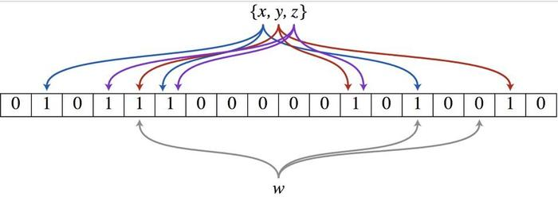

# 一、简介

Bloom filter 是由 Howard Bloom 在 1970 年提出的二进制向量数据结构，它具有很好的时间和空间效率，被用来**检测一个元素是不是集合中的一个成员**。 

使用场景：

- 字处理软件中，需要检查一个英语单词是否拼写正确
- 在 FBI，一个嫌疑人的名字是否已经在嫌疑名单上
- 在网络爬虫里，一个网址是否被访问过
- yahoo, gmail等邮箱垃圾邮件过滤功能
- 可以用于海量数据去重（近似）

# 二、计算方法

> 布隆过滤器原理很简单：就是把一个字符串哈希成一个整数key，然后选取一个很长的比特序列，开始都是0，在key把此位置的0变为1；下次进来一个字符串，哈希之后的值key，如果在此比特位上的值也是1，那么就说明这个字符串存在了。 

**在布隆过滤器上添加元素**：

1. 将要添加的元素给k个哈希函数；
2. 得到对应于位数组上的k个位置；
3. 将这k个位置设为1。

**在布隆过滤器上查询元素**：

1. 将要查询的元素给k个哈希函数；
2. 得到对应于位数组上的k个位置，进行判断：
   1. 如果k个位置有一个为0，则肯定不在集合中；
   2. 如果k个位置全部为1，则可能在集合中。

# 三、优缺点

**优点：**

1. 插入和查询时间都是常数 。
2. 它查询元素却不保存元素本身，具有良好的安全性。 

**缺点：**

- 当插入的元素越多，**错判**“在集合内”的概率就越大了 。
- Bloom filter 也**不能删除**一个元素，因为多个元素哈希的结果可能在 Bloom filter 结构中占用的是同一个位，如果删除了一个比特位，可能会影响多个元素的检测。  

