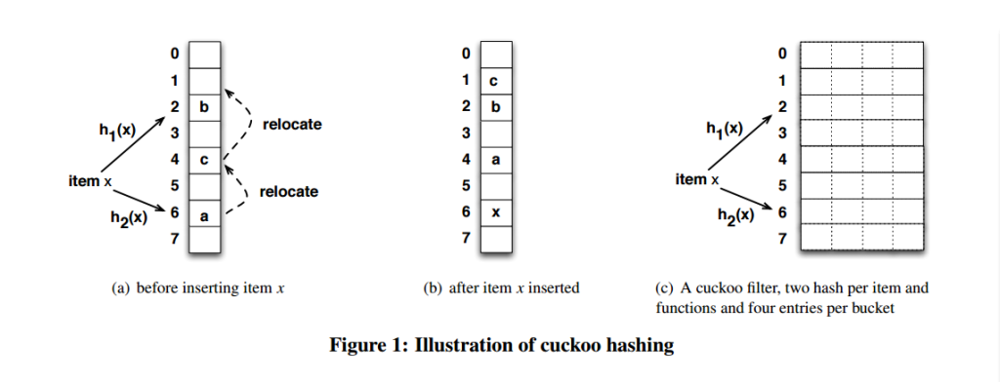

# 一、简介

​	我们知道布隆过滤器有两个缺点：**误判** 和 **不能删除元素**。而CuckooFilter就是用来解决这两个问题的，学习谅解这个过滤器之前，先学习之前的CuckooHash的概念。这个也是用于 **判断某个元素是否在一个集合里**。

# 二、算法执行

与cuckooHash需求不同：这个过滤器仅仅只是用于去重，那么不可能保存item的原始信息，每个bucket的slot应该保存item的一个**指纹信息**。（减少空间开销，像BloomFilter只需要一些bit就可以表示）

## 2.1 插入元素

由于slot中只放x的**指纹信息**，插入新元素的时候就会出现一个必须考虑的问题，若 一个item被挤出， 需要重新找位置的时候， 怎么计算这个iterm的另外一个位置呢（没有原来的key， 知道两个hash函数也没法计算）？cuckoo 采用只需要指纹信息就能找到第二个bucket的方式， 技巧在这里： 

那么在插入新元素时，要挤掉一个item的时候，h1(x)和h2(x)可以互相算出来。

## 2.2 查找元素

与布谷鸟哈希一样的查找方式，查找一个item x，通过2个hash函数算出对应的bucket，然后在slot里面查找是否有对应的指纹，若有，则说明集合中存在；反之不存在。

## 2.3 删除元素

知道了怎么查找，那么删除也就很容易实现了，也是找到对应的bucket，然后找到相应的slot的指纹，删除即可。

## 三、各种过滤器对比

